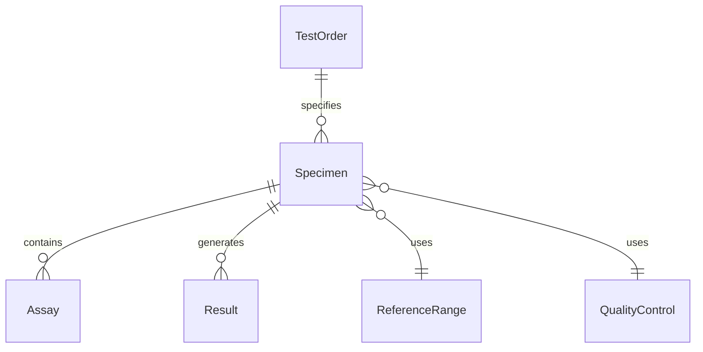
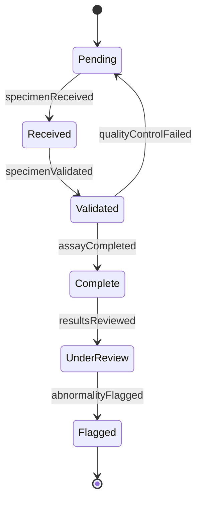
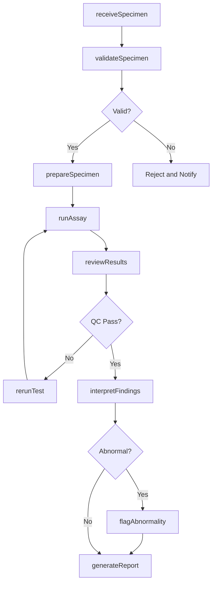
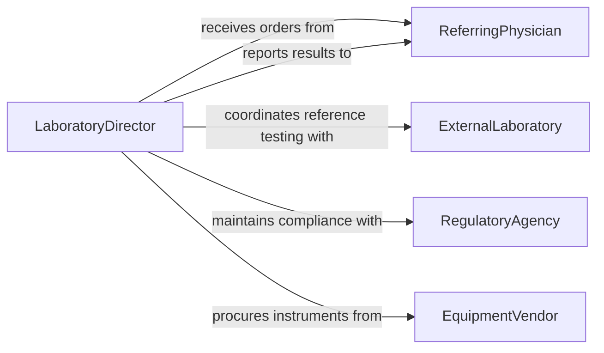

# Analyze Biological Samples

> Business-as-Code definition for biological sample analysis. Models the complete workflow from sample receipt through testing, interpretation, and reporting of results.

## Overview

Biological sample analysis encompasses the examination of tissue, blood, urine, microbiological cultures, and other biological specimens using laboratory techniques such as microscopy, chromatography, and molecular assays. This definition provides actions for each stage of the analytical pipeline, events for triggering downstream workflows, and searches for retrieving specimen and result data. It supports clinical diagnostics, research studies, environmental monitoring, and quality control applications.

## Actors

| Actor | Description |
|-------|-------------|
| ReferringPhysician | Orders tests and receives diagnostic results for patient care |
| Patient | Provides biological specimens for clinical testing |
| RegulatoryAgency | Establishes testing standards and conducts laboratory accreditation audits |
| EquipmentVendor | Supplies and maintains analytical instruments and reagents |
| ExternalLaboratory | Performs specialized reference testing not available in-house |
| ResearchSponsor | Funds studies requiring biological sample analysis |

## Roles

| Role | Description |
|------|-------------|
| LaboratoryDirector | Oversees all analytical operations and validates methodologies |
| MedicalTechnologist | Performs testing procedures and interprets preliminary results |
| Pathologist | Reviews complex findings and issues diagnostic interpretations |
| QualityAssuranceOfficer | Monitors compliance with testing standards and proficiency requirements |
| LaboratoryTechnician | Prepares specimens, maintains equipment, and assists with routine assays |

## Entities

| Entity | Description |
|--------|-------------|
| Specimen | A biological sample collected for analysis |
| TestOrder | A request specifying which assays to perform on a specimen |
| Assay | A defined analytical method or procedure applied to a specimen |
| Result | The quantitative or qualitative outcome of an assay |
| ReferenceRange | Normal value boundaries used to interpret test results |
| QualityControl | Control materials and metrics used to validate test accuracy |
| Instrument | Laboratory equipment used to perform analytical measurements |
| Report | A formal document summarizing findings and interpretations |

## Actions

| Action | Description |
|--------|-------------|
| receiveSpecimen | Log and accession an incoming biological sample |
| validateSpecimen | Verify specimen integrity, labeling, and collection conditions |
| prepareSpecimen | Process the specimen for analysis through centrifugation, staining, or extraction |
| runAssay | Execute the analytical test on the prepared specimen |
| reviewResults | Evaluate raw data against reference ranges and quality controls |
| interpretFindings | Apply clinical or scientific context to analytical results |
| generateReport | Produce a formal report of findings and interpretations |
| flagAbnormality | Mark results that fall outside expected reference ranges |
| rerunTest | Repeat an assay when results are inconclusive or quality control fails |

## Events

| Event | Description |
|-------|-------------|
| specimenReceived | A new biological sample has been accessioned into the laboratory |
| specimenValidated | Specimen integrity and labeling have been confirmed |
| assayCompleted | An analytical test has finished and raw data is available |
| resultsReviewed | Results have been evaluated against quality controls |
| abnormalityFlagged | A result outside the reference range has been identified |
| reportGenerated | A formal report of findings has been produced |
| testRerunRequested | A repeat analysis has been initiated due to quality concerns |
| qualityControlFailed | A control sample produced results outside acceptable limits |

## Searches

| Search | Description |
|--------|-------------|
| findSpecimens | Locate specimens by patient, collection date, or specimen type |
| getResults | Retrieve test results by assay, date range, or result status |
| getAbnormalResults | Find results flagged as outside reference ranges |
| findPendingTests | List specimens awaiting analysis or review |
| getQualityMetrics | Retrieve quality control pass rates and trend data |


## Entity Relationships



## State Diagram


## Workflow



## Actor Relationships



## Usage

### Calling Actions

```typescript
import { analyzeBiologicalSamples } from '@headlessly/analyze-biological-samples'

const lab = analyzeBiologicalSamples()

// Accession a new blood specimen
const specimen = await lab.receiveSpecimen({
  patientId: 'PT-2026-04821',
  specimenType: 'whole-blood',
  collectionDate: '2026-02-05',
  collectedBy: 'Phlebotomy Unit A'
})

// Run a complete blood count assay
const result = await lab.runAssay({
  specimenId: specimen.id,
  assayCode: 'CBC',
  instrument: 'hematology-analyzer-01'
})

// Review and interpret the results
const interpretation = await lab.interpretFindings({
  resultId: result.id,
  referenceRangeSet: 'adult-standard'
})
```

### Event-Driven Automation

```typescript
// Alert physician when critical values are detected
lab.abnormalityFlagged(async ({ specimenId, resultId, assayCode, value }) => {
  const specimen = await lab.findSpecimens({ specimenId })
  await notify({
    to: specimen[0].referringPhysicianId,
    priority: 'critical',
    message: `Critical value on ${assayCode}: ${value}`
  })
})

// Auto-quarantine batch when quality control fails
lab.qualityControlFailed(async ({ instrumentId, controlLotNumber }) => {
  await lab.rerunTest({
    instrumentId,
    reason: `QC failure on lot ${controlLotNumber}`
  })
})
```
