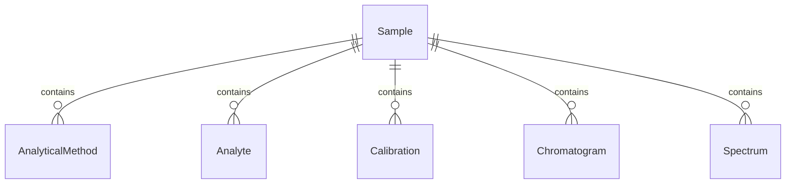
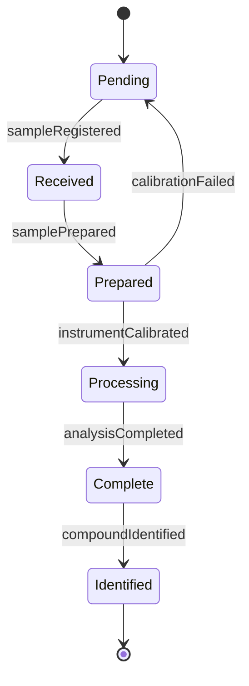
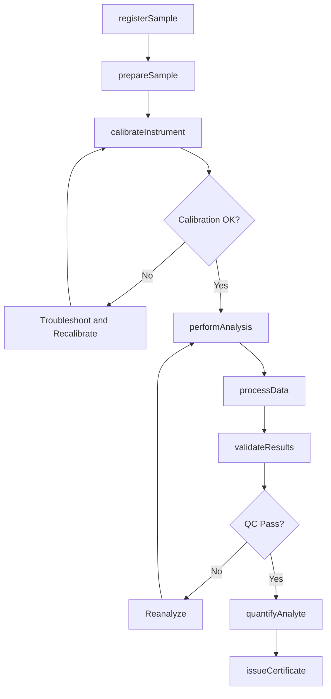
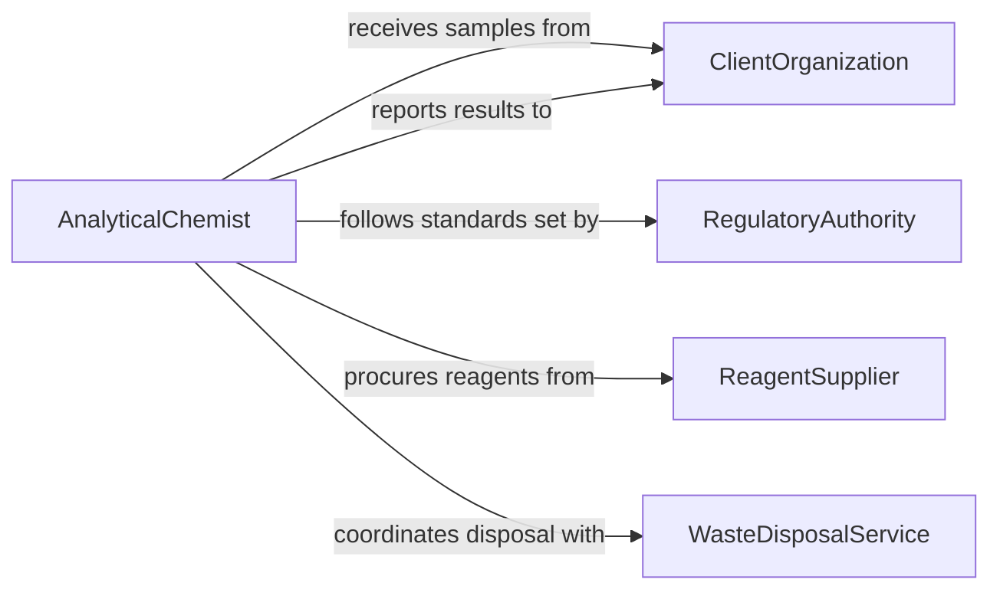

# Analyze Chemical Compounds or Substances

> Business-as-Code definition for chemical compound and substance analysis. Models the analytical workflow from sample preparation through instrumental analysis, data interpretation, and compliance reporting.

## Overview

Chemical compound and substance analysis involves identifying, quantifying, and characterizing the composition and properties of materials using techniques such as mass spectrometry, spectroscopy, chromatography, and wet chemistry methods. This definition exposes actions for each stage of chemical analysis, events for laboratory automation, and searches for retrieving analytical data. It supports pharmaceutical development, environmental testing, materials science, and regulatory compliance applications.

## Actors

| Actor | Description |
|-------|-------------|
| ClientOrganization | Submits samples and receives analytical reports |
| RegulatoryAuthority | Sets acceptable limits for chemical constituents and audits compliance |
| InstrumentManufacturer | Provides and services analytical instruments |
| ReagentSupplier | Supplies chemical standards, solvents, and reagents |
| AccreditationBody | Certifies laboratory methods and operational competence |
| WasteDisposalService | Handles disposal of hazardous chemical waste from analysis |

## Roles

| Role | Description |
|------|-------------|
| AnalyticalChemist | Designs methods, performs analyses, and interprets chemical data |
| LaboratoryManager | Oversees daily operations, staffing, and resource allocation |
| QualityControlSpecialist | Validates methods, runs controls, and ensures data integrity |
| SampleCoordinator | Manages sample intake, chain of custody, and storage |
| InstrumentationTechnician | Calibrates, maintains, and troubleshoots analytical instruments |

## Entities

| Entity | Description |
|--------|-------------|
| Sample | A material submitted for chemical analysis |
| AnalyticalMethod | A documented procedure for measuring a specific analyte |
| Analyte | The chemical compound or element being measured |
| Calibration | A set of standard measurements used to quantify analyte concentrations |
| Chromatogram | A graphical representation of separated chemical components |
| Spectrum | Spectral data showing absorption, emission, or mass characteristics |
| CertificateOfAnalysis | A formal document reporting analytical results and method details |
| ChainOfCustody | A record tracking sample handling from collection to disposal |

## Actions

| Action | Description |
|--------|-------------|
| registerSample | Log an incoming sample and assign a tracking identifier |
| prepareSample | Process a sample through dissolution, extraction, or derivatization |
| calibrateInstrument | Run standard solutions to establish measurement accuracy |
| performAnalysis | Execute the analytical method on a prepared sample |
| processData | Convert raw instrument signals into quantitative results |
| validateResults | Verify results against quality control criteria and blanks |
| identifyCompound | Determine the identity of unknown substances from spectral data |
| quantifyAnalyte | Calculate the concentration of a target analyte in the sample |
| issueCertificate | Generate a certificate of analysis for the completed work |

## Events

| Event | Description |
|-------|-------------|
| sampleRegistered | A new sample has been logged into the laboratory system |
| samplePrepared | A sample has been processed and is ready for instrument analysis |
| instrumentCalibrated | An instrument has passed calibration with acceptable linearity |
| analysisCompleted | An analytical run has finished producing raw data |
| compoundIdentified | An unknown substance has been matched to a reference compound |
| analyteQuantified | A concentration value has been determined for a target analyte |
| resultsValidated | Quality control checks have confirmed result accuracy |
| certificateIssued | A certificate of analysis has been generated and distributed |
| calibrationFailed | An instrument calibration did not meet acceptance criteria |

## Searches

| Search | Description |
|--------|-------------|
| findSamples | Locate samples by client, date, matrix type, or status |
| getAnalyticalResults | Retrieve quantitative results by analyte, method, or date range |
| findCalibrationRecords | List instrument calibration history and acceptance status |
| getMethodLibrary | Browse available analytical methods by analyte or technique |
| findOutOfSpecResults | Locate results exceeding regulatory or specification limits |


## Entity Relationships



## State Diagram


## Workflow



## Actor Relationships



## Usage

### Calling Actions

```typescript
import { analyzeChemicalCompoundsSubstances } from '@headlessly/analyze-chemical-compounds-substances'

const chem = analyzeChemicalCompoundsSubstances()

// Register a water sample for heavy metals analysis
const sample = await chem.registerSample({
  clientId: 'ENV-CORP-042',
  matrixType: 'drinking-water',
  analytes: ['lead', 'arsenic', 'mercury', 'cadmium'],
  method: 'EPA-200.8'
})

// Perform ICP-MS analysis
const analysis = await chem.performAnalysis({
  sampleId: sample.id,
  instrument: 'icp-ms-02',
  method: 'EPA-200.8'
})

// Issue certificate of analysis
await chem.issueCertificate({
  sampleId: sample.id,
  analysisIds: [analysis.id],
  signedBy: 'Dr. Chen, Laboratory Director'
})
```

### Event-Driven Automation

```typescript
// Alert client when results exceed regulatory limits
chem.analyteQuantified(async ({ sampleId, analyte, concentration, unit, regulatoryLimit }) => {
  if (concentration > regulatoryLimit) {
    await notify({
      to: 'client-contact',
      message: `${analyte} at ${concentration} ${unit} exceeds limit of ${regulatoryLimit} ${unit}`
    })
  }
})

// Schedule recalibration when calibration fails
chem.calibrationFailed(async ({ instrumentId, method }) => {
  await scheduleTask({
    type: 'instrument-maintenance',
    instrumentId,
    priority: 'high',
    reason: `Calibration failure on method ${method}`
  })
})
```
