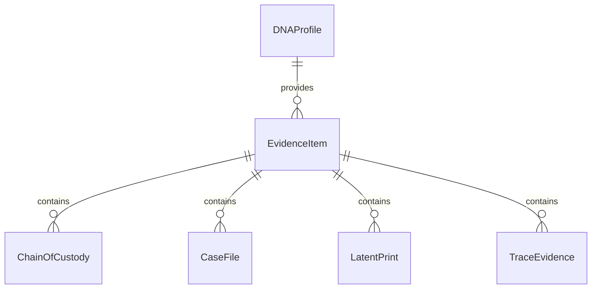
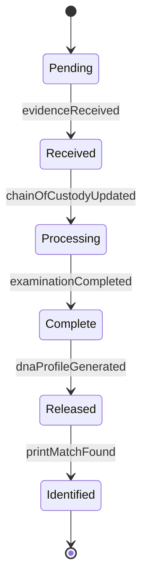
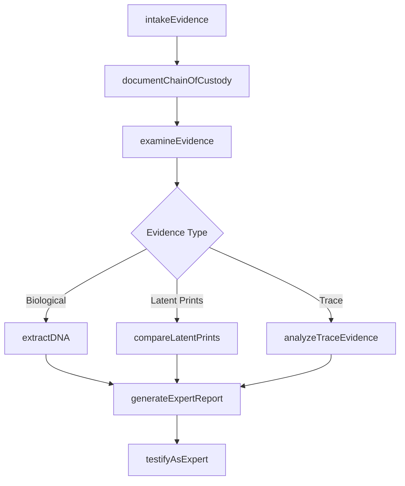
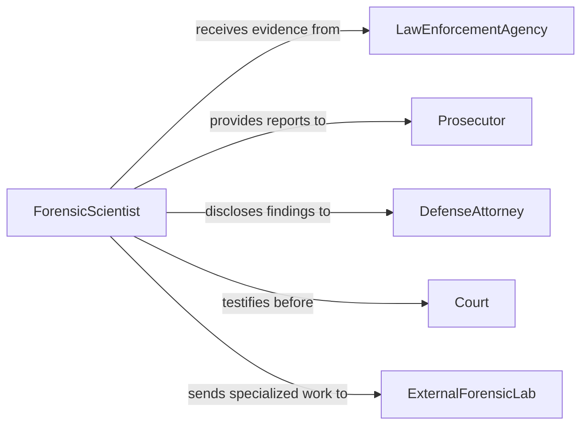

# Analyze Crime Scene Evidence

> Business-as-Code definition for crime scene evidence analysis. Models the workflow from evidence collection and intake through laboratory examination, analysis, and expert reporting.

## Overview

Crime scene evidence analysis involves the systematic examination of physical materials collected from crime scenes, including latent prints, trace evidence, biological fluids, firearms residue, and digital artifacts. This definition provides actions for evidence intake, laboratory processing, comparative analysis, and report generation. It supports law enforcement investigations, prosecutorial preparation, and defense review by maintaining strict chain-of-custody controls throughout the analytical process.

## Actors

| Actor | Description |
|-------|-------------|
| LawEnforcementAgency | Collects evidence at the scene and submits it for laboratory analysis |
| Prosecutor | Requests specific analyses and uses findings in legal proceedings |
| DefenseAttorney | Reviews analytical results and may request independent testing |
| Court | Receives expert testimony and admits evidence into proceedings |
| VictimAdvocate | Coordinates with laboratory on behalf of victims regarding case progress |
| ExternalForensicLab | Provides specialized analyses not available in the primary laboratory |

## Roles

| Role | Description |
|------|-------------|
| ForensicScientist | Performs laboratory examinations and interprets physical evidence |
| EvidenceCustodian | Manages intake, storage, and chain-of-custody documentation |
| CrimeSceneInvestigator | Collects and packages evidence at the scene following protocols |
| ForensicLabDirector | Oversees laboratory operations and validates analytical procedures |
| QualityAssuranceManager | Audits procedures, proficiency testing, and accreditation compliance |

## Entities

| Entity | Description |
|--------|-------------|
| EvidenceItem | A physical object or material collected from a crime scene |
| ChainOfCustody | A chronological record of evidence handling from scene to court |
| CaseFile | A collection of all evidence, analyses, and reports for an investigation |
| LatentPrint | A fingerprint or palmprint recovered from a surface |
| TraceEvidence | Microscopic materials such as fibers, hair, glass, or soil |
| DNAProfile | A genetic identification profile extracted from biological evidence |
| BallisticsReport | An analysis of firearms, ammunition, and projectile markings |
| ExpertReport | A formal document of findings prepared for legal proceedings |

## Actions

| Action | Description |
|--------|-------------|
| intakeEvidence | Receive and log evidence items into the laboratory system |
| documentChainOfCustody | Record each transfer and handling event for an evidence item |
| examineEvidence | Conduct visual and instrumental examination of physical evidence |
| extractDNA | Isolate genetic material from biological evidence for profiling |
| compareLatentPrints | Match recovered prints against known reference prints or databases |
| analyzeTraceEvidence | Identify and characterize microscopic materials using microscopy and spectroscopy |
| generateExpertReport | Prepare a formal report of analytical findings for court use |
| testifyAsExpert | Provide sworn expert testimony regarding analytical methods and findings |

## Events

| Event | Description |
|-------|-------------|
| evidenceReceived | A new evidence item has been logged into laboratory custody |
| chainOfCustodyUpdated | A transfer or handling event has been recorded for an evidence item |
| examinationCompleted | Physical examination of an evidence item has been finished |
| dnaProfileGenerated | A genetic profile has been extracted and entered into the system |
| printMatchFound | A latent print has been matched to a known individual |
| traceEvidenceIdentified | A microscopic material has been classified and characterized |
| expertReportIssued | A formal forensic report has been finalized and distributed |
| noMatchDetermined | Comparative analysis found no match in available databases |

## Searches

| Search | Description |
|--------|-------------|
| findEvidenceByCaseNumber | Locate all evidence items associated with a specific case |
| getChainOfCustody | Retrieve the complete handling history for an evidence item |
| findPendingAnalyses | List evidence items awaiting laboratory examination |
| searchDNAProfiles | Query the DNA database for matching genetic profiles |
| findExpertReports | Locate completed forensic reports by case, analyst, or date |


## Entity Relationships



## State Diagram


## Workflow



## Actor Relationships



## Usage

### Calling Actions

```typescript
import { analyzeCrimeSceneEvidence } from '@headlessly/analyze-crime-scene-evidence'

const forensics = analyzeCrimeSceneEvidence()

// Intake a new evidence item
const evidence = await forensics.intakeEvidence({
  caseNumber: 'PD-2026-00847',
  itemDescription: 'Glass fragment recovered from entry point',
  collectedBy: 'CSI Unit 3',
  collectionDate: '2026-02-04',
  storageRequirements: 'room-temperature-dry'
})

// Analyze trace evidence on the glass fragment
const traceResult = await forensics.analyzeTraceEvidence({
  evidenceId: evidence.id,
  techniques: ['sem-eds', 'refractive-index'],
  materialType: 'glass'
})

// Generate the expert report
await forensics.generateExpertReport({
  caseNumber: 'PD-2026-00847',
  evidenceIds: [evidence.id],
  analyst: 'Dr. Rivera, Trace Evidence Section'
})
```

### Event-Driven Automation

```typescript
// Notify detective when a DNA profile match is found
forensics.dnaProfileGenerated(async ({ caseNumber, profileId }) => {
  const matches = await forensics.searchDNAProfiles({ profileId })
  if (matches.length > 0) {
    await notify({
      to: 'lead-detective',
      message: `DNA match found in case ${caseNumber}: ${matches.length} hit(s)`
    })
  }
})

// Auto-flag cases with evidence pending longer than 30 days
forensics.evidenceReceived(async ({ evidenceId, caseNumber, receivedDate }) => {
  await scheduleTask({
    type: 'pending-analysis-reminder',
    dueDate: addDays(receivedDate, 30),
    evidenceId,
    caseNumber
  })
})
```
