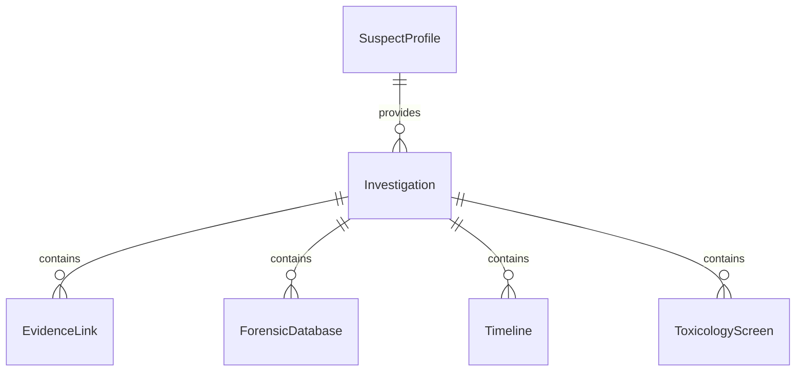
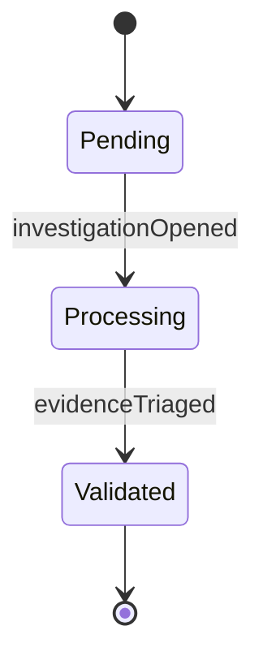
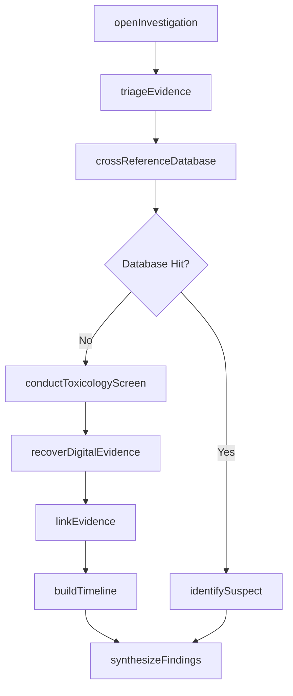
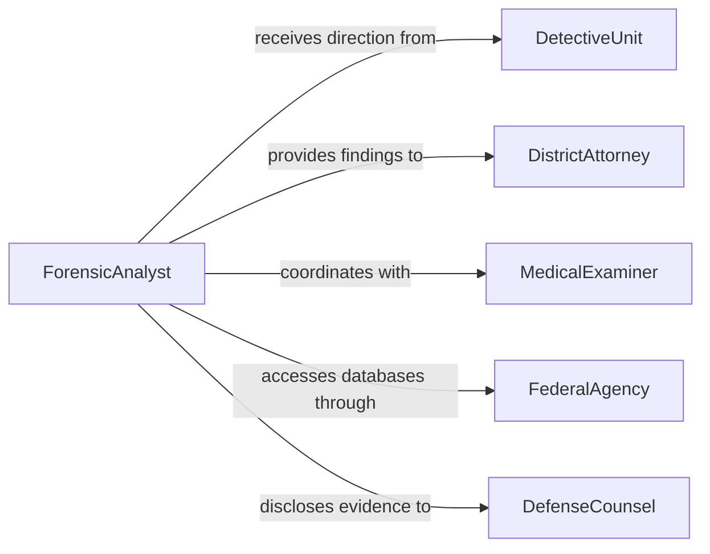

# Analyze Forensic Evidence to Solve Crimes

> Business-as-Code definition for forensic evidence analysis in criminal investigations. Models the investigative workflow from evidence receipt through multi-disciplinary analysis, suspect identification, and case resolution support.

## Overview

Forensic evidence analysis to solve crimes integrates multiple scientific disciplines -- including DNA analysis, toxicology, digital forensics, and pattern evidence examination -- to reconstruct criminal events and identify perpetrators. This definition provides actions for coordinating cross-disciplinary analyses, linking evidence across cases, and building investigative timelines. It differs from general crime scene evidence analysis by focusing specifically on the investigative synthesis that connects disparate evidence to suspects and criminal activities.

## Actors

| Actor | Description |
|-------|-------------|
| DetectiveUnit | Directs the investigation and requests specific forensic analyses |
| DistrictAttorney | Uses forensic findings to build prosecution cases |
| MedicalExaminer | Provides autopsy findings and cause-of-death determinations |
| FederalAgency | Collaborates on multi-jurisdictional cases and provides database access |
| DefenseCounsel | Reviews forensic evidence and may retain independent experts |
| WitnessOrInformant | Provides contextual information that guides forensic examination priorities |

## Roles

| Role | Description |
|------|-------------|
| ForensicAnalyst | Performs specialized analyses and interprets results in investigative context |
| CaseCoodinator | Manages the flow of evidence and analysis across laboratory sections |
| DatabaseAdministrator | Manages access to CODIS, AFIS, NIBIN, and other forensic databases |
| ForensicPathologist | Determines cause and manner of death through autopsy and toxicology |
| InvestigativeReviewer | Synthesizes findings from multiple disciplines into an investigative summary |

## Entities

| Entity | Description |
|--------|-------------|
| Investigation | A criminal case combining multiple evidence items and analyses |
| SuspectProfile | A composite record linking forensic identifiers to a person of interest |
| EvidenceLink | A documented connection between two or more evidence items or cases |
| ForensicDatabase | A repository of known profiles such as CODIS, AFIS, or NIBIN |
| Timeline | A chronological reconstruction of events based on forensic evidence |
| ToxicologyScreen | Results of chemical analysis for drugs, poisons, or alcohol in biological specimens |
| DigitalArtifact | Electronic data recovered from devices, networks, or storage media |
| CaseNarrative | An integrative document combining all forensic findings into a coherent account |

## Actions

| Action | Description |
|--------|-------------|
| openInvestigation | Create a new forensic investigation record and assign case resources |
| triageEvidence | Prioritize evidence items based on probative value and case urgency |
| crossReferenceDatabase | Search forensic databases for matches to recovered profiles or patterns |
| linkEvidence | Establish documented connections between evidence items across cases |
| buildTimeline | Construct a chronological sequence of events from forensic data |
| conductToxicologyScreen | Test biological specimens for the presence of drugs, alcohol, or toxins |
| recoverDigitalEvidence | Extract and preserve data from electronic devices and storage media |
| synthesizeFindings | Combine results from multiple disciplines into a unified case narrative |
| identifySuspect | Confirm the identity of a person of interest through forensic evidence |

## Events

| Event | Description |
|-------|-------------|
| investigationOpened | A new forensic investigation has been initiated |
| evidenceTriaged | Evidence items have been prioritized and assigned to laboratory sections |
| databaseHitConfirmed | A forensic database search has returned a verified match |
| evidenceLinked | A connection between evidence items or cases has been documented |
| timelineConstructed | A chronological reconstruction of events has been completed |
| toxicologyResultsReady | Drug, alcohol, or toxin screening results are available |
| digitalEvidenceRecovered | Data from an electronic device has been extracted and preserved |
| suspectIdentified | Forensic evidence has positively linked a person to the investigation |
| findingsSynthesized | A comprehensive case narrative integrating all analyses has been completed |

## Searches

| Search | Description |
|--------|-------------|
| findInvestigations | Locate investigations by case number, jurisdiction, or status |
| searchSuspectProfiles | Query suspect records by forensic identifiers or demographic criteria |
| getEvidenceLinks | Retrieve documented connections between evidence items |
| findDatabaseHits | List confirmed matches from CODIS, AFIS, NIBIN, or other repositories |
| getCaseTimeline | Retrieve the reconstructed event sequence for an investigation |
| findOpenCasesByEvidenceType | Locate unsolved cases with specific types of unprocessed evidence |


## Entity Relationships



## State Diagram


## Workflow



## Actor Relationships



## Usage

### Calling Actions

```typescript
import { analyzeForensicEvidenceSolveCrimes } from '@headlessly/analyze-forensic-evidence-solve-crimes'

const forensics = analyzeForensicEvidenceSolveCrimes()

// Open a new homicide investigation
const investigation = await forensics.openInvestigation({
  caseNumber: 'HOM-2026-00193',
  jurisdiction: 'metro-county',
  offenseType: 'homicide',
  priority: 'high'
})

// Cross-reference a DNA profile against CODIS
const hits = await forensics.crossReferenceDatabase({
  investigationId: investigation.id,
  database: 'CODIS',
  profileId: 'dna-profile-0047'
})

// Build an event timeline from all analyzed evidence
await forensics.buildTimeline({
  investigationId: investigation.id,
  evidenceIds: ['ev-001', 'ev-002', 'ev-003'],
  startDate: '2026-01-28',
  endDate: '2026-02-01'
})
```

### Event-Driven Automation

```typescript
// Alert lead detective when a database hit is confirmed
forensics.databaseHitConfirmed(async ({ investigationId, database, matchedProfileId }) => {
  await notify({
    to: 'lead-detective',
    priority: 'urgent',
    message: `Confirmed ${database} hit in case ${investigationId}: profile ${matchedProfileId}`
  })
})

// Auto-synthesize findings when all evidence sections have reported
forensics.digitalEvidenceRecovered(async ({ investigationId }) => {
  const pending = await forensics.findInvestigations({
    investigationId,
    pendingSections: true
  })
  if (pending.length === 0) {
    await forensics.synthesizeFindings({ investigationId })
  }
})
```
