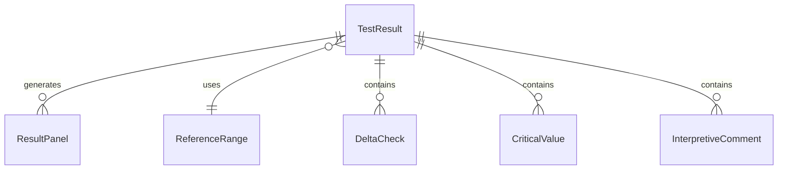
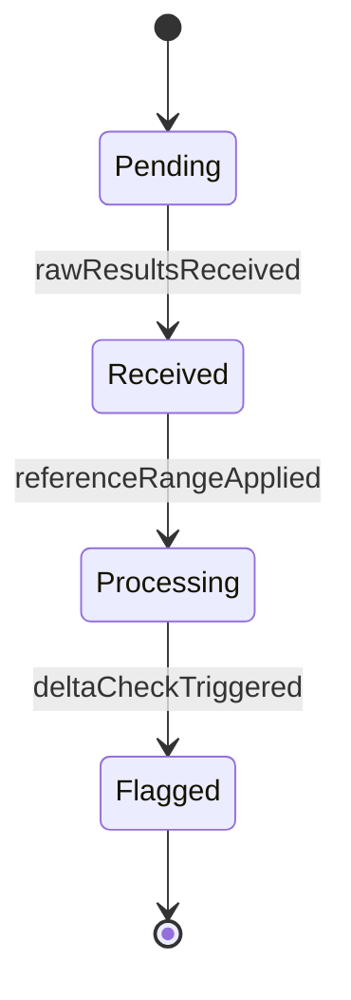
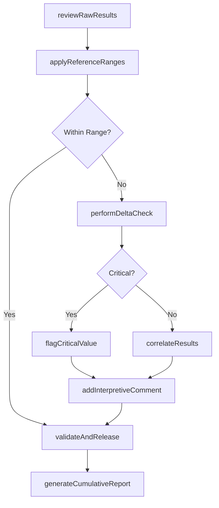
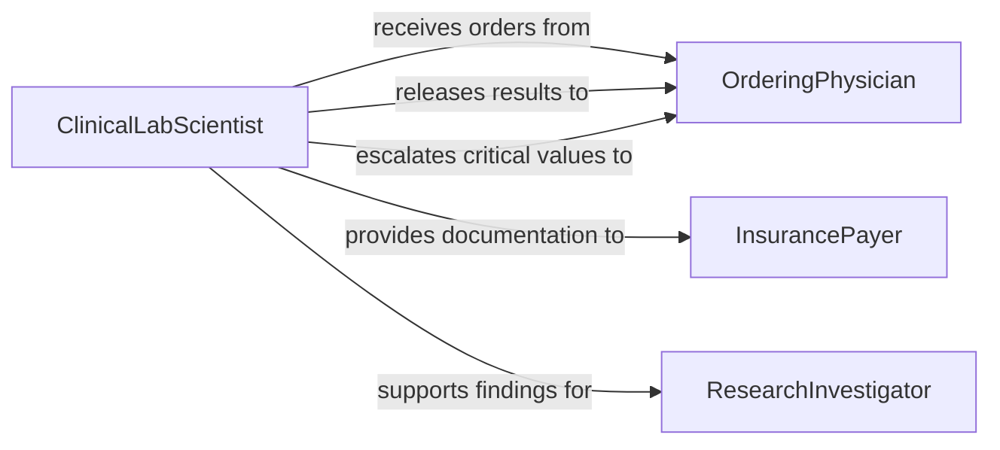

# Analyze Laboratory Findings

> Business-as-Code definition for laboratory findings analysis. Models the workflow of reviewing, interpreting, correlating, and reporting results produced by clinical, research, and industrial laboratories.

## Overview

Laboratory findings analysis involves the systematic review and interpretation of test results generated by analytical instruments and manual procedures. Analysts compare results against reference ranges, historical data, and quality control benchmarks to determine their clinical, scientific, or regulatory significance. This definition provides actions for reviewing raw data, correlating multi-test results, identifying trends or anomalies, and producing interpretive reports that guide decision-making in healthcare, research, and manufacturing contexts.

## Actors

| Actor | Description |
|-------|-------------|
| OrderingPhysician | Requests laboratory tests and relies on findings for diagnosis and treatment |
| Patient | The individual whose specimens produce the laboratory findings |
| RegulatoryInspector | Audits laboratory operations and validates compliance with testing standards |
| InstrumentServiceProvider | Maintains and calibrates laboratory instruments that generate raw data |
| InsurancePayer | Requires documented laboratory findings to authorize coverage for treatments |
| ResearchInvestigator | Uses laboratory findings to support or refute scientific hypotheses |

## Roles

| Role | Description |
|------|-------------|
| ClinicalLabScientist | Reviews and validates test results before release |
| Pathologist | Provides expert interpretation of complex or ambiguous findings |
| LaboratoryInformatics | Manages data systems that store, route, and flag laboratory results |
| QualityManager | Monitors analytical accuracy through proficiency testing and control tracking |

## Entities

| Entity | Description |
|--------|-------------|
| TestResult | A single measured value or qualitative outcome from a laboratory procedure |
| ResultPanel | A grouped set of related test results ordered as a unit |
| ReferenceRange | Established normal boundaries for a given analyte and population |
| DeltaCheck | A comparison of a current result against the same patient's prior values |
| CriticalValue | A result that indicates an immediately life-threatening condition |
| InterpretiveComment | A narrative annotation providing clinical context to a result |
| CumulativeReport | A longitudinal summary of a patient's or sample's results over time |
| ValidationRecord | Documentation that a result has been reviewed and approved for release |

## Actions

| Action | Description |
|--------|-------------|
| reviewRawResults | Examine instrument output for completeness and technical validity |
| applyReferenceRanges | Compare results against population-specific normal value boundaries |
| performDeltaCheck | Compare current results to previous values for the same patient or sample |
| flagCriticalValue | Identify and escalate results indicating immediate clinical danger |
| correlateResults | Cross-reference multiple test results to identify diagnostic patterns |
| addInterpretiveComment | Attach a narrative explanation to clarify a result's significance |
| validateAndRelease | Approve a result for distribution to the ordering provider |
| generateCumulativeReport | Produce a longitudinal summary of results over a specified period |

## Events

| Event | Description |
|-------|-------------|
| rawResultsReceived | Instrument data has been transmitted to the laboratory information system |
| referenceRangeApplied | A result has been compared against its applicable reference range |
| deltaCheckTriggered | A significant difference from a prior result has been detected |
| criticalValueFlagged | A life-threatening result has been identified and escalated |
| resultsCorrelated | Multiple results have been analyzed together to form a diagnostic pattern |
| interpretiveCommentAdded | A narrative annotation has been attached to a result |
| resultValidated | A result has been reviewed, approved, and released for reporting |
| cumulativeReportGenerated | A longitudinal summary of findings has been produced |

## Searches

| Search | Description |
|--------|-------------|
| findResultsByPatient | Retrieve all test results for a specific patient or specimen |
| getCriticalValues | List all flagged critical values awaiting acknowledgment |
| getDeltaCheckAlerts | Find results with significant changes from prior values |
| getResultsByPanel | Retrieve grouped results for a specific test panel |
| findUnvalidatedResults | List results awaiting review and release approval |
| getResultTrends | Retrieve longitudinal result data for trend analysis |


## Entity Relationships



## State Diagram


## Workflow



## Actor Relationships



## Usage

### Calling Actions

```typescript
import { analyzeLaboratoryFindings } from '@headlessly/analyze-laboratory-findings'

const lab = analyzeLaboratoryFindings()

// Review raw results from a metabolic panel
const rawResults = await lab.reviewRawResults({
  panelCode: 'CMP',
  specimenId: 'SP-2026-10482',
  instrumentId: 'chemistry-analyzer-03'
})

// Perform delta check against patient history
const deltaAlerts = await lab.performDeltaCheck({
  patientId: 'PT-2026-05511',
  resultIds: rawResults.map(r => r.id),
  lookbackPeriod: '90d'
})

// Validate and release the results
await lab.validateAndRelease({
  resultIds: rawResults.map(r => r.id),
  validatedBy: 'CLS-Martinez',
  comments: deltaAlerts.length > 0 ? 'Delta check alerts reviewed and acknowledged' : undefined
})
```

### Event-Driven Automation

```typescript
// Immediately notify physician of critical values
lab.criticalValueFlagged(async ({ patientId, testCode, value, criticalRange }) => {
  await notify({
    to: 'ordering-physician',
    priority: 'stat',
    message: `CRITICAL: ${testCode} = ${value} (critical range: ${criticalRange}) for patient ${patientId}`
  })
})

// Auto-generate cumulative report on result validation
lab.resultValidated(async ({ patientId, panelCode }) => {
  await lab.generateCumulativeReport({
    patientId,
    panelCode,
    period: 'last-12-months'
  })
})
```
