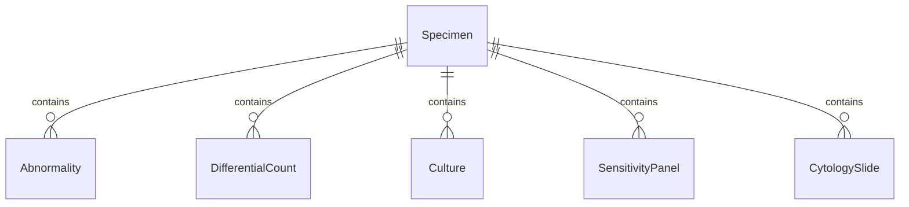
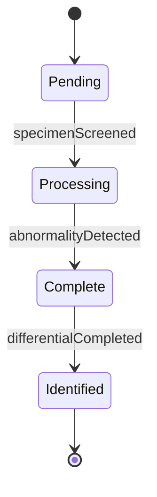
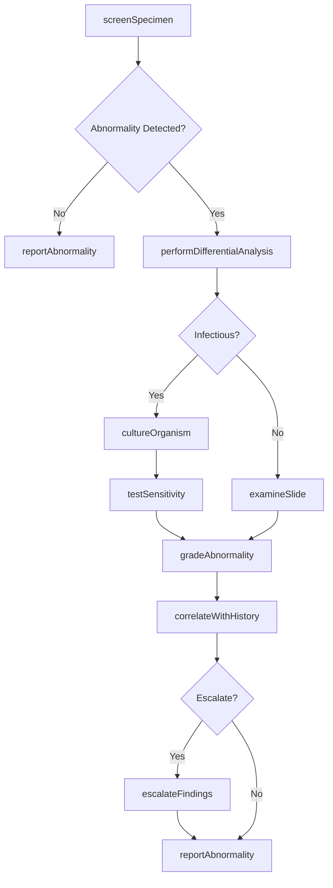
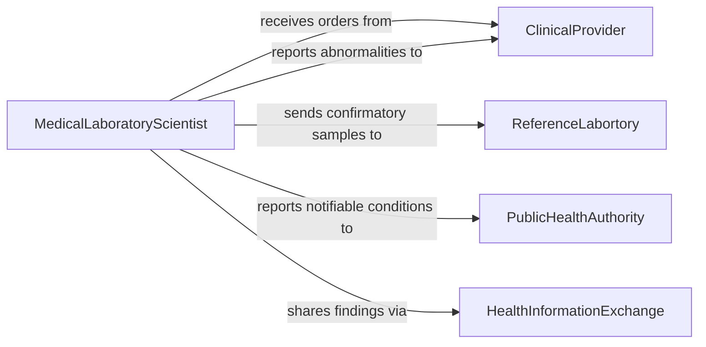

# Analyze Laboratory Specimens to Detect Abnormalities

> Business-as-Code definition for detecting abnormalities in laboratory specimens. Models the diagnostic workflow from specimen screening through anomaly detection, classification, and clinical correlation.

## Overview

Analyzing laboratory specimens to detect abnormalities involves systematic screening of clinical samples for pathological indicators, including atypical cell morphology, elevated biomarkers, infectious agents, and metabolic imbalances. This definition covers hematology, cytology, microbiology, and clinical chemistry screening workflows. It provides actions for performing differential analyses, grading severity, and correlating findings with patient history to support timely diagnosis and treatment.

## Actors

| Actor | Description |
|-------|-------------|
| ClinicalProvider | Orders specimen analysis and acts on abnormal findings |
| Patient | Provides the biological specimen under examination |
| ReferenceLabortory | Performs confirmatory testing on unusual or ambiguous abnormalities |
| Accreditor | Audits specimen handling and analytical processes for compliance |
| HealthInformationExchange | Facilitates sharing of abnormal findings across care settings |
| PublicHealthAuthority | Receives mandatory reports of notifiable conditions identified in specimens |

## Roles

| Role | Description |
|------|-------------|
| MedicalLaboratoryScientist | Screens specimens and identifies morphological or chemical abnormalities |
| Cytotechnologist | Examines cellular specimens for precancerous or malignant changes |
| Microbiologist | Identifies infectious organisms and determines antimicrobial susceptibility |
| Histotechnologist | Prepares tissue sections for microscopic examination |
| SupervisingPathologist | Provides final diagnostic interpretation of complex abnormalities |

## Entities

| Entity | Description |
|--------|-------------|
| Specimen | A clinical sample submitted for abnormality screening |
| Abnormality | A detected deviation from normal parameters in a specimen |
| DifferentialCount | A classification and enumeration of cell types in a blood smear |
| Culture | A microbiological growth medium inoculated with specimen material |
| SensitivityPanel | A set of antimicrobial agents tested against an isolated organism |
| CytologySlide | A prepared cellular specimen on a glass slide for microscopic review |
| HistologySection | A thin tissue slice mounted for staining and examination |
| AbnormalityGrade | A severity classification assigned to a detected abnormality |
| DiagnosticCorrelation | A link between laboratory abnormalities and clinical findings |

## Actions

| Action | Description |
|--------|-------------|
| screenSpecimen | Perform initial examination of a specimen for gross abnormalities |
| performDifferentialAnalysis | Classify and count cell populations to identify atypical distributions |
| cultureOrganism | Inoculate growth media and incubate to isolate infectious agents |
| testSensitivity | Determine antimicrobial susceptibility of isolated organisms |
| examineSlide | Review stained cellular or tissue preparations under microscopy |
| gradeAbnormality | Assign a severity classification to a detected anomaly |
| correlateWithHistory | Compare findings against patient demographics and medical history |
| escalateFindings | Route significant abnormalities for supervisory review or confirmatory testing |
| reportAbnormality | Document and communicate detected abnormalities to the clinical provider |

## Events

| Event | Description |
|-------|-------------|
| specimenScreened | Initial examination of a specimen has been completed |
| abnormalityDetected | A deviation from expected parameters has been identified |
| differentialCompleted | Cell population analysis has been finalized |
| organismIsolated | A pathogenic organism has been grown and identified in culture |
| sensitivityDetermined | Antimicrobial susceptibility results are available |
| abnormalityGraded | A severity classification has been assigned to a finding |
| findingsEscalated | An abnormality has been routed for supervisory or confirmatory review |
| abnormalityReported | A formal report of detected abnormalities has been sent to the provider |
| notifiableConditionIdentified | A finding requiring mandatory public health reporting has been detected |

## Searches

| Search | Description |
|--------|-------------|
| findAbnormalSpecimens | Locate specimens with detected abnormalities by type, grade, or date |
| getPatientHistory | Retrieve prior specimen results and abnormality records for a patient |
| findPendingCultures | List cultures awaiting incubation completion or organism identification |
| getSensitivityResults | Retrieve antimicrobial susceptibility data for isolated organisms |
| findEscalatedCases | Locate specimens routed for supervisory review or confirmatory testing |
| getAbnormalityTrends | Retrieve aggregate abnormality rates by type, period, or population |


## Entity Relationships



## State Diagram


## Workflow



## Actor Relationships



## Usage

### Calling Actions

```typescript
import { analyzeLaboratorySpecimensDetectAbnormalities } from '@headlessly/analyze-laboratory-specimens-detect-abnormalities'

const screening = analyzeLaboratorySpecimensDetectAbnormalities()

// Screen a blood specimen for abnormalities
const result = await screening.screenSpecimen({
  specimenId: 'SP-2026-22481',
  specimenType: 'peripheral-blood',
  requestedTests: ['CBC-with-differential', 'peripheral-smear']
})

// Perform differential count on flagged specimen
const differential = await screening.performDifferentialAnalysis({
  specimenId: 'SP-2026-22481',
  method: 'manual-100-cell-count'
})

// Grade and report the abnormality
await screening.gradeAbnormality({
  specimenId: 'SP-2026-22481',
  abnormalityType: 'left-shift-neutrophilia',
  grade: 'moderate'
})
```

### Event-Driven Automation

```typescript
// Escalate high-grade abnormalities to pathologist
screening.abnormalityDetected(async ({ specimenId, abnormalityType, grade }) => {
  if (grade === 'severe' || grade === 'critical') {
    await screening.escalateFindings({
      specimenId,
      escalateTo: 'supervising-pathologist',
      reason: `${grade} ${abnormalityType} requires review`
    })
  }
})

// Auto-report notifiable conditions to public health
screening.notifiableConditionIdentified(async ({ specimenId, condition, patientId }) => {
  await reportToPublicHealth({
    condition,
    specimenId,
    patientId,
    reportingFacility: 'metro-clinical-lab'
  })
})
```
