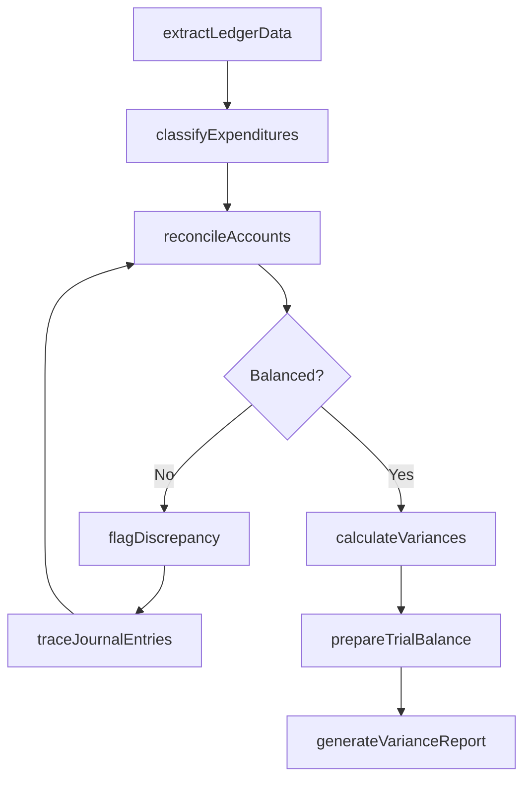
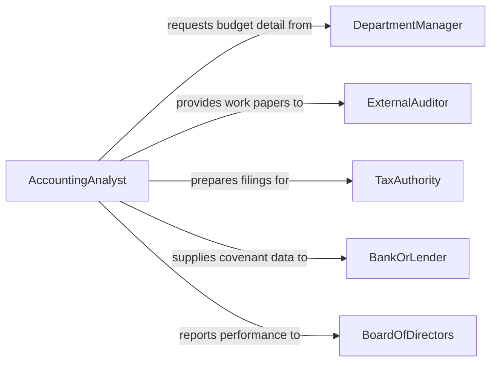

# Analyze Budgetary or Accounting Data

> Business-as-Code definition for budgetary and accounting data analysis. Models the complete workflow from data extraction through variance analysis, reconciliation, and financial reporting.

## Overview

Budgetary and accounting data analysis involves examining general ledger entries, budget allocations, expenditure records, and revenue figures to assess financial performance and compliance. Analysts compare actual results against budgeted amounts, identify variances, trace discrepancies through journal entries, and prepare reports for management and regulatory bodies. This definition supports month-end close, annual budget review, audit preparation, and ongoing financial monitoring.

## Actors

| Actor | Description |
|-------|-------------|
| DepartmentManager | Provides budget justification and responds to variance inquiries |
| ExternalAuditor | Reviews accounting data for accuracy and compliance with standards |
| TaxAuthority | Requires financial data in prescribed formats for regulatory filings |
| BankOrLender | Evaluates financial data for credit and covenant compliance |
| BoardOfDirectors | Receives summarized financial performance reports for governance decisions |
| VendorOrSupplier | Generates invoices and payment records that flow into accounting data |

## Roles

| Role | Description |
|------|-------------|
| AccountingAnalyst | Performs detailed review of ledger entries and budget variances |
| Controller | Oversees financial reporting accuracy and internal controls |
| BudgetAnalyst | Compares actual expenditures to budgeted amounts and forecasts |
| StaffAccountant | Prepares journal entries, reconciliations, and supporting schedules |
| FinancialReportingManager | Produces management and regulatory financial statements |

## Entities

| Entity | Description |
|--------|-------------|
| GeneralLedger | The master record of all financial transactions |
| BudgetLineItem | A specific category of planned revenue or expenditure |
| JournalEntry | A recorded financial transaction with debits and credits |
| VarianceReport | A comparison of actual versus budgeted figures with explanations |
| Reconciliation | A document matching two sets of records to verify agreement |
| TrialBalance | A listing of all account balances at a point in time |
| CostCenter | An organizational unit to which expenses are allocated |
| FinancialStatement | A formal report of financial position, performance, or cash flow |

## Actions

| Action | Description |
|--------|-------------|
| extractLedgerData | Retrieve general ledger entries for a specified period and account range |
| calculateVariances | Compute differences between actual and budgeted amounts by line item |
| reconcileAccounts | Match transactions between two sources to identify discrepancies |
| classifyExpenditures | Categorize spending by cost center, project, or account code |
| traceJournalEntries | Follow a transaction from source document through ledger posting |
| prepareTrialBalance | Generate a listing of all account balances for period-end review |
| generateVarianceReport | Produce a formatted report of budget-to-actual variances |
| flagDiscrepancy | Mark an account or entry that requires investigation or correction |

## Events

| Event | Description |
|-------|-------------|
| ledgerDataExtracted | General ledger data for a period has been pulled for analysis |
| variancesCalculated | Budget-to-actual variances have been computed |
| accountReconciled | An account reconciliation has been completed and balanced |
| expenditureClassified | A transaction has been assigned to a cost center and account code |
| discrepancyFlagged | An unexplained difference has been identified for investigation |
| trialBalancePrepared | A complete listing of account balances has been generated |
| varianceReportGenerated | A formatted variance report has been produced and distributed |
| reconciliationException | A reconciliation could not be balanced and requires manual review |

## Searches

| Search | Description |
|--------|-------------|
| findVariances | Locate budget-to-actual variances by cost center, threshold, or period |
| getLedgerEntries | Retrieve journal entries by account, date range, or amount |
| getReconciliationStatus | Check the completion status of account reconciliations |
| findUnclassifiedTransactions | Locate expenditures not yet assigned to a cost center |
| getBudgetUtilization | Retrieve percentage of budget consumed by line item or department |

## Workflow



## Actor Relationships



## Usage

### Calling Actions

```typescript
import { analyzeBudgetaryAccountingData } from '@headlessly/analyze-budgetary-accounting-data'

const accounting = analyzeBudgetaryAccountingData()

// Extract Q1 ledger data for the marketing department
const ledgerData = await accounting.extractLedgerData({
  period: { start: '2026-01-01', end: '2026-03-31' },
  costCenter: 'marketing',
  accountRange: { from: '5000', to: '5999' }
})

// Calculate variances against budget
const variances = await accounting.calculateVariances({
  period: 'Q1-2026',
  costCenter: 'marketing',
  threshold: 0.10
})

// Generate the variance report
await accounting.generateVarianceReport({
  period: 'Q1-2026',
  costCenters: ['marketing', 'sales', 'engineering'],
  includeExplanations: true,
  distributeTo: ['controller', 'cfo']
})
```

### Event-Driven Automation

```typescript
// Alert management when variances exceed threshold
accounting.variancesCalculated(async ({ costCenter, variances }) => {
  const significant = variances.filter(v => Math.abs(v.percentage) > 15)
  if (significant.length > 0) {
    await notify({
      to: `${costCenter}-manager`,
      message: `${significant.length} line items exceed 15% variance in ${costCenter}`
    })
  }
})

// Auto-escalate unresolved reconciliation exceptions
accounting.reconciliationException(async ({ accountId, amount, age }) => {
  if (age > 5) {
    await notify({
      to: 'controller',
      message: `Reconciliation exception on account ${accountId} ($${amount}) unresolved for ${age} days`
    })
  }
})
```
