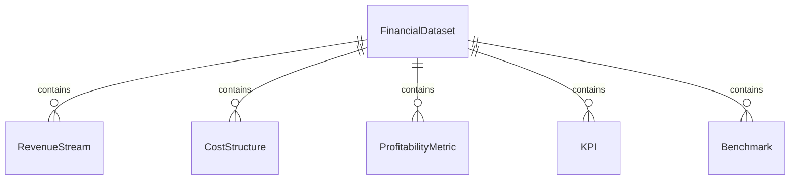
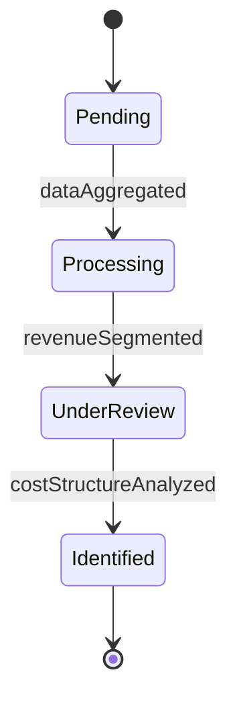
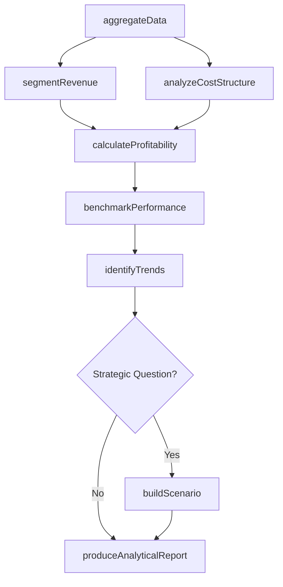
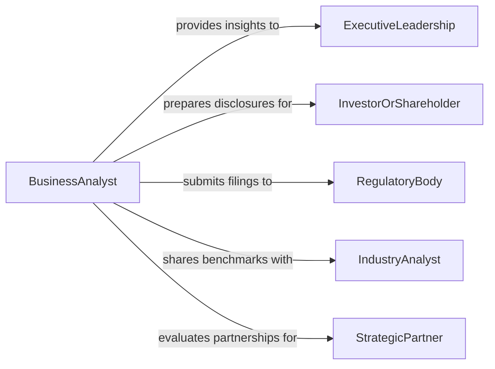

# Analyze Business or Financial Data

> Business-as-Code definition for business and financial data analysis. Models the comprehensive workflow of collecting, structuring, analyzing, and interpreting business performance and financial metrics.

## Overview

Business and financial data analysis encompasses the broad examination of operational metrics, revenue streams, cost structures, profitability indicators, and market performance data to inform strategic decision-making. Analysts aggregate data from accounting systems, CRM platforms, ERP modules, and external market sources to produce insights on business health, competitive positioning, and growth opportunities. This definition supports executive dashboards, strategic planning, investor relations, and operational performance reviews.

## Actors

| Actor | Description |
|-------|-------------|
| ExecutiveLeadership | Consumes analytical outputs for strategic and investment decisions |
| InvestorOrShareholder | Evaluates business performance data for investment decisions |
| RegulatoryBody | Requires standardized financial disclosures and compliance filings |
| IndustryAnalyst | Benchmarks organizational performance against peers and market indices |
| CustomerBase | Generates revenue data through purchasing behavior and contract terms |
| StrategicPartner | Shares data for joint ventures, alliances, and partnership evaluations |

## Roles

| Role | Description |
|------|-------------|
| BusinessAnalyst | Structures and interprets operational and financial data for decision support |
| FinancialAnalyst | Performs quantitative analysis of financial statements and projections |
| DataEngineer | Builds and maintains data pipelines that feed analytical systems |
| ChiefFinancialOfficer | Directs financial analysis priorities and acts on strategic insights |
| RevenueAnalyst | Focuses on revenue recognition, pricing analysis, and sales performance |

## Entities

| Entity | Description |
|--------|-------------|
| FinancialDataset | A structured collection of financial records for analysis |
| RevenueStream | A distinct source of income categorized by product, service, or channel |
| CostStructure | A breakdown of fixed and variable costs across business functions |
| ProfitabilityMetric | A calculated indicator such as gross margin, EBITDA, or net income |
| KPI | A key performance indicator tracking business health |
| Benchmark | An external or historical reference point for comparing performance |
| Trend | A directional pattern observed in time-series business data |
| AnalyticalReport | A document presenting findings, visualizations, and recommendations |

## Actions

| Action | Description |
|--------|-------------|
| aggregateData | Collect and combine data from multiple business and financial sources |
| segmentRevenue | Break down revenue by product line, geography, channel, or customer segment |
| analyzeCostStructure | Examine fixed and variable costs to identify savings opportunities |
| calculateProfitability | Compute margin and return metrics across business units |
| benchmarkPerformance | Compare organizational metrics against industry standards or peers |
| identifyTrends | Detect patterns and directional changes in time-series data |
| buildScenario | Model alternative business outcomes based on variable assumptions |
| produceAnalyticalReport | Generate a comprehensive report with findings and strategic recommendations |

## Events

| Event | Description |
|-------|-------------|
| dataAggregated | Business and financial data from multiple sources has been consolidated |
| revenueSegmented | Revenue has been broken down by the requested dimensions |
| costStructureAnalyzed | Cost analysis across business functions has been completed |
| profitabilityCalculated | Margin and return metrics have been computed |
| performanceBenchmarked | Organizational metrics have been compared against benchmarks |
| trendIdentified | A significant pattern has been detected in the data |
| scenarioModeled | An alternative outcome scenario has been projected |
| analyticalReportProduced | A comprehensive report has been generated and distributed |

## Searches

| Search | Description |
|--------|-------------|
| findRevenueBySegment | Retrieve revenue data by product, geography, channel, or customer |
| getCostBreakdown | List costs by category, department, or fixed versus variable classification |
| getProfitabilityMetrics | Retrieve calculated margin and return metrics by business unit |
| getBenchmarkComparisons | Access performance comparisons against industry or peer data |
| findTrends | Locate significant patterns by metric, period, or business unit |
| getScenarioProjections | Retrieve modeled outcomes for scenario analysis |


## Entity Relationships



## State Diagram


## Workflow



## Actor Relationships



## Usage

### Calling Actions

```typescript
import { analyzeBusinessFinancialData } from '@headlessly/analyze-business-financial-data'

const analytics = analyzeBusinessFinancialData()

// Aggregate data from multiple business systems
const dataset = await analytics.aggregateData({
  sources: ['erp', 'crm', 'billing'],
  period: { start: '2025-01-01', end: '2025-12-31' },
  granularity: 'monthly'
})

// Segment revenue by product line and geography
const segments = await analytics.segmentRevenue({
  datasetId: dataset.id,
  dimensions: ['product-line', 'region'],
  period: 'FY2025'
})

// Build a growth scenario
const scenario = await analytics.buildScenario({
  baselineDatasetId: dataset.id,
  assumptions: {
    revenueGrowth: 0.12,
    costInflation: 0.03,
    headcountChange: 15
  },
  projectionPeriod: 'FY2026'
})
```

### Event-Driven Automation

```typescript
// Alert leadership when profitability drops below target
analytics.profitabilityCalculated(async ({ businessUnit, grossMargin, target }) => {
  if (grossMargin < target) {
    await notify({
      to: 'cfo',
      message: `${businessUnit} gross margin at ${(grossMargin * 100).toFixed(1)}% vs ${(target * 100).toFixed(1)}% target`
    })
  }
})

// Auto-generate quarterly report when data aggregation completes
analytics.dataAggregated(async ({ datasetId, period }) => {
  if (isQuarterEnd(period)) {
    await analytics.produceAnalyticalReport({
      datasetId,
      reportType: 'quarterly-business-review',
      distributeTo: ['executive-team', 'board-of-directors']
    })
  }
})
```
