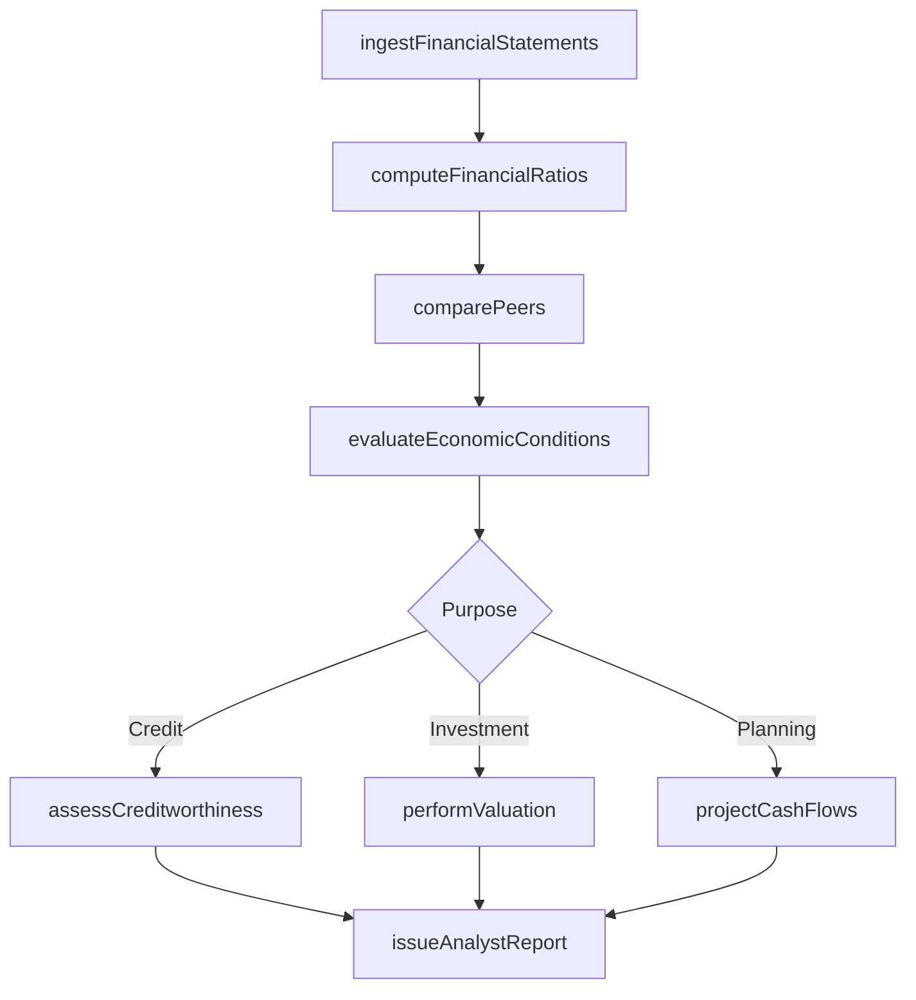
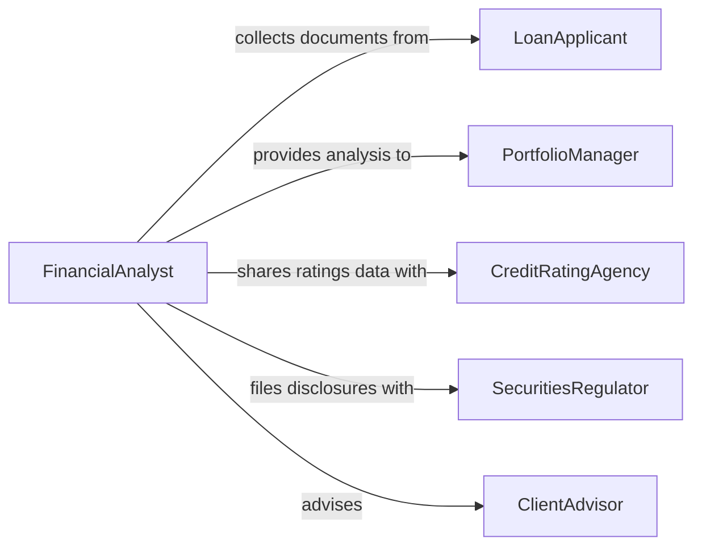

# Analyze Financial Information

> Business-as-Code definition for financial information analysis. Models the workflow of evaluating financial statements, investment data, credit profiles, and economic indicators to support decision-making.

## Overview

Financial information analysis involves examining balance sheets, income statements, cash flow reports, credit data, and economic indicators to assess the financial health of organizations, investments, or individuals. Analysts apply ratio analysis, trend evaluation, and comparative assessment to produce actionable insights for lending decisions, portfolio management, underwriting, and regulatory compliance. This definition supports banking, insurance, investment management, and corporate finance functions.

## Actors

| Actor | Description |
|-------|-------------|
| LoanApplicant | Provides financial documentation for credit evaluation |
| PortfolioManager | Uses financial analysis to make investment allocation decisions |
| CreditRatingAgency | Assigns creditworthiness ratings based on financial analysis |
| SecuritiesRegulator | Requires disclosure analysis and compliance with financial reporting standards |
| ClientAdvisor | Translates financial analysis into recommendations for individual clients |
| CounterpartyOrIssuer | Provides financial disclosures subject to analysis |

## Roles

| Role | Description |
|------|-------------|
| FinancialAnalyst | Performs detailed quantitative analysis of financial data |
| CreditAnalyst | Evaluates borrower creditworthiness and repayment capacity |
| RiskOfficer | Assesses portfolio and counterparty risk using financial metrics |
| ComplianceOfficer | Ensures financial analysis processes meet regulatory requirements |
| InvestmentResearcher | Conducts fundamental analysis on securities and market instruments |

## Entities

| Entity | Description |
|--------|-------------|
| FinancialStatement | A formal record of financial activity such as a balance sheet or income statement |
| RatioAnalysis | A set of calculated ratios measuring liquidity, leverage, profitability, and efficiency |
| CreditProfile | A composite assessment of a borrower's financial capacity and history |
| CashFlowProjection | A forward-looking estimate of cash inflows and outflows |
| InvestmentValuation | An estimate of the intrinsic value of a security or asset |
| EconomicIndicator | A macroeconomic data point such as GDP, inflation, or employment figures |
| PeerComparison | A side-by-side analysis of financial metrics against comparable entities |
| AnalystReport | A written assessment of financial condition with conclusions and recommendations |

## Actions

| Action | Description |
|--------|-------------|
| ingestFinancialStatements | Load balance sheets, income statements, and cash flow reports for analysis |
| computeFinancialRatios | Calculate liquidity, leverage, profitability, and efficiency ratios |
| assessCreditworthiness | Evaluate a borrower's financial capacity and risk profile |
| projectCashFlows | Estimate future cash inflows and outflows based on historical data |
| performValuation | Determine the intrinsic value of a security or business using DCF or comparable methods |
| comparePeers | Benchmark financial metrics against industry peers or comparable entities |
| evaluateEconomicConditions | Incorporate macroeconomic indicators into financial assessments |
| issueAnalystReport | Produce a written assessment with findings, conclusions, and recommendations |

## Events

| Event | Description |
|-------|-------------|
| financialStatementsIngested | Financial documents have been loaded and parsed for analysis |
| ratiosComputed | Financial ratios have been calculated and are ready for interpretation |
| creditworthinessAssessed | A credit evaluation has been completed with a risk rating |
| cashFlowsProjected | Future cash flow estimates have been generated |
| valuationCompleted | An intrinsic value estimate has been determined |
| peersCompared | A comparative analysis against peer entities has been completed |
| economicConditionsEvaluated | Macroeconomic factors have been incorporated into the analysis |
| analystReportIssued | A formal analytical report has been produced and distributed |

## Searches

| Search | Description |
|--------|-------------|
| findFinancialStatements | Locate financial documents by entity, period, or filing type |
| getRatiosByEntity | Retrieve calculated financial ratios for a specific organization |
| getCreditProfiles | Access credit assessments by borrower, rating, or risk level |
| getValuations | Retrieve valuation estimates by security, method, or date |
| findPeerComparisons | Locate comparative analyses by industry, size, or geography |

## Workflow



## Actor Relationships



## Usage

### Calling Actions

```typescript
import { analyzeFinancialInformation } from '@headlessly/analyze-financial-information'

const finance = analyzeFinancialInformation()

// Ingest annual financial statements for a public company
const statements = await finance.ingestFinancialStatements({
  entityId: 'ACME-CORP',
  filingType: '10-K',
  period: 'FY2025'
})

// Compute key financial ratios
const ratios = await finance.computeFinancialRatios({
  entityId: 'ACME-CORP',
  period: 'FY2025',
  ratioSets: ['liquidity', 'leverage', 'profitability', 'efficiency']
})

// Perform DCF valuation
const valuation = await finance.performValuation({
  entityId: 'ACME-CORP',
  method: 'discounted-cash-flow',
  discountRate: 0.10,
  projectionYears: 5
})
```

### Event-Driven Automation

```typescript
// Trigger peer comparison when ratios are computed
finance.ratiosComputed(async ({ entityId, period }) => {
  await finance.comparePeers({
    entityId,
    period,
    peerGroup: 'same-industry-same-size'
  })
})

// Alert risk officer when credit assessment is negative
finance.creditworthinessAssessed(async ({ entityId, rating, riskLevel }) => {
  if (riskLevel === 'high' || riskLevel === 'very-high') {
    await notify({
      to: 'risk-officer',
      message: `Credit assessment for ${entityId}: ${rating} (${riskLevel} risk)`
    })
  }
})
```
