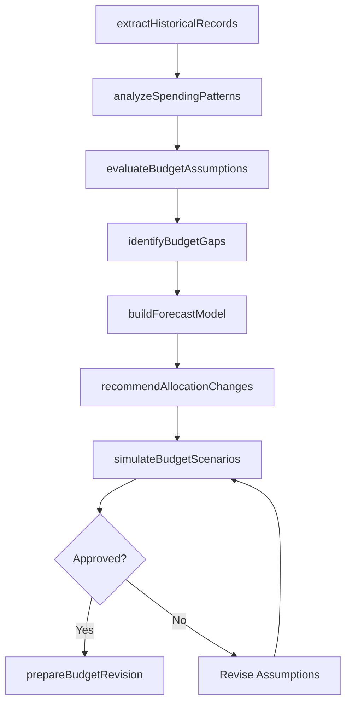
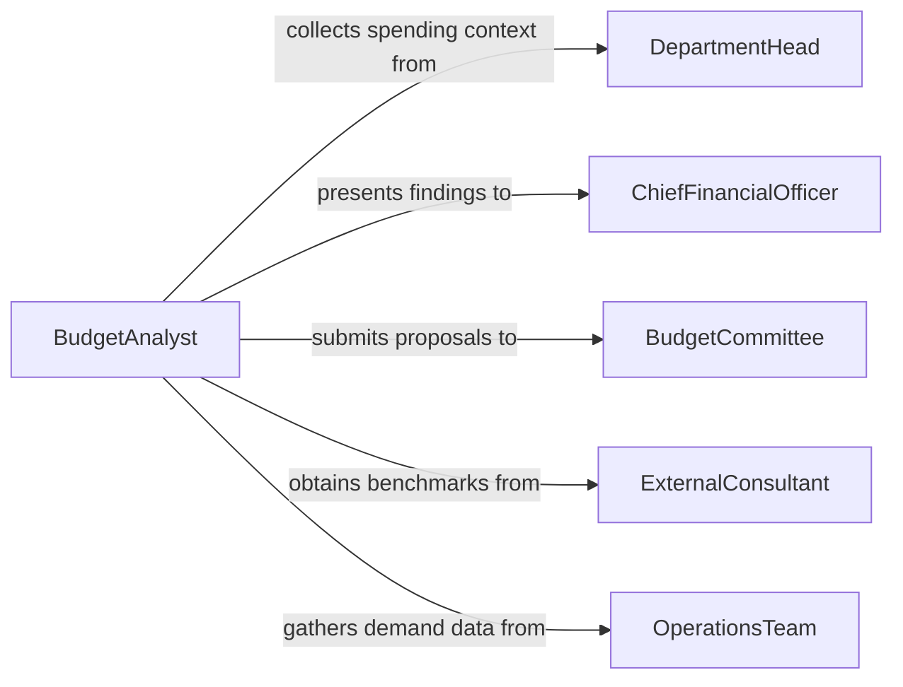

# Analyze Financial Records to Improve Budgeting

> Business-as-Code definition for analyzing financial records to improve budgeting and planning. Models the process of mining historical financial data to refine forecasts, tighten budget accuracy, and enhance strategic resource allocation.

## Overview

Analyzing financial records to improve budgeting involves examining historical spending patterns, revenue trends, and cost behaviors to create more accurate and effective budgets. Analysts identify areas of chronic over- or under-spending, assess the reliability of prior assumptions, and recommend adjustments to budget methodologies. This definition supports zero-based budgeting initiatives, rolling forecast improvements, capital planning optimization, and departmental budget refinement across fiscal cycles.

## Actors

| Actor | Description |
|-------|-------------|
| DepartmentHead | Provides operational context for spending patterns and submits budget proposals |
| ChiefFinancialOfficer | Sets budget policy and approves refined budget methodologies |
| BudgetCommittee | Reviews consolidated budget proposals and allocates organizational resources |
| ExternalConsultant | Provides benchmarking data and budgeting methodology expertise |
| OperationsTeam | Supplies demand forecasts and resource utilization data |
| BoardFinanceCommittee | Approves final capital and operating budgets |

## Roles

| Role | Description |
|------|-------------|
| BudgetAnalyst | Reviews historical records and proposes budget improvements |
| ForecastingSpecialist | Develops predictive models based on financial trend data |
| CostAccountant | Analyzes cost behaviors and allocation methodologies |
| FinancialPlanningManager | Coordinates the budget refinement process across departments |
| StrategicPlanner | Aligns budget recommendations with long-term organizational objectives |

## Entities

| Entity | Description |
|--------|-------------|
| HistoricalSpendingRecord | A time-series record of actual expenditures by category and period |
| BudgetAssumption | A documented premise underlying a budget figure |
| SpendingVariance | The difference between budgeted and actual amounts for a line item |
| ForecastModel | A mathematical model projecting future financial performance |
| BudgetTemplate | A standardized framework for departmental budget submissions |
| AllocationFormula | A method for distributing shared costs across organizational units |
| BudgetRevision | A proposed modification to an existing budget based on analysis |
| PlanningScenario | An alternative budget projection based on different assumptions |

## Actions

| Action | Description |
|--------|-------------|
| extractHistoricalRecords | Pull spending and revenue data from prior fiscal periods |
| analyzeSpendingPatterns | Identify recurring trends, seasonal variations, and anomalies in historical data |
| evaluateBudgetAssumptions | Test whether prior budget assumptions held true against actual results |
| buildForecastModel | Create a predictive model calibrated to historical financial patterns |
| identifyBudgetGaps | Locate systematic over- or under-budgeting by category |
| recommendAllocationChanges | Propose revised allocation formulas based on actual cost behaviors |
| simulateBudgetScenarios | Model alternative budget configurations under different assumptions |
| prepareBudgetRevision | Draft a revised budget incorporating analytical findings |

## Events

| Event | Description |
|-------|-------------|
| historicalRecordsExtracted | Prior period financial data has been compiled for analysis |
| spendingPatternsAnalyzed | Trends and anomalies in historical spending have been identified |
| budgetAssumptionsEvaluated | Prior assumptions have been tested against actual performance |
| forecastModelBuilt | A predictive model has been constructed and validated |
| budgetGapsIdentified | Systematic budgeting inaccuracies have been documented |
| allocationChangesRecommended | Revised cost allocation formulas have been proposed |
| budgetScenariosSimulated | Alternative budget configurations have been modeled |
| budgetRevisionPrepared | A revised budget proposal has been drafted for review |

## Searches

| Search | Description |
|--------|-------------|
| findSpendingByCategory | Retrieve historical spending by account, department, or project |
| getVarianceHistory | Access multi-period variance trends for specific budget lines |
| getBudgetAssumptions | Retrieve documented assumptions underlying a specific budget |
| getForecastAccuracy | Compare forecast predictions to actual results over time |
| findBudgetGaps | Locate line items with persistent over- or under-budgeting |

## Workflow



## Actor Relationships



## Usage

### Calling Actions

```typescript
import { analyzeFinancialRecordsImproveBudgeting } from '@headlessly/analyze-financial-records-improve-budgeting'

const budgeting = analyzeFinancialRecordsImproveBudgeting()

// Extract three years of historical spending data
const records = await budgeting.extractHistoricalRecords({
  periods: ['FY2023', 'FY2024', 'FY2025'],
  departments: ['engineering', 'marketing', 'operations'],
  granularity: 'monthly'
})

// Identify systematic budget gaps
const gaps = await budgeting.identifyBudgetGaps({
  datasetId: records.id,
  threshold: 0.10,
  minimumPeriods: 6
})

// Simulate a zero-based budget scenario
const scenario = await budgeting.simulateBudgetScenarios({
  methodology: 'zero-based',
  baselineDatasetId: records.id,
  assumptions: {
    revenueGrowth: 0.08,
    inflationRate: 0.025,
    headcountGrowth: 0.05
  }
})
```

### Event-Driven Automation

```typescript
// Alert finance team when persistent budget gaps are found
budgeting.budgetGapsIdentified(async ({ gaps }) => {
  const chronic = gaps.filter(g => g.consecutivePeriods >= 6)
  if (chronic.length > 0) {
    await notify({
      to: 'financial-planning-manager',
      message: `${chronic.length} budget lines show persistent gaps over 6+ periods`
    })
  }
})

// Auto-trigger forecast model rebuild when new historical data is available
budgeting.historicalRecordsExtracted(async ({ datasetId, latestPeriod }) => {
  await budgeting.buildForecastModel({
    datasetId,
    method: 'time-series-decomposition',
    validationPeriod: latestPeriod
  })
})
```
