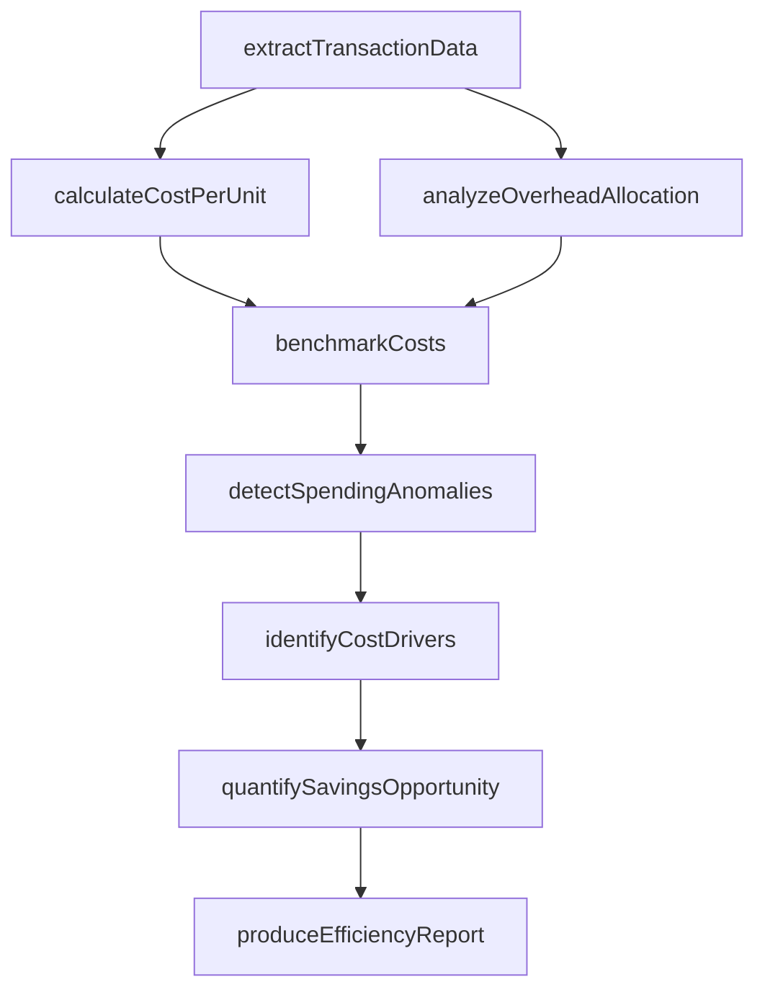
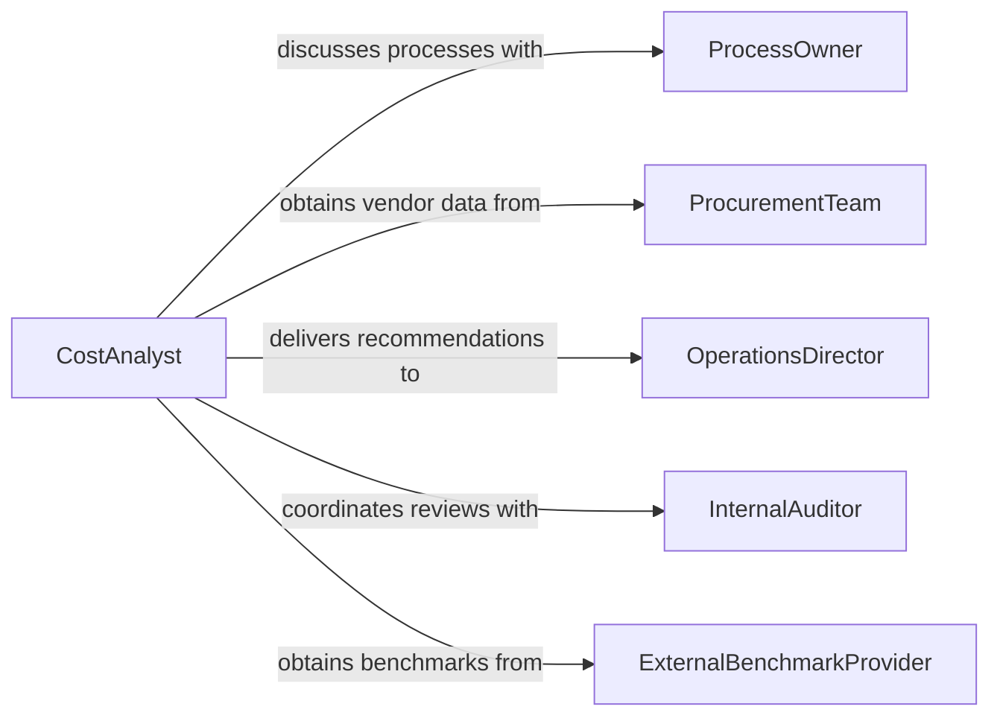

# Analyze Financial Records to Improve Efficiency

> Business-as-Code definition for analyzing financial records to improve operational efficiency. Models the process of identifying cost reduction opportunities, eliminating waste, and optimizing resource utilization through financial data examination.

## Overview

Analyzing financial records to improve efficiency involves examining transaction-level spending data, cost-per-unit metrics, overhead allocations, and process costs to identify opportunities for waste reduction and resource optimization. Analysts compare spending across business units, benchmark against industry standards, and trace cost drivers to their root causes. This definition supports lean finance initiatives, procurement optimization, shared services consolidation, and continuous improvement programs aimed at lowering operational costs while maintaining output quality.

## Actors

| Actor | Description |
|-------|-------------|
| ProcessOwner | Manages the operational activities whose costs are being analyzed |
| ProcurementTeam | Provides vendor pricing, contract terms, and purchasing volume data |
| OperationsDirector | Implements efficiency recommendations and tracks operational savings |
| InternalAuditor | Validates cost allocation accuracy and identifies control weaknesses |
| SharedServicesCenter | Consolidates common functions whose costs span multiple departments |
| ExternalBenchmarkProvider | Supplies industry cost and efficiency benchmarks for comparison |

## Roles

| Role | Description |
|------|-------------|
| CostAnalyst | Examines financial records to identify cost reduction opportunities |
| ProcessImprovementSpecialist | Translates financial findings into operational efficiency recommendations |
| ManagementAccountant | Prepares activity-based cost analyses and overhead allocation studies |
| EfficiencyProgramManager | Coordinates cross-functional efficiency initiatives and tracks savings |
| DataAnalyst | Builds analytical models to surface spending anomalies and patterns |

## Entities

| Entity | Description |
|--------|-------------|
| CostDriver | A factor that causes a change in the cost of an activity |
| CostPerUnit | The calculated expense to produce one unit of output |
| OverheadAllocation | The distribution of indirect costs across products or departments |
| SpendingAnomaly | An unexpected or outlier transaction pattern in financial records |
| EfficiencyMetric | A calculated measure of output relative to input cost |
| SavingsOpportunity | A documented potential for cost reduction with estimated impact |
| ProcessCost | The total cost of performing a specific business process |
| EfficiencyReport | A document summarizing findings and prioritized recommendations |

## Actions

| Action | Description |
|--------|-------------|
| extractTransactionData | Pull detailed spending records at the transaction level |
| calculateCostPerUnit | Compute unit economics for products, services, or processes |
| analyzeOverheadAllocation | Examine how indirect costs are distributed and assess accuracy |
| detectSpendingAnomalies | Identify outlier transactions or unusual spending patterns |
| benchmarkCosts | Compare cost metrics against industry standards or peer organizations |
| identifyCostDrivers | Trace spending to the underlying activities that generate costs |
| quantifySavingsOpportunity | Estimate the financial impact of implementing a specific efficiency improvement |
| produceEfficiencyReport | Generate a prioritized list of recommendations with projected savings |

## Events

| Event | Description |
|-------|-------------|
| transactionDataExtracted | Detailed spending records have been compiled for analysis |
| costPerUnitCalculated | Unit economics have been computed for the target scope |
| overheadAnalyzed | Indirect cost allocation has been reviewed and assessed |
| spendingAnomalyDetected | An unusual spending pattern has been identified |
| costsBenchmarked | Organizational costs have been compared against external standards |
| costDriversIdentified | Root causes of spending have been traced and documented |
| savingsOpportunityQuantified | A potential cost reduction has been estimated and documented |
| efficiencyReportProduced | A comprehensive efficiency analysis has been finalized |

## Searches

| Search | Description |
|--------|-------------|
| findTransactionsByVendor | Retrieve spending records by vendor, contract, or payment terms |
| getCostPerUnitTrends | Access unit cost data over time for a product or process |
| getOverheadRatios | Retrieve indirect cost percentages by department or product line |
| findSpendingAnomalies | Locate outlier transactions by amount, frequency, or category |
| getSavingsOpportunities | List documented cost reduction opportunities by impact and difficulty |
| getBenchmarkResults | Access cost comparisons against industry or peer data |

## Workflow



## Actor Relationships



## Usage

### Calling Actions

```typescript
import { analyzeFinancialRecordsImproveEfficiency } from '@headlessly/analyze-financial-records-improve-efficiency'

const efficiency = analyzeFinancialRecordsImproveEfficiency()

// Extract transaction-level spending for the fulfillment center
const transactions = await efficiency.extractTransactionData({
  department: 'fulfillment',
  period: { start: '2025-01-01', end: '2025-12-31' },
  minimumAmount: 100
})

// Calculate cost per order fulfilled
const unitCost = await efficiency.calculateCostPerUnit({
  datasetId: transactions.id,
  outputMetric: 'orders-fulfilled',
  includedCostCategories: ['labor', 'materials', 'shipping', 'overhead']
})

// Quantify a specific savings opportunity
await efficiency.quantifySavingsOpportunity({
  description: 'Consolidate shipping carriers from 5 to 2',
  currentCost: unitCost.shippingCostPerUnit,
  projectedCost: unitCost.shippingCostPerUnit * 0.82,
  annualVolume: 450000,
  implementationCost: 35000
})
```

### Event-Driven Automation

```typescript
// Alert operations when a spending anomaly is detected
efficiency.spendingAnomalyDetected(async ({ department, vendor, amount, expectedRange }) => {
  await notify({
    to: `${department}-manager`,
    message: `Spending anomaly: ${vendor} charge of $${amount} outside expected range $${expectedRange.min}-$${expectedRange.max}`
  })
})

// Auto-schedule quarterly efficiency review when cost data is refreshed
efficiency.transactionDataExtracted(async ({ department, period }) => {
  if (isQuarterEnd(period.end)) {
    await scheduleTask({
      type: 'efficiency-review',
      department,
      dueDate: addDays(period.end, 15),
      assignTo: 'cost-analyst'
    })
  }
})
```
