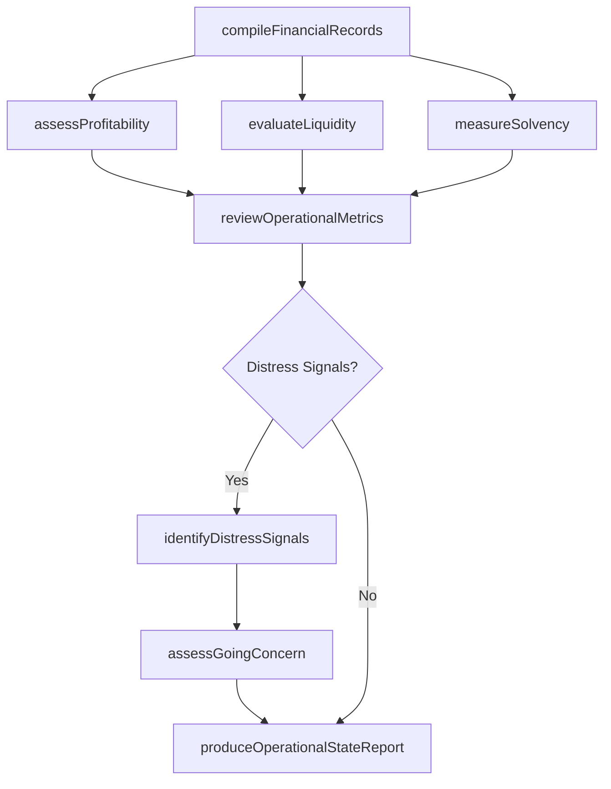
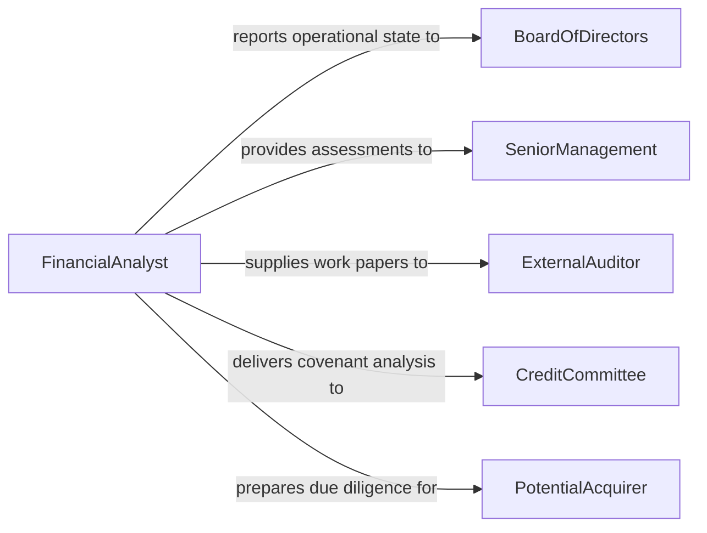

# Analyze Financial Records or Reports to Determine State of Operations

> Business-as-Code definition for analyzing financial records and reports to assess operational health. Models the process of evaluating financial performance indicators, solvency measures, and operational metrics to determine current business standing.

## Overview

Analyzing financial records and reports to determine the state of operations involves reviewing income statements, balance sheets, cash flow statements, and management reports to assess whether an organization is operating efficiently, meeting its financial targets, and maintaining adequate liquidity. This analysis identifies operational strengths and weaknesses, flags financial distress signals, and provides the factual foundation for corrective action. It supports board-level governance, operational turnaround planning, merger due diligence, and ongoing performance management.

## Actors

| Actor | Description |
|-------|-------------|
| BoardOfDirectors | Relies on operational state assessments for governance and fiduciary oversight |
| SeniorManagement | Receives operational health reports and directs corrective actions |
| ExternalAuditor | Reviews financial records for accuracy and going-concern determination |
| CreditCommittee | Evaluates operational state for lending and covenant compliance decisions |
| RegulatoryExaminer | Assesses operational health for industry-specific compliance requirements |
| PotentialAcquirer | Analyzes operational state as part of merger or acquisition due diligence |

## Roles

| Role | Description |
|------|-------------|
| FinancialAnalyst | Performs quantitative analysis of records to assess operational condition |
| Controller | Ensures accuracy of financial records underlying the analysis |
| OperationalAuditor | Evaluates whether financial records reflect true operational performance |
| TreasuryAnalyst | Assesses liquidity and cash position as indicators of operational health |
| ChiefOperatingOfficer | Acts on operational state findings to improve business performance |

## Entities

| Entity | Description |
|--------|-------------|
| IncomeStatement | A report of revenue, expenses, and net income for a period |
| BalanceSheet | A snapshot of assets, liabilities, and equity at a point in time |
| CashFlowStatement | A report of cash inflows and outflows from operating, investing, and financing activities |
| OperationalScorecard | A dashboard of key financial and operational performance indicators |
| SolvencyAssessment | An evaluation of an organization's ability to meet long-term obligations |
| LiquidityAnalysis | An assessment of short-term ability to cover current liabilities |
| GoingConcernEvaluation | A determination of whether the organization can continue operating |
| OperationalStateReport | A comprehensive document summarizing overall operational health |

## Actions

| Action | Description |
|--------|-------------|
| compileFinancialRecords | Gather income statements, balance sheets, and cash flow statements for analysis |
| assessProfitability | Evaluate revenue, costs, and margins to determine earning capacity |
| evaluateLiquidity | Analyze current ratio, quick ratio, and cash reserves to assess short-term health |
| measureSolvency | Compute debt-to-equity, interest coverage, and other long-term stability metrics |
| reviewOperationalMetrics | Examine non-financial KPIs that correlate with financial performance |
| identifyDistressSignals | Detect patterns indicating potential financial or operational failure |
| assessGoingConcern | Determine whether the organization has the resources to continue operating |
| produceOperationalStateReport | Generate a comprehensive report on the current state of operations |

## Events

| Event | Description |
|-------|-------------|
| financialRecordsCompiled | Financial statements have been gathered and standardized for analysis |
| profitabilityAssessed | Earning capacity analysis has been completed |
| liquidityEvaluated | Short-term financial health metrics have been calculated |
| solvencyMeasured | Long-term stability metrics have been computed |
| operationalMetricsReviewed | Non-financial performance indicators have been examined |
| distressSignalDetected | A pattern suggesting potential financial or operational failure has been found |
| goingConcernAssessed | A determination of operational continuity has been made |
| operationalStateReportProduced | A comprehensive health assessment has been finalized and distributed |

## Searches

| Search | Description |
|--------|-------------|
| getFinancialStatements | Retrieve financial statements by entity, period, or filing type |
| getProfitabilityMetrics | Access margin and earnings data by business unit or period |
| getLiquidityRatios | Retrieve current ratio, quick ratio, and cash position data |
| getSolvencyIndicators | Access debt-to-equity, interest coverage, and related metrics |
| findDistressSignals | Locate entities or periods where distress indicators have been flagged |
| getOperationalScorecards | Retrieve composite performance dashboards by entity or period |

## Workflow



## Actor Relationships



## Usage

### Calling Actions

```typescript
import { analyzeFinancialRecordsReportsDetermine } from '@headlessly/analyze-financial-records-reports-determine'

const ops = analyzeFinancialRecordsReportsDetermine()

// Compile all financial records for the subsidiary
const records = await ops.compileFinancialRecords({
  entityId: 'subsidiary-west',
  periods: ['Q1-2026', 'Q2-2026', 'Q3-2026'],
  includeIntercompany: true
})

// Evaluate liquidity position
const liquidity = await ops.evaluateLiquidity({
  entityId: 'subsidiary-west',
  period: 'Q3-2026',
  metrics: ['current-ratio', 'quick-ratio', 'cash-burn-rate']
})

// Produce the operational state report
await ops.produceOperationalStateReport({
  entityId: 'subsidiary-west',
  period: 'Q3-2026',
  sections: ['profitability', 'liquidity', 'solvency', 'going-concern'],
  distributeTo: ['board-of-directors', 'cfo', 'external-auditor']
})
```

### Event-Driven Automation

```typescript
// Escalate immediately when distress signals are detected
ops.distressSignalDetected(async ({ entityId, signalType, severity }) => {
  await notify({
    to: 'cfo',
    priority: 'urgent',
    message: `Distress signal for ${entityId}: ${signalType} (severity: ${severity})`
  })
  if (severity === 'critical') {
    await ops.assessGoingConcern({ entityId })
  }
})

// Auto-generate quarterly operational state report
ops.financialRecordsCompiled(async ({ entityId, period }) => {
  if (isQuarterEnd(period)) {
    await ops.produceOperationalStateReport({
      entityId,
      period,
      sections: ['profitability', 'liquidity', 'solvency']
    })
  }
})
```
