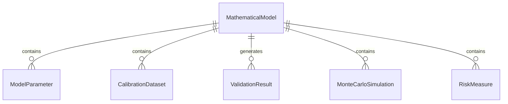
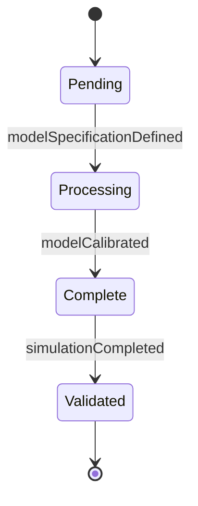
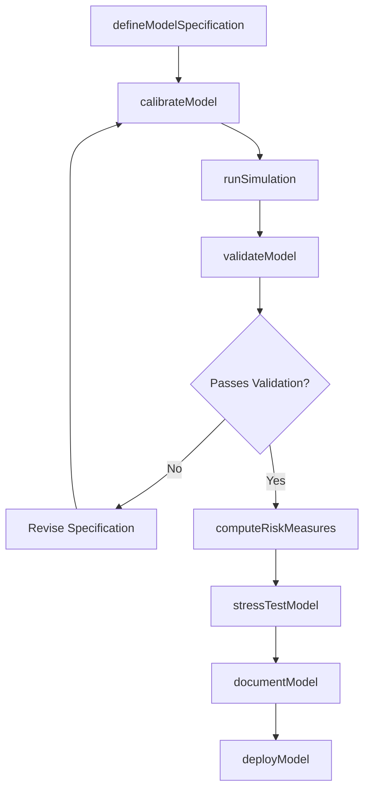
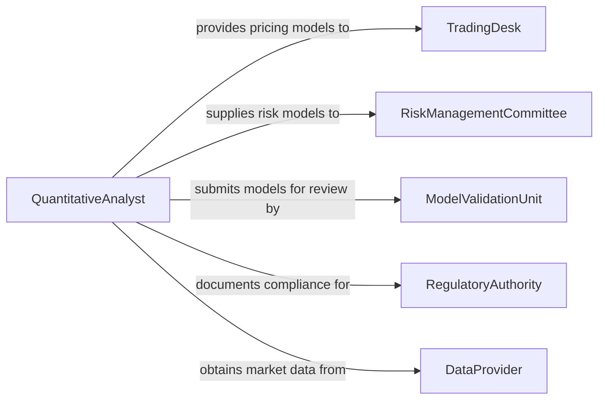

# Apply Mathematical Models of Financial or Business Conditions

> Business-as-Code definition for applying mathematical models to financial and business conditions. Models the workflow of constructing, calibrating, validating, and deploying quantitative models for pricing, risk management, forecasting, and strategic planning.

## Overview

Applying mathematical models of financial or business conditions involves using statistical, econometric, stochastic, and optimization techniques to simulate market behavior, forecast business outcomes, price financial instruments, and quantify risk. Practitioners construct models from historical data, calibrate parameters to observed conditions, validate predictions against actual outcomes, and deploy models into decision-making workflows. This definition supports derivatives pricing, credit risk modeling, supply chain optimization, demand forecasting, and portfolio construction.

## Actors

| Actor | Description |
|-------|-------------|
| TradingDesk | Uses model outputs for pricing, hedging, and execution decisions |
| RiskManagementCommittee | Relies on model outputs for risk limits and capital allocation |
| ModelValidationUnit | Independently reviews models for accuracy and regulatory compliance |
| RegulatoryAuthority | Sets standards for model governance, documentation, and capital requirements |
| DataProvider | Supplies market data, economic indicators, and reference data for model calibration |
| BusinessUnitLeader | Consumes model outputs for strategic planning and resource allocation |

## Roles

| Role | Description |
|------|-------------|
| QuantitativeAnalyst | Designs, builds, and calibrates mathematical models |
| ModelRiskManager | Oversees model governance, validation, and lifecycle management |
| DataScientist | Prepares datasets, engineers features, and evaluates model performance |
| RiskAnalyst | Applies model outputs to compute risk measures and stress scenarios |
| ActuarialAnalyst | Applies probabilistic models to insurance, pension, and liability valuation |

## Entities

| Entity | Description |
|--------|-------------|
| MathematicalModel | A formal representation of financial or business relationships using equations |
| ModelParameter | A variable within a model that is estimated or calibrated from data |
| CalibrationDataset | A set of historical observations used to fit model parameters |
| ValidationResult | A measurement of model accuracy against out-of-sample data |
| MonteCarloSimulation | A computational technique using random sampling to estimate outcome distributions |
| RiskMeasure | A quantified metric such as VaR, CVaR, or expected shortfall |
| Scenario | A defined set of conditions used to stress-test model behavior |
| ModelDocumentation | A formal record of model methodology, assumptions, and limitations |

## Actions

| Action | Description |
|--------|-------------|
| defineModelSpecification | Establish the mathematical framework, variables, and assumptions for a model |
| calibrateModel | Fit model parameters to observed data using optimization or estimation techniques |
| runSimulation | Execute Monte Carlo or other simulation methods to generate outcome distributions |
| validateModel | Test model predictions against holdout data and assess accuracy metrics |
| computeRiskMeasures | Calculate VaR, CVaR, expected shortfall, and other risk quantifications |
| stressTestModel | Apply extreme scenarios to evaluate model behavior under adverse conditions |
| deployModel | Integrate a validated model into production decision-making systems |
| documentModel | Produce formal documentation of methodology, assumptions, limitations, and validation results |

## Events

| Event | Description |
|-------|-------------|
| modelSpecificationDefined | The mathematical framework for a model has been established |
| modelCalibrated | Model parameters have been fitted to observed data |
| simulationCompleted | A simulation run has finished and output distributions are available |
| modelValidated | Model accuracy has been assessed against out-of-sample data |
| riskMeasuresComputed | Quantitative risk metrics have been calculated |
| stressTestCompleted | Model behavior under extreme scenarios has been evaluated |
| modelDeployed | A validated model has been integrated into production systems |
| modelDocumented | Formal documentation of the model has been completed |
| modelBreachDetected | Model performance has fallen outside acceptable tolerance bands |

## Searches

| Search | Description |
|--------|-------------|
| findModels | Locate models by type, business domain, or deployment status |
| getCalibrationHistory | Retrieve parameter calibration records over time for a model |
| getValidationResults | Access accuracy metrics and test outcomes for a model version |
| getSimulationOutputs | Retrieve distribution data and summary statistics from simulation runs |
| getRiskMeasures | Access computed risk metrics by model, portfolio, or scenario |
| findModelBreaches | Locate instances where model performance exceeded tolerance thresholds |


## Entity Relationships



## State Diagram


## Workflow



## Actor Relationships



## Usage

### Calling Actions

```typescript
import { applyMathematicalModelsFinancialBusiness } from '@headlessly/apply-mathematical-models-financial-business'

const modeling = applyMathematicalModelsFinancialBusiness()

// Define a credit risk model specification
const model = await modeling.defineModelSpecification({
  name: 'PD-LGD Credit Model v3',
  type: 'logistic-regression',
  targetVariable: 'probability-of-default',
  features: ['debt-to-income', 'credit-utilization', 'payment-history', 'years-in-business'],
  assumptions: ['independent-defaults', 'stable-economic-conditions']
})

// Calibrate the model on historical loan data
await modeling.calibrateModel({
  modelId: model.id,
  calibrationDataset: 'loan-performance-2020-2025',
  method: 'maximum-likelihood',
  holdoutRatio: 0.20
})

// Run Monte Carlo simulation for portfolio loss distribution
const simulation = await modeling.runSimulation({
  modelId: model.id,
  method: 'monte-carlo',
  iterations: 100000,
  portfolioId: 'commercial-lending-book'
})
```

### Event-Driven Automation

```typescript
// Alert risk management when model breach is detected
modeling.modelBreachDetected(async ({ modelId, metric, observed, threshold }) => {
  await notify({
    to: 'model-risk-manager',
    priority: 'high',
    message: `Model ${modelId} breach: ${metric} = ${observed} (threshold: ${threshold})`
  })
})

// Auto-trigger recalibration when new data is available
modeling.modelCalibrated(async ({ modelId, calibrationDate }) => {
  const nextCalibration = addMonths(calibrationDate, 3)
  await scheduleTask({
    type: 'model-recalibration',
    modelId,
    dueDate: nextCalibration,
    assignTo: 'quantitative-analyst'
  })
})
```
