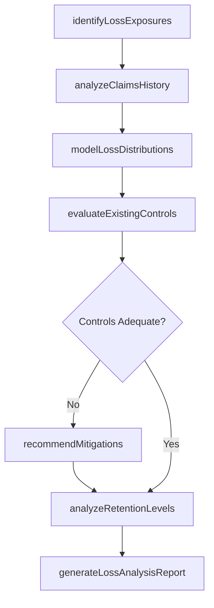
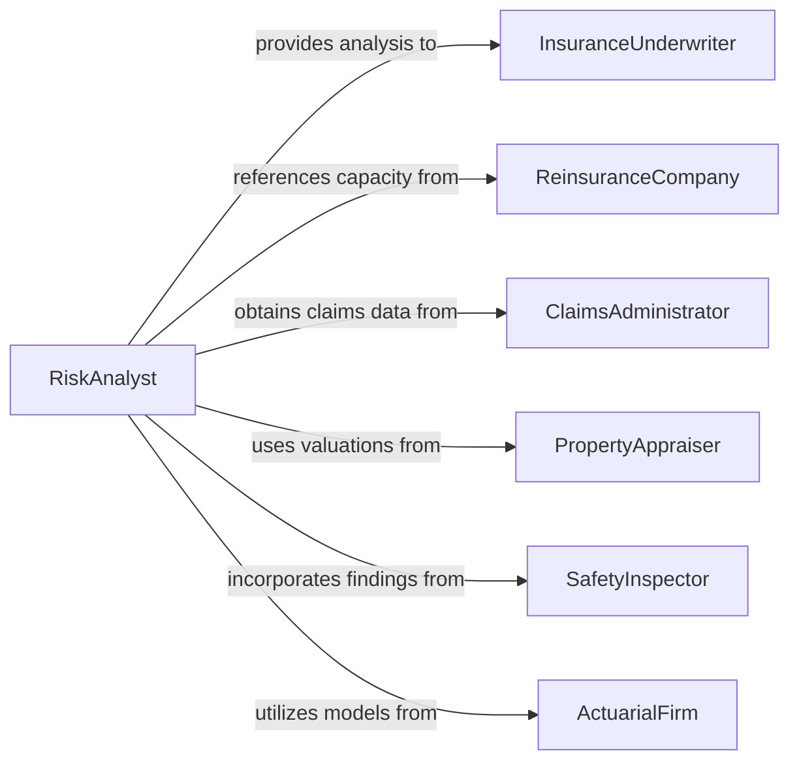

# Analyze Risks to Minimize Losses or Damages

> Business-as-Code definition for analyzing risks to minimize losses or damages. Models the quantitative and qualitative assessment of loss exposures across property, liability, operational, and financial domains to develop risk mitigation strategies that reduce the frequency and severity of adverse events.

## Overview

Analyzing risks to minimize losses or damages involves identifying loss exposures, quantifying potential financial impact through actuarial and statistical methods, evaluating existing controls, and recommending risk treatment strategies including avoidance, reduction, transfer, and retention. This definition provides actions for exposure identification, loss modeling, control assessment, and mitigation planning. It supports insurance underwriters, loss control specialists, claims analysts, and enterprise risk managers.

## Actors

| Actor | Description |
|-------|-------------|
| InsuranceUnderwriter | Evaluates risk exposures to determine coverage terms and pricing |
| ReinsuranceCompany | Provides catastrophic loss coverage and aggregate risk analysis |
| ClaimsAdministrator | Processes loss events and provides historical claims data |
| PropertyAppraiser | Assesses the replacement value of physical assets exposed to loss |
| SafetyInspector | Evaluates physical conditions and compliance with loss prevention standards |
| ActuarialFirm | Provides statistical modeling of loss frequency and severity distributions |

## Roles

| Role | Description |
|------|-------------|
| LossControlSpecialist | Identifies hazards and recommends measures to reduce loss frequency |
| RiskAnalyst | Quantifies loss exposures and models potential financial impact |
| UnderwritingAnalyst | Evaluates risk characteristics to determine insurability and pricing |
| ClaimsAnalyst | Analyzes historical loss data to identify patterns and trends |
| LossPreventionEngineer | Designs physical and procedural safeguards to minimize damage |

## Entities

| Entity | Description |
|--------|-------------|
| LossExposure | A quantified vulnerability to financial loss from a specific peril or hazard |
| LossDistributionModel | A statistical representation of expected loss frequency and severity |
| ClaimsHistory | A record of past loss events used to project future losses |
| ControlRecommendation | A suggested measure for reducing loss frequency or severity |
| RetentionAnalysis | A study of the optimal amount of risk to self-insure versus transfer |
| LossMitigationPlan | A documented strategy for reducing exposure to specific perils |
| RiskTransferStructure | An insurance or hedging arrangement for shifting risk to third parties |

## Actions

| Action | Description |
|--------|-------------|
| identifyLossExposures | Catalog all sources of potential financial loss across domains |
| modelLossDistributions | Apply actuarial methods to project loss frequency and severity |
| analyzeClaimsHistory | Examine past loss events to identify patterns and root causes |
| evaluateExistingControls | Assess the effectiveness of current loss prevention measures |
| recommendMitigations | Propose measures to reduce loss frequency, severity, or both |
| analyzeRetentionLevels | Determine optimal self-insurance versus risk transfer thresholds |
| generateLossAnalysisReport | Produce a comprehensive loss exposure and mitigation summary |

## Events

| Event | Description |
|-------|-------------|
| lossExposuresIdentified | Potential sources of financial loss have been cataloged |
| lossDistributionsModeled | Loss frequency and severity projections have been calculated |
| claimsHistoryAnalyzed | Past loss patterns and root causes have been identified |
| existingControlsEvaluated | Current loss prevention measures have been assessed |
| mitigationsRecommended | Loss reduction measures have been proposed |
| retentionLevelsAnalyzed | Self-insurance thresholds have been determined |
| lossAnalysisReportGenerated | A comprehensive loss exposure summary has been produced |

## Searches

| Search | Description |
|--------|-------------|
| findLossExposures | List loss exposures by domain, peril type, or severity |
| getClaimsData | Retrieve historical claims by type, date, or amount |
| getLossProjections | Access modeled loss frequency and severity projections |
| getControlRecommendations | View mitigation recommendations by exposure or priority |
| getRetentionAnalyses | Retrieve self-insurance threshold analyses by coverage line |

## Workflow



## Actor Relationships



## Usage

### Calling Actions

```typescript
import { analyzeRisksMinimizeLossesDamages } from '@headlessly/analyze-risks-minimize-losses-damages'

const analyst = analyzeRisksMinimizeLossesDamages()

// Identify and model exposures
const analysis = await analyst.identifyLossExposures({
  domains: ['property', 'general-liability', 'workers-compensation', 'cyber'],
  locations: ['headquarters', 'manufacturing-plant-1', 'distribution-center-east']
})

await analyst.analyzeClaimsHistory({
  analysisId: analysis.id,
  period: { start: '2020-01-01', end: '2025-12-31' }
})
await analyst.modelLossDistributions({ analysisId: analysis.id })

// Evaluate and recommend
await analyst.evaluateExistingControls({ analysisId: analysis.id })
await analyst.recommendMitigations({ analysisId: analysis.id })
await analyst.analyzeRetentionLevels({ analysisId: analysis.id })

// Report
await analyst.generateLossAnalysisReport({ analysisId: analysis.id })
```

### Event-Driven Automation

```typescript
// Alert on high-severity exposures
analyst.lossExposuresIdentified(async ({ analysisId, exposures }) => {
  const severe = exposures.filter(e => e.maxProbableLoss > 5000000)
  if (severe.length > 0) {
    await notify({
      to: 'risk-management-leadership',
      message: `${severe.length} exposures exceed $5M maximum probable loss threshold`
    })
  }
})

// Distribute loss analysis reports
analyst.lossAnalysisReportGenerated(async ({ analysisId, reportId }) => {
  await distribute({ reportId, recipients: ['CFO', 'insurance-broker', 'risk-committee'] })
})
```
