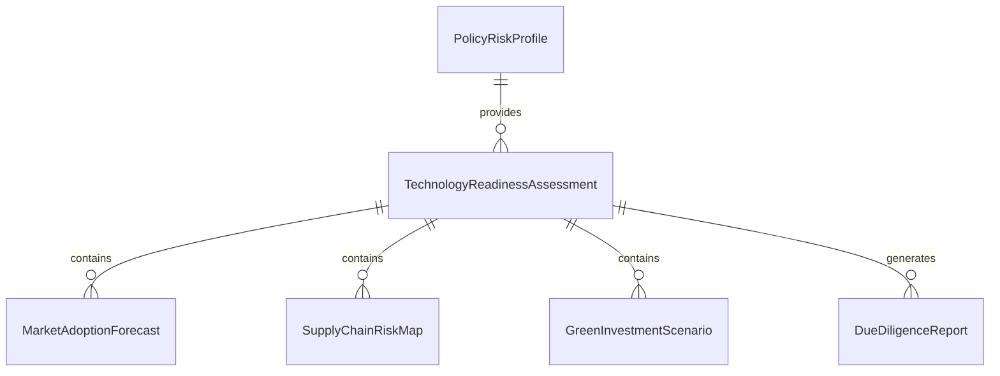
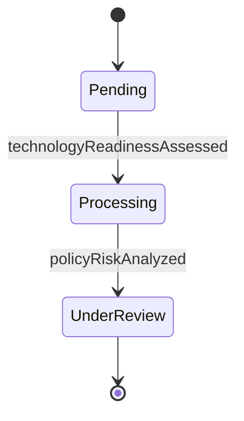
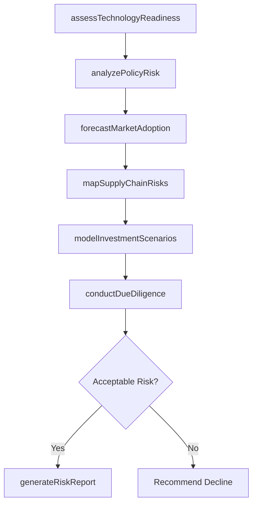
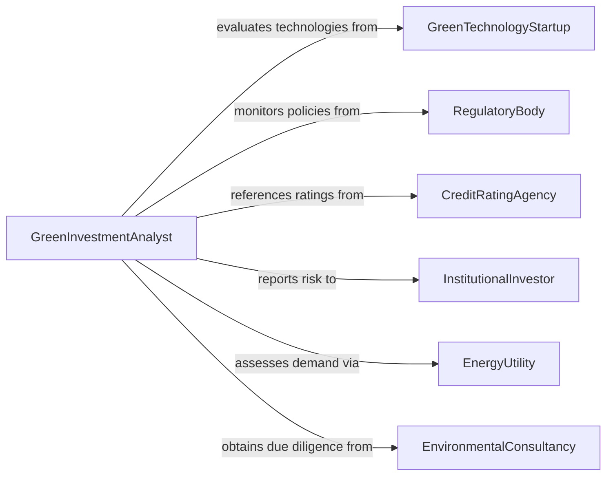

# Analyze Risks Related to Investments in Green Technology

> Business-as-Code definition for analyzing risks related to investments in green technology. Models the assessment of technology maturity, regulatory uncertainty, market adoption, supply chain dependencies, and financial return risks specific to renewable energy, clean transportation, carbon capture, and other sustainability-focused investments.

## Overview

Analyzing risks related to investments in green technology involves evaluating technology readiness levels, policy and subsidy volatility, market adoption uncertainty, supply chain concentration risks, and financial performance projections for investments in renewable energy, energy storage, electric vehicles, carbon markets, and sustainable materials. This definition provides actions for risk categorization, scenario modeling, due diligence assessment, and investment risk reporting. It supports ESG investment analysts, cleantech venture capitalists, corporate sustainability officers, and green bond underwriters.

## Actors

| Actor | Description |
|-------|-------------|
| GreenTechnologyStartup | Develops emerging clean technologies seeking investment capital |
| RegulatoryBody | Establishes subsidies, tax credits, and emissions standards that affect green investment returns |
| CreditRatingAgency | Rates green bonds and sustainability-linked financial instruments |
| InstitutionalInvestor | Allocates capital to green technology portfolios requiring risk assessment |
| EnergyUtility | Adopts green technologies and influences market demand signals |
| EnvironmentalConsultancy | Provides technical due diligence on green technology viability |

## Roles

| Role | Description |
|------|-------------|
| GreenInvestmentAnalyst | Evaluates financial and technical risks of clean technology investments |
| ESGRiskManager | Assesses environmental, social, and governance risk factors in portfolios |
| TechnologyDueDiligenceSpecialist | Reviews technology readiness and commercialization risks |
| PortfolioRiskOfficer | Manages aggregate green investment risk exposure across portfolios |

## Entities

| Entity | Description |
|--------|-------------|
| TechnologyReadinessAssessment | An evaluation of a green technology's maturity and commercialization stage |
| PolicyRiskProfile | An assessment of regulatory and subsidy-related risks for a green investment |
| MarketAdoptionForecast | A projection of customer uptake rates for a green technology |
| SupplyChainRiskMap | A visualization of critical material and component dependencies |
| GreenInvestmentScenario | An alternative return projection based on different policy and market assumptions |
| DueDiligenceReport | A comprehensive assessment of technical, financial, and regulatory risks |
| GreenBondRiskRating | A credit assessment specific to green-labeled financial instruments |

## Actions

| Action | Description |
|--------|-------------|
| assessTechnologyReadiness | Evaluate the maturity and commercialization potential of a green technology |
| analyzePolicyRisk | Assess the impact of regulatory changes, subsidy expiration, and carbon pricing on returns |
| forecastMarketAdoption | Project customer and industry adoption rates for the green technology |
| mapSupplyChainRisks | Identify critical material dependencies and supplier concentration risks |
| modelInvestmentScenarios | Generate return projections under different policy and market conditions |
| conductDueDiligence | Perform comprehensive technical and financial risk assessment |
| generateRiskReport | Produce a green investment risk analysis for stakeholders |

## Events

| Event | Description |
|-------|-------------|
| technologyReadinessAssessed | The maturity of the green technology has been evaluated |
| policyRiskAnalyzed | Regulatory and subsidy risks have been assessed |
| marketAdoptionForecasted | Customer adoption projections have been generated |
| supplyChainRisksMapped | Critical material and component dependencies have been identified |
| investmentScenariosModeled | Return projections under multiple assumptions have been created |
| dueDiligenceConducted | Comprehensive risk assessment has been completed |
| riskReportGenerated | A green investment risk analysis has been produced |

## Searches

| Search | Description |
|--------|-------------|
| findGreenInvestments | List green technology investments by sector, stage, or risk rating |
| getPolicyRisks | Retrieve regulatory risk assessments by jurisdiction or technology type |
| getAdoptionForecasts | Access market adoption projections by technology or geography |
| getSupplyChainRisks | View supply chain dependency maps by material or component |
| getDueDiligenceReports | Locate due diligence assessments by investment or date |


## Entity Relationships



## State Diagram


## Workflow



## Actor Relationships



## Usage

### Calling Actions

```typescript
import { analyzeRisksRelatedInvestmentsGreen } from '@headlessly/analyze-risks-related-investments-green'

const analyst = analyzeRisksRelatedInvestmentsGreen()

// Assess technology and policy risks
const assessment = await analyst.assessTechnologyReadiness({
  technology: 'solid-state-battery-storage',
  company: 'greenpower-innovations',
  trlTarget: 7
})

await analyst.analyzePolicyRisk({
  assessmentId: assessment.id,
  jurisdictions: ['US-federal', 'EU', 'california'],
  policies: ['IRA-tax-credits', 'EU-green-deal', 'carbon-border-adjustment']
})

await analyst.forecastMarketAdoption({ assessmentId: assessment.id })
await analyst.mapSupplyChainRisks({ assessmentId: assessment.id })

// Model scenarios and conduct due diligence
await analyst.modelInvestmentScenarios({
  assessmentId: assessment.id,
  scenarios: ['base-case', 'subsidy-expiration', 'accelerated-adoption']
})
await analyst.conductDueDiligence({ assessmentId: assessment.id })
await analyst.generateRiskReport({ assessmentId: assessment.id })
```

### Event-Driven Automation

```typescript
// Alert on policy risk changes
analyst.policyRiskAnalyzed(async ({ assessmentId, jurisdiction, riskLevel, previousLevel }) => {
  if (riskLevel > previousLevel) {
    await notify({
      to: 'investment-committee',
      message: `Policy risk increased in ${jurisdiction}: ${previousLevel} to ${riskLevel}`
    })
  }
})

// Distribute due diligence reports
analyst.dueDiligenceConducted(async ({ assessmentId, reportId, technology }) => {
  await distribute({ reportId, recipients: ['portfolio-management', 'risk-committee', 'ESG-team'] })
})
```
