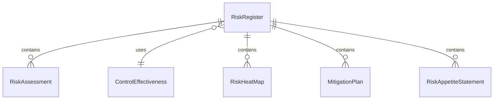
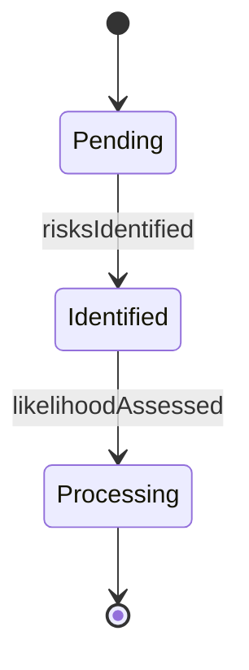
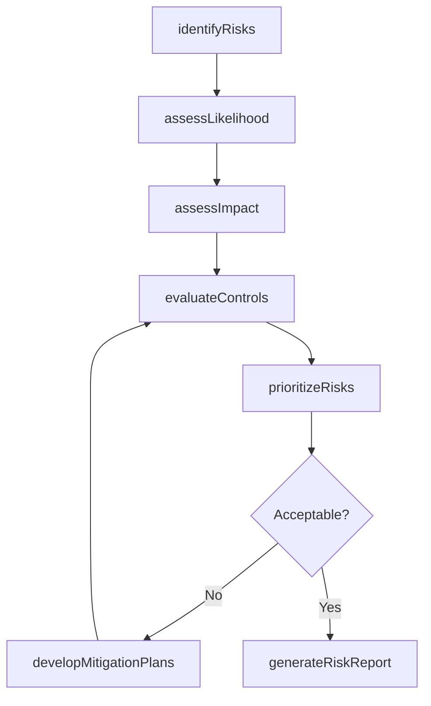
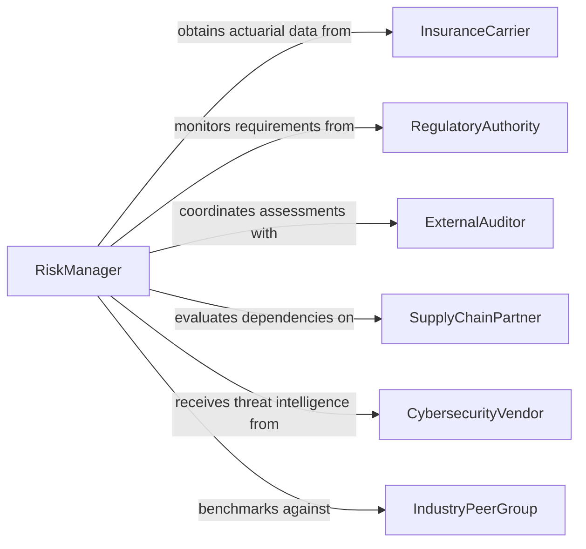

# Assess Risks to Business Operations

> Business-as-Code definition for assessing risks to business operations. Models the identification, evaluation, and prioritization of operational, strategic, financial, and compliance risks that could disrupt business continuity, reduce profitability, or damage organizational reputation.

## Overview

Assessing risks to business operations involves identifying potential threats across operational, strategic, financial, compliance, and reputational domains, then evaluating their likelihood and potential impact to prioritize risk mitigation efforts. This definition provides actions for risk identification, impact assessment, control evaluation, and risk reporting. It supports risk managers, internal auditors, compliance officers, and executive leadership teams.

## Actors

| Actor | Description |
|-------|-------------|
| InsuranceCarrier | Provides risk transfer products and actuarial risk assessments |
| RegulatoryAuthority | Establishes compliance requirements that create regulatory risk exposure |
| ExternalAuditor | Conducts independent assessments of organizational risk controls |
| SupplyChainPartner | Represents upstream and downstream dependencies that introduce operational risk |
| CybersecurityVendor | Provides threat intelligence and security risk assessments |
| IndustryPeerGroup | Serves as a benchmark for risk exposure and mitigation practices |

## Roles

| Role | Description |
|------|-------------|
| RiskManager | Oversees the enterprise risk identification and assessment process |
| InternalAuditor | Evaluates the effectiveness of risk controls and mitigation measures |
| ComplianceOfficer | Assesses regulatory and legal risk exposure |
| BusinessContinuityPlanner | Evaluates operational disruption risks and recovery capabilities |
| ChiefRiskOfficer | Synthesizes risk assessments into enterprise-level risk strategy |

## Entities

| Entity | Description |
|--------|-------------|
| RiskRegister | A comprehensive inventory of identified risks with severity ratings |
| RiskAssessment | An evaluation of a specific risk's likelihood and potential impact |
| ControlEffectiveness | A measure of how well existing controls mitigate a given risk |
| RiskHeatMap | A visual representation of risks plotted by likelihood and impact |
| MitigationPlan | A documented strategy for reducing a risk to acceptable levels |
| RiskAppetiteStatement | An organizational declaration of acceptable risk exposure levels |
| RiskReport | A periodic summary of risk posture, changes, and recommended actions |

## Actions

| Action | Description |
|--------|-------------|
| identifyRisks | Catalog potential threats across all operational domains |
| assessLikelihood | Evaluate the probability of each identified risk materializing |
| assessImpact | Estimate the financial, operational, and reputational consequences of each risk |
| evaluateControls | Review the effectiveness of existing risk mitigation measures |
| prioritizeRisks | Rank risks by combined likelihood and impact scores |
| developMitigationPlans | Create strategies to reduce priority risks to acceptable levels |
| generateRiskReport | Produce a comprehensive risk posture summary for stakeholders |

## Events

| Event | Description |
|-------|-------------|
| risksIdentified | Potential threats have been cataloged across operational domains |
| likelihoodAssessed | Risk probability scores have been assigned |
| impactAssessed | Consequence estimates have been calculated for identified risks |
| controlsEvaluated | Existing mitigation measures have been reviewed for effectiveness |
| risksPrioritized | Risks have been ranked by combined likelihood and impact |
| mitigationPlansDeveloped | Risk reduction strategies have been created |
| riskReportGenerated | A comprehensive risk posture summary has been produced |

## Searches

| Search | Description |
|--------|-------------|
| findRisks | List risks by category, severity, or status |
| getRiskAssessments | Retrieve risk assessments by domain, rating, or date |
| getControlEffectiveness | View control effectiveness scores by risk or control type |
| getMitigationPlans | Access mitigation strategies by risk priority or status |
| getRiskTrends | Track risk severity changes over assessment periods |


## Entity Relationships



## State Diagram


## Workflow



## Actor Relationships



## Usage

### Calling Actions

```typescript
import { assessRisksBusinessOperations } from '@headlessly/assess-risks-business-operations'

const riskManager = assessRisksBusinessOperations()

// Identify and assess risks
const assessment = await riskManager.identifyRisks({
  domains: ['operational', 'financial', 'compliance', 'cybersecurity', 'reputational'],
  businessUnits: ['manufacturing', 'sales', 'technology', 'finance']
})

await riskManager.assessLikelihood({ assessmentId: assessment.id })
await riskManager.assessImpact({ assessmentId: assessment.id })
await riskManager.evaluateControls({ assessmentId: assessment.id })

// Prioritize and mitigate
await riskManager.prioritizeRisks({ assessmentId: assessment.id })
await riskManager.developMitigationPlans({
  assessmentId: assessment.id,
  threshold: 'high'
})

// Report
await riskManager.generateRiskReport({ assessmentId: assessment.id })
```

### Event-Driven Automation

```typescript
// Escalate critical risks to executive leadership
riskManager.risksPrioritized(async ({ assessmentId, risks }) => {
  const critical = risks.filter(r => r.severity === 'critical')
  if (critical.length > 0) {
    await notify({
      to: 'executive-risk-committee',
      message: `${critical.length} critical risks identified requiring immediate attention`
    })
  }
})

// Track mitigation plan completion
riskManager.mitigationPlansDeveloped(async ({ assessmentId, plans }) => {
  await notify({
    to: 'risk-management-team',
    message: `${plans.length} mitigation plans created. Review and assign owners.`
  })
})
```
