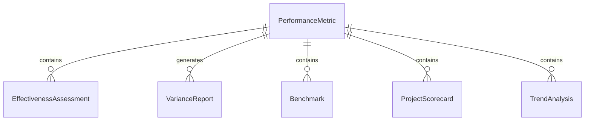
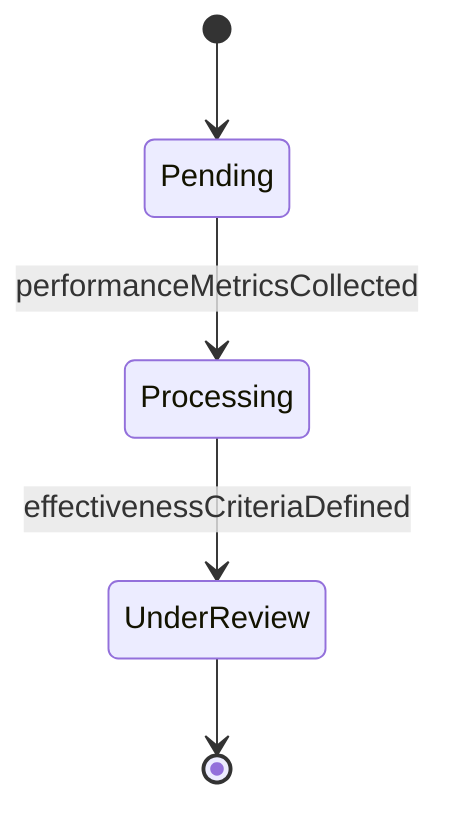
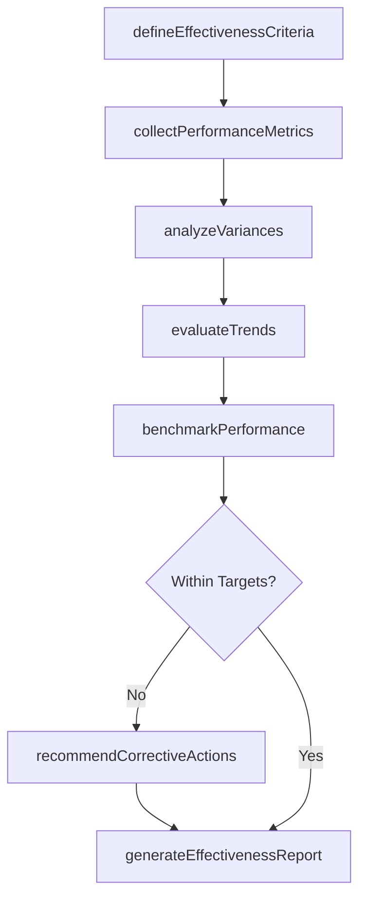
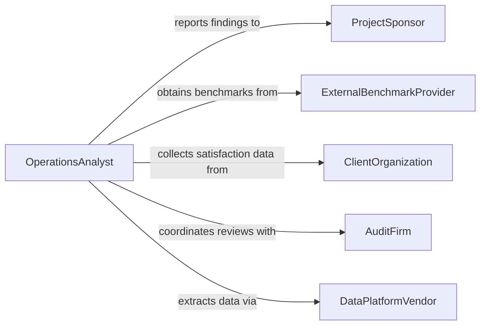

# Analyze Data to Assess Operational or Project Effectiveness

> Business-as-Code definition for analyzing data to assess operational or project effectiveness. Models the collection, measurement, and evaluation of key performance indicators, milestones, and operational metrics to determine whether projects and operations are meeting their intended objectives.

## Overview

Analyzing data to assess operational or project effectiveness involves gathering performance metrics from operational systems and project management tools, comparing actual results against planned targets, identifying variances and root causes, and producing effectiveness assessments that inform corrective actions and future planning. This definition provides actions for metric collection, variance analysis, trend evaluation, and effectiveness reporting. It supports project managers, operations analysts, program evaluators, and continuous improvement specialists.

## Actors

| Actor | Description |
|-------|-------------|
| ProjectSponsor | Funds and authorizes projects requiring effectiveness assessment |
| ExternalBenchmarkProvider | Supplies industry benchmarks for comparative performance analysis |
| ClientOrganization | Receives project deliverables and provides satisfaction data |
| AuditFirm | Conducts independent evaluations of operational and project performance |
| DataPlatformVendor | Provides business intelligence tools for metric collection and visualization |
| RegulatoryOversight | Establishes performance standards that projects must demonstrate compliance with |

## Roles

| Role | Description |
|------|-------------|
| OperationsAnalyst | Collects and analyzes operational performance data against targets |
| ProjectManager | Tracks project milestones, budget, and scope metrics |
| ProgramEvaluator | Assesses overall program effectiveness across multiple projects |
| ContinuousImprovementLead | Identifies improvement opportunities from effectiveness assessments |

## Entities

| Entity | Description |
|--------|-------------|
| PerformanceMetric | A quantifiable measure used to evaluate operational or project success |
| EffectivenessAssessment | A structured evaluation comparing actual results to planned objectives |
| VarianceReport | A document detailing deviations between planned and actual performance |
| Benchmark | An industry or organizational standard used for comparative evaluation |
| ProjectScorecard | A summary of key project health indicators including scope, schedule, and budget |
| TrendAnalysis | A longitudinal study of performance changes over multiple measurement periods |
| CorrectiveActionPlan | A documented response to address identified performance gaps |

## Actions

| Action | Description |
|--------|-------------|
| collectPerformanceMetrics | Gather KPIs and operational data from source systems |
| defineEffectivenessCriteria | Establish the standards against which performance will be measured |
| analyzeVariances | Compare actual results to targets and quantify deviations |
| evaluateTrends | Assess performance trajectory over multiple reporting periods |
| benchmarkPerformance | Compare operational or project metrics against industry standards |
| assessProjectHealth | Evaluate scope, schedule, budget, and quality indicators for a project |
| generateEffectivenessReport | Produce a comprehensive assessment of operational or project performance |
| recommendCorrectiveActions | Propose interventions to close identified performance gaps |

## Events

| Event | Description |
|-------|-------------|
| performanceMetricsCollected | KPIs and operational data have been gathered from source systems |
| effectivenessCriteriaDefined | Measurement standards have been established |
| variancesAnalyzed | Deviations between planned and actual results have been quantified |
| trendsEvaluated | Performance trajectory has been assessed over multiple periods |
| performanceBenchmarked | Metrics have been compared against industry standards |
| projectHealthAssessed | Scope, schedule, budget, and quality indicators have been evaluated |
| effectivenessReportGenerated | A comprehensive performance assessment has been produced |
| correctiveActionsRecommended | Interventions to address performance gaps have been proposed |

## Searches

| Search | Description |
|--------|-------------|
| findAssessments | List effectiveness assessments by project, department, or date |
| getPerformanceMetrics | Retrieve KPIs by category, time period, or target status |
| getVariances | Access variance details by severity, domain, or root cause |
| getBenchmarks | View benchmark comparisons by metric or industry standard |
| getProjectScorecards | Locate project health summaries by status or manager |


## Entity Relationships



## State Diagram


## Workflow



## Actor Relationships



## Usage

### Calling Actions

```typescript
import { analyzeDataAssessOperationalProject } from '@headlessly/analyze-data-assess-operational-project'

const analyst = analyzeDataAssessOperationalProject()

// Define criteria and collect metrics
const assessment = await analyst.defineEffectivenessCriteria({
  projectId: 'proj-erp-migration',
  criteria: [
    { metric: 'schedule-variance', target: 0, tolerance: 5 },
    { metric: 'budget-variance', target: 0, tolerance: 10 },
    { metric: 'defect-rate', target: 2, tolerance: 1 }
  ]
})

await analyst.collectPerformanceMetrics({
  assessmentId: assessment.id,
  sources: ['jira', 'sap', 'financial-system'],
  period: { start: '2025-01-01', end: '2025-06-30' }
})

// Analyze and benchmark
await analyst.analyzeVariances({ assessmentId: assessment.id })
await analyst.evaluateTrends({ assessmentId: assessment.id })
await analyst.benchmarkPerformance({ assessmentId: assessment.id, benchmark: 'gartner-it-project-2025' })

// Report
await analyst.generateEffectivenessReport({ assessmentId: assessment.id })
```

### Event-Driven Automation

```typescript
// Alert stakeholders when variances exceed tolerance
analyst.variancesAnalyzed(async ({ assessmentId, variances }) => {
  const critical = variances.filter(v => v.deviationPercent > v.tolerance)
  if (critical.length > 0) {
    await notify({
      to: 'project-governance-board',
      message: `${critical.length} metrics exceed tolerance thresholds on assessment ${assessmentId}`
    })
  }
})

// Distribute effectiveness reports
analyst.effectivenessReportGenerated(async ({ assessmentId, reportId }) => {
  await distribute({ reportId, recipients: ['project-sponsor', 'pmo', 'operations-leadership'] })
})
```
