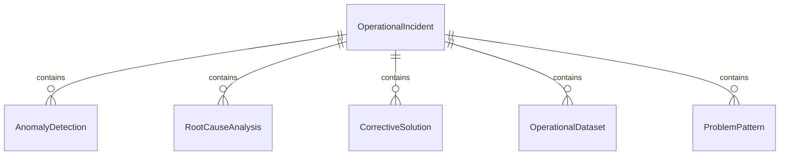
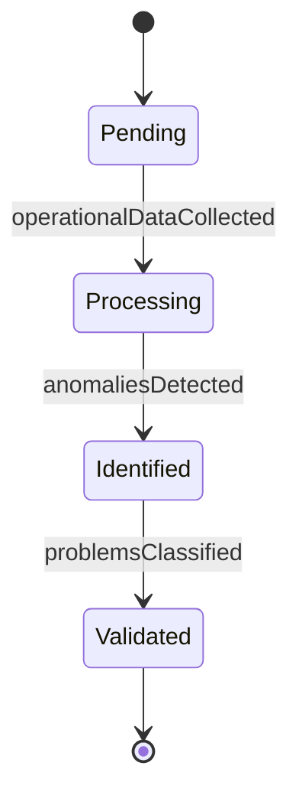
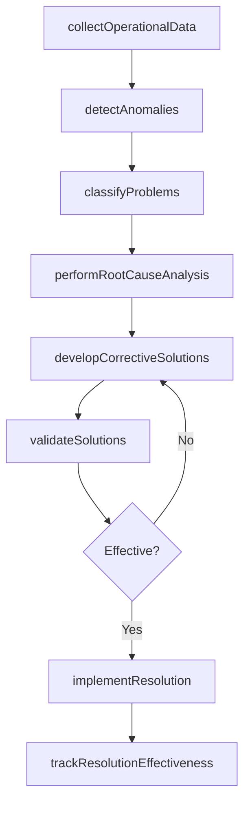
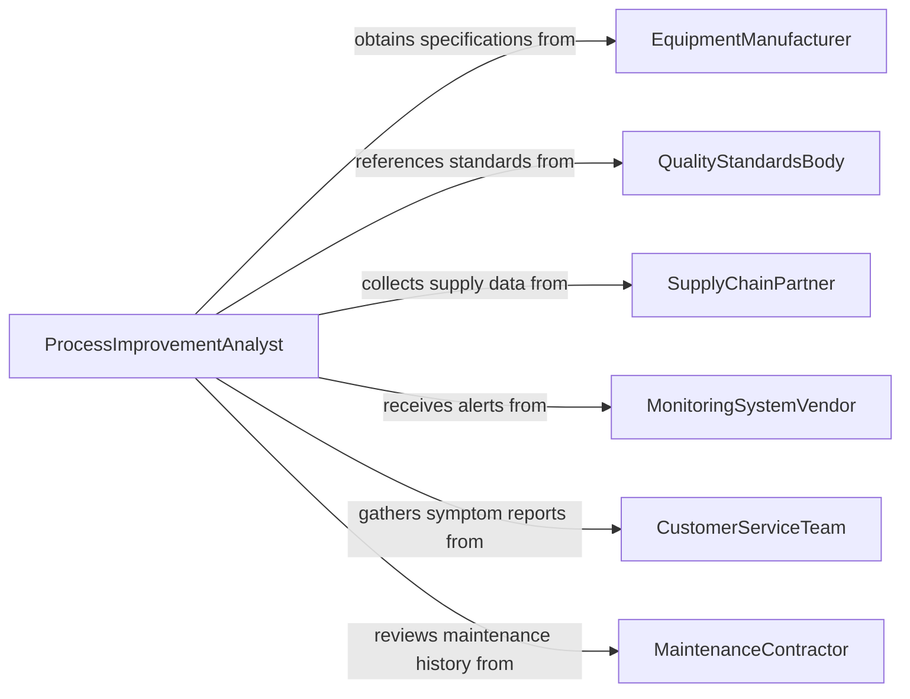

# Analyze Data to Identify or Resolve Operational Problems

> Business-as-Code definition for analyzing data to identify or resolve operational problems. Models the diagnostic process of gathering operational data, detecting anomalies and patterns, performing root cause analysis, and developing data-driven solutions to recurring or emergent operational issues.

## Overview

Analyzing data to identify or resolve operational problems involves collecting data from production systems, quality control processes, and incident logs to detect patterns of failure, inefficiency, or deviation from expected performance. This definition provides actions for anomaly detection, root cause analysis, corrective solution development, and resolution tracking. It supports operations managers, quality engineers, process improvement analysts, and incident response teams.

## Actors

| Actor | Description |
|-------|-------------|
| EquipmentManufacturer | Provides technical specifications and diagnostic data for operational equipment |
| QualityStandardsBody | Establishes conformance criteria against which operational deviations are measured |
| SupplyChainPartner | Contributes data on material quality and delivery performance affecting operations |
| MonitoringSystemVendor | Supplies real-time operational monitoring and alerting platforms |
| CustomerServiceTeam | Reports customer-facing symptoms of operational problems |
| MaintenanceContractor | Provides maintenance history and equipment condition data |

## Roles

| Role | Description |
|------|-------------|
| OperationsManager | Oversees operational performance and authorizes corrective actions |
| ProcessImprovementAnalyst | Investigates operational data to identify inefficiencies and root causes |
| QualityEngineer | Analyzes defect data and develops quality-related corrective measures |
| IncidentResponseLead | Coordinates rapid data analysis during critical operational disruptions |
| DataEngineer | Prepares and integrates operational data from disparate source systems |

## Entities

| Entity | Description |
|--------|-------------|
| OperationalIncident | A documented occurrence of an operational problem or disruption |
| AnomalyDetection | A flagged deviation from expected operational parameters |
| RootCauseAnalysis | A structured investigation to determine the fundamental cause of a problem |
| CorrectiveSolution | A proposed or implemented fix for an identified operational problem |
| OperationalDataset | A curated collection of operational metrics used for diagnostic analysis |
| ProblemPattern | A recurring sequence of events or conditions associated with operational failures |
| ResolutionTracker | A record of corrective actions and their effectiveness over time |

## Actions

| Action | Description |
|--------|-------------|
| collectOperationalData | Gather metrics, logs, and event data from operational systems |
| detectAnomalies | Identify deviations from expected operational baselines |
| classifyProblems | Categorize detected issues by type, severity, and affected area |
| performRootCauseAnalysis | Investigate the fundamental causes of identified operational problems |
| developCorrectiveSolutions | Design data-driven fixes for root causes |
| validateSolutions | Test proposed solutions against historical data to confirm effectiveness |
| implementResolution | Deploy corrective actions into operational processes |
| trackResolutionEffectiveness | Monitor resolved problems to confirm sustained improvement |

## Events

| Event | Description |
|-------|-------------|
| operationalDataCollected | Metrics and logs have been gathered from source systems |
| anomaliesDetected | Deviations from expected baselines have been identified |
| problemsClassified | Detected issues have been categorized by type and severity |
| rootCauseIdentified | The fundamental cause of an operational problem has been determined |
| correctiveSolutionsDeveloped | Data-driven fixes have been designed for root causes |
| solutionsValidated | Proposed solutions have been tested against historical data |
| resolutionImplemented | Corrective actions have been deployed into operations |
| resolutionEffectivenessTracked | Post-resolution monitoring has confirmed sustained improvement |

## Searches

| Search | Description |
|--------|-------------|
| findIncidents | List operational incidents by type, severity, or date range |
| getAnomalies | Retrieve detected anomalies by system, metric, or threshold |
| getRootCauses | Access root cause analyses by problem category or status |
| getResolutions | View corrective solutions by implementation status or effectiveness |
| getProblemPatterns | Identify recurring problem patterns by frequency or impact |


## Entity Relationships



## State Diagram


## Workflow



## Actor Relationships



## Usage

### Calling Actions

```typescript
import { analyzeDataIdentifyResolveOperational } from '@headlessly/analyze-data-identify-resolve-operational'

const analyst = analyzeDataIdentifyResolveOperational()

// Collect and detect
const investigation = await analyst.collectOperationalData({
  systems: ['production-line-3', 'quality-control', 'shipping'],
  period: { start: '2025-03-01', end: '2025-03-31' },
  metrics: ['throughput', 'defect-rate', 'downtime-minutes', 'cycle-time']
})

await analyst.detectAnomalies({
  investigationId: investigation.id,
  method: 'statistical-process-control',
  threshold: 2.5
})

// Classify and investigate
await analyst.classifyProblems({ investigationId: investigation.id })
await analyst.performRootCauseAnalysis({
  investigationId: investigation.id,
  technique: 'five-whys'
})

// Resolve
await analyst.developCorrectiveSolutions({ investigationId: investigation.id })
await analyst.validateSolutions({ investigationId: investigation.id })
await analyst.implementResolution({ investigationId: investigation.id })
```

### Event-Driven Automation

```typescript
// Escalate critical anomalies
analyst.anomaliesDetected(async ({ investigationId, anomalies }) => {
  const critical = anomalies.filter(a => a.severity === 'critical')
  if (critical.length > 0) {
    await notify({
      to: 'operations-leadership',
      message: `${critical.length} critical anomalies detected requiring immediate investigation`
    })
  }
})

// Confirm resolution sustainability
analyst.resolutionEffectivenessTracked(async ({ investigationId, resolutionId, effectivenessScore }) => {
  if (effectivenessScore < 0.85) {
    await notify({
      to: 'process-improvement-team',
      message: `Resolution ${resolutionId} effectiveness at ${effectivenessScore * 100}% - consider additional corrective action`
    })
  }
})
```
