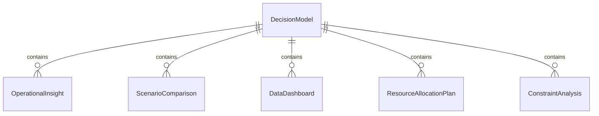
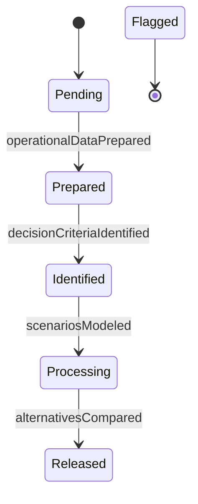
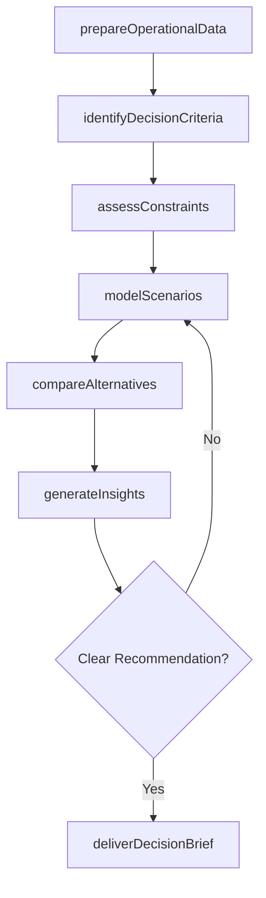
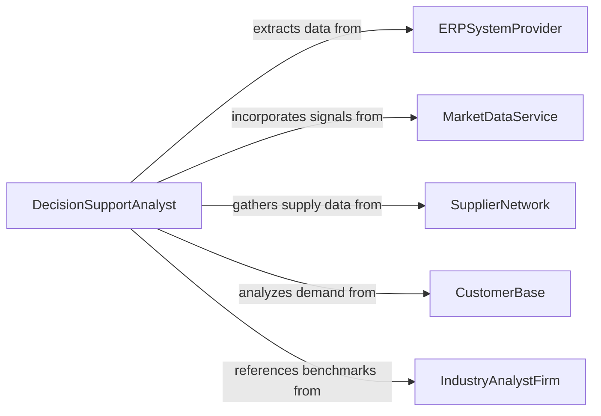

# Analyze Data to Inform Operational Decisions or Activities

> Business-as-Code definition for analyzing data to inform operational decisions or activities. Models the process of gathering, transforming, and interpreting operational data to provide actionable insights that guide resource allocation, process adjustments, scheduling, and tactical planning.

## Overview

Analyzing data to inform operational decisions involves extracting relevant data from production, logistics, financial, and workforce systems, applying analytical techniques to identify patterns and trade-offs, and presenting findings in formats that enable managers to make timely, evidence-based decisions about day-to-day operations. This definition provides actions for data preparation, scenario comparison, decision support modeling, and insight delivery. It supports operations directors, production supervisors, capacity planners, and decision support analysts.

## Actors

| Actor | Description |
|-------|-------------|
| ERPSystemProvider | Supplies integrated operational data from enterprise resource planning platforms |
| MarketDataService | Provides external demand signals and market conditions affecting operations |
| SupplierNetwork | Contributes lead time, availability, and pricing data for supply-side decisions |
| CustomerBase | Generates demand patterns and order data that drive operational planning |
| IndustryAnalystFirm | Publishes operational benchmarks and best practice frameworks |
| RegulatoryBody | Establishes compliance requirements that constrain operational decisions |

## Roles

| Role | Description |
|------|-------------|
| DecisionSupportAnalyst | Prepares data analyses and scenario models for operational decision-makers |
| OperationsDirector | Makes strategic operational decisions based on analytical findings |
| CapacityPlanner | Uses data analysis to optimize resource allocation and production scheduling |
| SupplyChainCoordinator | Applies data insights to procurement and distribution decisions |

## Entities

| Entity | Description |
|--------|-------------|
| DecisionModel | A structured framework for evaluating operational alternatives using data |
| OperationalInsight | A finding or recommendation derived from data analysis |
| ScenarioComparison | A side-by-side evaluation of operational alternatives with projected outcomes |
| DataDashboard | A real-time visualization of key operational metrics for decision support |
| ResourceAllocationPlan | A data-driven plan for distributing personnel, equipment, or budget |
| ConstraintAnalysis | An assessment of factors limiting operational options |
| DecisionBrief | A concise summary of findings and recommendations for decision-makers |

## Actions

| Action | Description |
|--------|-------------|
| prepareOperationalData | Extract, clean, and integrate data from operational source systems |
| identifyDecisionCriteria | Define the factors and constraints relevant to the operational decision |
| modelScenarios | Generate projections for alternative operational approaches |
| compareAlternatives | Evaluate scenarios against decision criteria to identify trade-offs |
| assessConstraints | Analyze resource, regulatory, and capacity limitations on available options |
| generateInsights | Synthesize analytical findings into actionable recommendations |
| deliverDecisionBrief | Present data-driven findings and recommendations to decision-makers |

## Events

| Event | Description |
|-------|-------------|
| operationalDataPrepared | Data has been extracted, cleaned, and integrated from source systems |
| decisionCriteriaIdentified | Factors and constraints for the decision have been defined |
| scenariosModeled | Projections for alternative operational approaches have been generated |
| alternativesCompared | Scenarios have been evaluated against decision criteria |
| constraintsAssessed | Resource and regulatory limitations have been analyzed |
| insightsGenerated | Actionable recommendations have been synthesized from analysis |
| decisionBriefDelivered | Findings and recommendations have been presented to decision-makers |

## Searches

| Search | Description |
|--------|-------------|
| findDecisionModels | List decision models by domain, date, or decision type |
| getOperationalInsights | Retrieve insights by category, priority, or operational area |
| getScenarioComparisons | Access scenario evaluations by decision or outcome metric |
| getDashboards | View operational dashboards by department or metric group |
| getDecisionBriefs | Locate decision briefs by status, author, or topic |


## Entity Relationships



## State Diagram


## Workflow



## Actor Relationships



## Usage

### Calling Actions

```typescript
import { analyzeDataInformOperationalDecisions } from '@headlessly/analyze-data-inform-operational-decisions'

const analyst = analyzeDataInformOperationalDecisions()

// Prepare data and define decision
const decision = await analyst.prepareOperationalData({
  sources: ['erp-production', 'warehouse-management', 'demand-forecast'],
  period: { start: '2025-04-01', end: '2025-06-30' }
})

await analyst.identifyDecisionCriteria({
  decisionId: decision.id,
  criteria: ['unit-cost', 'lead-time', 'quality-yield', 'capacity-utilization']
})

await analyst.assessConstraints({ decisionId: decision.id })

// Model and compare
await analyst.modelScenarios({
  decisionId: decision.id,
  scenarios: ['increase-shift-capacity', 'outsource-overflow', 'defer-low-margin-orders']
})

await analyst.compareAlternatives({ decisionId: decision.id })
await analyst.generateInsights({ decisionId: decision.id })
await analyst.deliverDecisionBrief({ decisionId: decision.id })
```

### Event-Driven Automation

```typescript
// Notify leadership when decision briefs are ready
analyst.decisionBriefDelivered(async ({ decisionId, briefId, topic }) => {
  await notify({
    to: 'operations-leadership',
    message: `Decision brief ready for review: ${topic}`
  })
})

// Trigger re-analysis when constraints change
analyst.constraintsAssessed(async ({ decisionId, constraints }) => {
  const binding = constraints.filter(c => c.status === 'binding')
  if (binding.length > 2) {
    await notify({
      to: 'capacity-planning',
      message: `${binding.length} binding constraints identified - consider expanding analysis scope`
    })
  }
})
```
