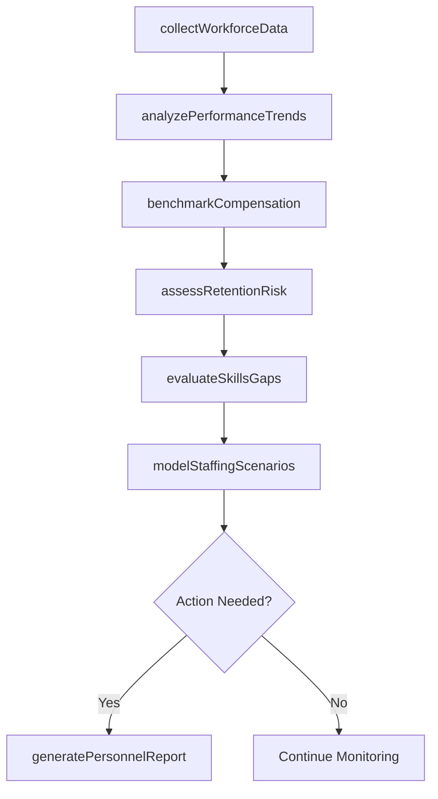
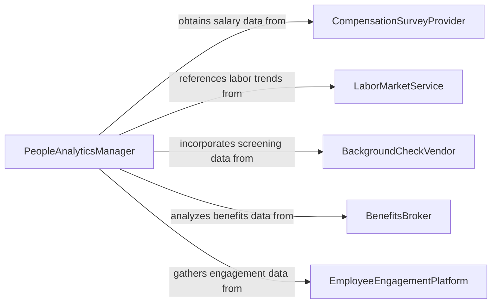

# Analyze Data to Inform Personnel Decisions

> Business-as-Code definition for analyzing data to inform personnel decisions. Models the collection and evaluation of workforce data including performance metrics, compensation benchmarks, turnover trends, and skills inventories to support hiring, promotion, retention, and organizational development decisions.

## Overview

Analyzing data to inform personnel decisions involves gathering workforce analytics from HR information systems, performance management platforms, and labor market sources, then applying statistical and comparative methods to generate insights on staffing levels, employee performance, compensation equity, succession readiness, and retention risk. This definition provides actions for workforce data collection, talent analytics, compensation analysis, and personnel recommendation reporting. It supports HR directors, people analytics teams, compensation specialists, and talent acquisition managers.

## Actors

| Actor | Description |
|-------|-------------|
| CompensationSurveyProvider | Publishes salary benchmarks and total compensation data by role and geography |
| LaborMarketService | Provides labor supply, demand, and wage trend data for workforce planning |
| BackgroundCheckVendor | Supplies employment verification and screening data for hiring decisions |
| BenefitsBroker | Provides benefits utilization and cost data affecting total compensation analysis |
| EmployeeEngagementPlatform | Delivers engagement survey results and sentiment data |
| UniversityRecruitingPartner | Provides candidate pipeline data from academic institutions |

## Roles

| Role | Description |
|------|-------------|
| PeopleAnalyticsManager | Designs and executes workforce data analyses for personnel decisions |
| HRBusinessPartner | Translates analytical findings into personnel recommendations for business units |
| CompensationAnalyst | Evaluates pay equity, market competitiveness, and total rewards data |
| TalentAcquisitionManager | Uses data to optimize recruiting strategies and candidate selection |
| SuccessionPlanner | Analyzes readiness and development data for leadership pipeline decisions |

## Entities

| Entity | Description |
|--------|-------------|
| WorkforceProfile | An aggregate view of workforce demographics, skills, and distribution |
| PerformanceDataset | A collection of employee performance ratings, objectives, and outcomes |
| CompensationBenchmark | A market-based salary and benefits comparison by role and geography |
| RetentionRiskScore | A predictive measure of an employee's likelihood of voluntary departure |
| SkillsInventory | A catalog of employee competencies, certifications, and development gaps |
| SuccessionReadinessMatrix | A mapping of internal candidates to critical roles by readiness level |
| PersonnelRecommendation | A data-driven suggestion for a hiring, promotion, or retention action |
| TurnoverAnalysis | A study of attrition patterns, causes, and financial impact |

## Actions

| Action | Description |
|--------|-------------|
| collectWorkforceData | Gather employee demographics, performance, and compensation data from HR systems |
| analyzePerformanceTrends | Evaluate employee performance patterns across teams and time periods |
| benchmarkCompensation | Compare internal pay levels against market survey data |
| assessRetentionRisk | Calculate predictive attrition scores based on engagement and tenure data |
| evaluateSkillsGaps | Identify workforce competency deficiencies relative to organizational needs |
| modelStaffingScenarios | Project workforce requirements under different business growth assumptions |
| generatePersonnelReport | Produce a data-driven summary of workforce findings and recommendations |

## Events

| Event | Description |
|-------|-------------|
| workforceDataCollected | Employee demographics, performance, and compensation data have been gathered |
| performanceTrendsAnalyzed | Employee performance patterns have been evaluated |
| compensationBenchmarked | Internal pay levels have been compared against market data |
| retentionRiskAssessed | Predictive attrition scores have been calculated |
| skillsGapsEvaluated | Workforce competency deficiencies have been identified |
| staffingScenariosModeled | Workforce requirement projections have been generated |
| personnelReportGenerated | A data-driven workforce summary has been produced |

## Searches

| Search | Description |
|--------|-------------|
| findWorkforceProfiles | List workforce profiles by department, location, or role category |
| getPerformanceData | Retrieve performance metrics by team, rating level, or review period |
| getCompensationBenchmarks | Access market compensation comparisons by role or geography |
| getRetentionRisks | View retention risk scores by department, tenure, or risk level |
| getSkillsGaps | Identify competency gaps by function or criticality |

## Workflow



## Actor Relationships



## Usage

### Calling Actions

```typescript
import { analyzeDataInformPersonnelDecisions } from '@headlessly/analyze-data-inform-personnel-decisions'

const analyst = analyzeDataInformPersonnelDecisions()

// Collect workforce data
const analysis = await analyst.collectWorkforceData({
  departments: ['engineering', 'sales', 'operations'],
  dataPoints: ['performance-ratings', 'compensation', 'tenure', 'engagement-scores'],
  period: { start: '2024-01-01', end: '2025-12-31' }
})

// Analyze trends and risks
await analyst.analyzePerformanceTrends({ analysisId: analysis.id })
await analyst.benchmarkCompensation({
  analysisId: analysis.id,
  surveys: ['radford-tech', 'mercer-general-industry']
})
await analyst.assessRetentionRisk({ analysisId: analysis.id })
await analyst.evaluateSkillsGaps({ analysisId: analysis.id })

// Model and report
await analyst.modelStaffingScenarios({
  analysisId: analysis.id,
  scenarios: ['10-percent-growth', 'flat-headcount', 'restructure']
})
await analyst.generatePersonnelReport({ analysisId: analysis.id })
```

### Event-Driven Automation

```typescript
// Alert HR when high retention risk is detected
analyst.retentionRiskAssessed(async ({ analysisId, riskScores }) => {
  const highRisk = riskScores.filter(r => r.score > 0.75 && r.performanceRating >= 4)
  if (highRisk.length > 0) {
    await notify({
      to: 'hr-business-partners',
      message: `${highRisk.length} high-performing employees flagged as high retention risk`
    })
  }
})

// Notify compensation team of pay equity gaps
analyst.compensationBenchmarked(async ({ analysisId, benchmarkResults }) => {
  const belowMarket = benchmarkResults.filter(b => b.compaRatio < 0.90)
  if (belowMarket.length > 0) {
    await notify({
      to: 'compensation-team',
      message: `${belowMarket.length} roles are below 90% of market median - review recommended`
    })
  }
})
```
