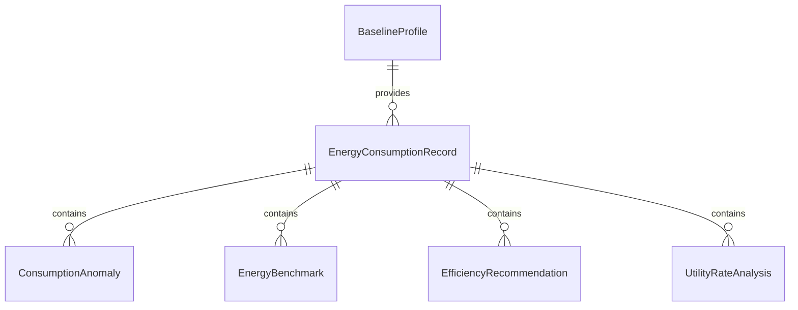
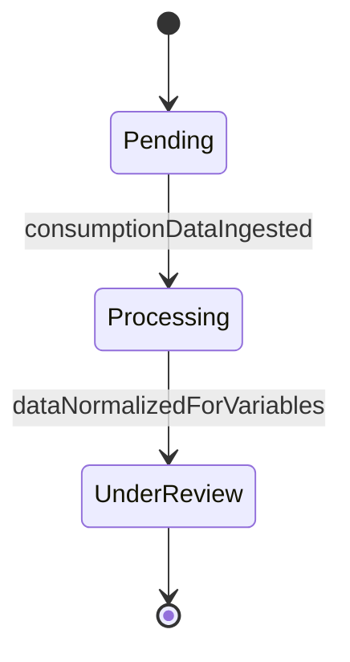
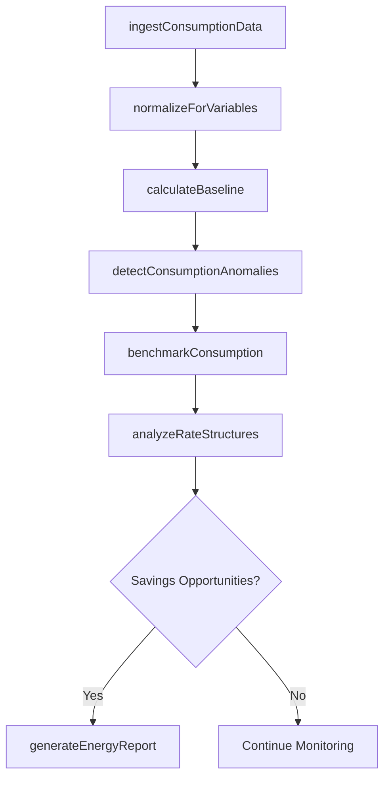
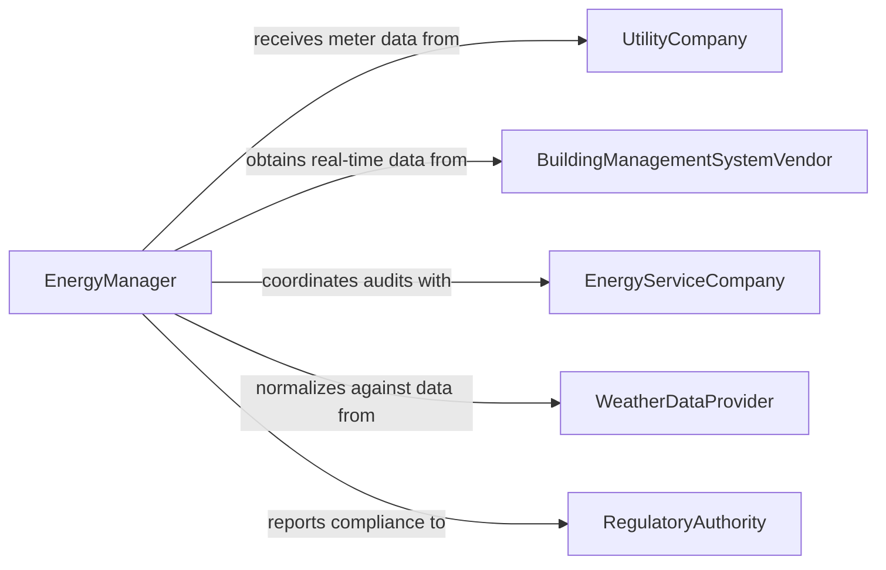

# Analyze Energy Usage Data

> Business-as-Code definition for analyzing energy usage data. Models the collection, normalization, and interpretation of electricity, gas, water, and fuel consumption data across facilities and operations to identify waste, optimize consumption patterns, and support sustainability and cost reduction goals.

## Overview

Analyzing energy usage data involves gathering consumption readings from utility meters, building management systems, and IoT sensors, normalizing data for weather and occupancy variables, identifying consumption patterns and anomalies, benchmarking against industry standards, and recommending efficiency improvements. This definition provides actions for data ingestion, baseline calculation, anomaly detection, and efficiency reporting. It supports energy managers, facilities directors, sustainability officers, and utility analysts.

## Actors

| Actor | Description |
|-------|-------------|
| UtilityCompany | Provides metered consumption data and rate schedules for electricity, gas, and water |
| BuildingManagementSystemVendor | Supplies real-time HVAC, lighting, and equipment monitoring data |
| EnergyServiceCompany | Conducts energy audits and implements efficiency retrofit projects |
| WeatherDataProvider | Delivers temperature, humidity, and degree-day data for consumption normalization |
| RegulatoryAuthority | Establishes energy reporting mandates and emissions reduction targets |
| IoTSensorManufacturer | Provides sub-metering and equipment-level consumption monitoring devices |

## Roles

| Role | Description |
|------|-------------|
| EnergyManager | Oversees energy data collection, analysis, and efficiency program management |
| SustainabilityAnalyst | Evaluates energy consumption relative to carbon emissions and sustainability goals |
| FacilitiesEngineer | Interprets building-level energy data to optimize mechanical and electrical systems |
| UtilityAnalyst | Analyzes rate structures and billing data to reduce energy procurement costs |

## Entities

| Entity | Description |
|--------|-------------|
| EnergyConsumptionRecord | A time-stamped measurement of energy usage by source and location |
| BaselineProfile | A normalized consumption pattern used as a reference for measuring savings |
| ConsumptionAnomaly | A deviation from expected energy usage patterns indicating waste or equipment failure |
| EnergyBenchmark | A comparison of facility consumption against industry or portfolio averages |
| EfficiencyRecommendation | A proposed measure to reduce energy consumption or cost |
| UtilityRateAnalysis | An evaluation of energy pricing structures and procurement optimization opportunities |
| CarbonEmissionsCalculation | A derived measure of greenhouse gas emissions based on energy consumption data |

## Actions

| Action | Description |
|--------|-------------|
| ingestConsumptionData | Collect energy usage readings from meters, sensors, and utility accounts |
| normalizeForVariables | Adjust consumption data for weather, occupancy, and production volume |
| calculateBaseline | Establish reference consumption profiles for facilities or systems |
| detectConsumptionAnomalies | Identify unusual energy usage patterns indicating waste or malfunction |
| benchmarkConsumption | Compare facility energy performance against industry standards or peer facilities |
| analyzeRateStructures | Evaluate utility tariffs and identify cost optimization opportunities |
| generateEnergyReport | Produce a comprehensive energy usage analysis with efficiency recommendations |

## Events

| Event | Description |
|-------|-------------|
| consumptionDataIngested | Energy usage readings have been collected from source systems |
| dataNormalizedForVariables | Consumption data has been adjusted for weather and occupancy factors |
| baselineCalculated | Reference consumption profiles have been established |
| consumptionAnomaliesDetected | Unusual energy usage patterns have been identified |
| consumptionBenchmarked | Facility performance has been compared against industry standards |
| rateStructuresAnalyzed | Utility tariff optimization opportunities have been identified |
| energyReportGenerated | A comprehensive energy usage analysis has been produced |

## Searches

| Search | Description |
|--------|-------------|
| findConsumptionRecords | List energy consumption data by facility, source, or time period |
| getAnomalies | Retrieve consumption anomalies by location, severity, or type |
| getBenchmarks | Access energy benchmarks by facility type or performance quartile |
| getBaselines | View baseline consumption profiles by facility or system |
| getEfficiencyRecommendations | Locate efficiency measures by projected savings or implementation cost |


## Entity Relationships



## State Diagram


## Workflow



## Actor Relationships



## Usage

### Calling Actions

```typescript
import { analyzeEnergyUsageData } from '@headlessly/analyze-energy-usage-data'

const analyst = analyzeEnergyUsageData()

// Ingest and normalize
const analysis = await analyst.ingestConsumptionData({
  facilities: ['headquarters', 'manufacturing-plant-1', 'data-center-east'],
  sources: ['electricity', 'natural-gas', 'chilled-water'],
  period: { start: '2025-01-01', end: '2025-12-31' },
  granularity: '15-minute'
})

await analyst.normalizeForVariables({
  analysisId: analysis.id,
  variables: ['heating-degree-days', 'cooling-degree-days', 'occupancy-rate']
})

await analyst.calculateBaseline({ analysisId: analysis.id, referenceYear: 2024 })

// Detect and benchmark
await analyst.detectConsumptionAnomalies({ analysisId: analysis.id, threshold: 2.0 })
await analyst.benchmarkConsumption({
  analysisId: analysis.id,
  benchmark: 'energy-star-commercial'
})

// Analyze rates and report
await analyst.analyzeRateStructures({ analysisId: analysis.id })
await analyst.generateEnergyReport({ analysisId: analysis.id })
```

### Event-Driven Automation

```typescript
// Alert facilities team on consumption anomalies
analyst.consumptionAnomaliesDetected(async ({ analysisId, anomalies }) => {
  const urgent = anomalies.filter(a => a.excessCostPerDay > 500)
  if (urgent.length > 0) {
    await notify({
      to: 'facilities-engineering',
      message: `${urgent.length} consumption anomalies detected costing over $500/day each`
    })
  }
})

// Distribute energy reports to stakeholders
analyst.energyReportGenerated(async ({ analysisId, reportId }) => {
  await distribute({ reportId, recipients: ['sustainability-officer', 'facilities-director', 'CFO'] })
})
```
