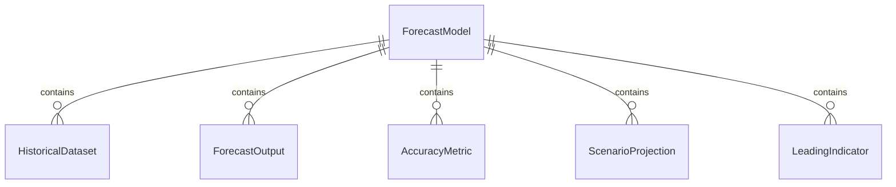
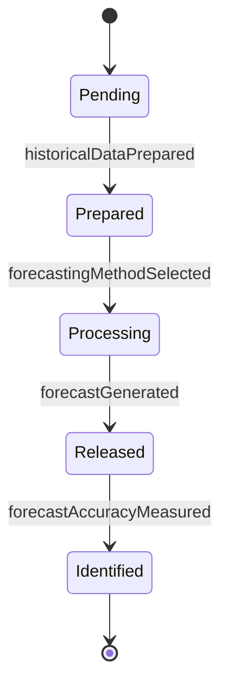
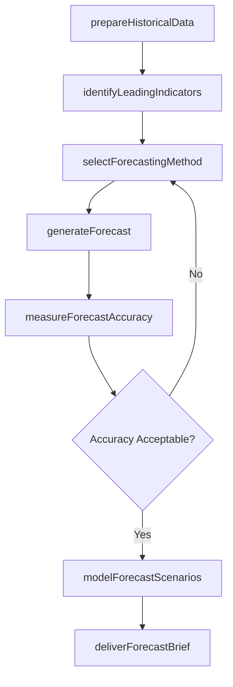
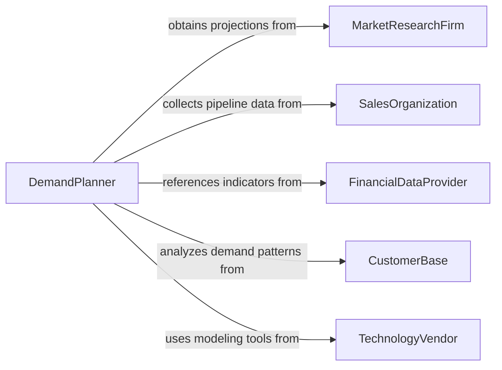

# Analyze Forecasting Data to Improve Business Decisions

> Business-as-Code definition for analyzing forecasting data to improve business decisions. Models the process of gathering historical and leading indicator data, applying statistical and machine learning forecasting methods, evaluating forecast accuracy, and translating projections into actionable business guidance.

## Overview

Analyzing forecasting data to improve business decisions involves collecting historical sales, financial, operational, and market data, generating demand, revenue, and resource forecasts using time-series analysis, regression modeling, and ensemble methods, then validating forecast accuracy and presenting scenario-based projections to executive leadership for strategic planning. This definition provides actions for data preparation, forecast generation, accuracy measurement, and decision-ready insight delivery. It supports business intelligence analysts, demand planners, financial planning teams, and strategic planning executives.

## Actors

| Actor | Description |
|-------|-------------|
| MarketResearchFirm | Provides macroeconomic forecasts and industry growth projections |
| SalesOrganization | Contributes pipeline data, win rates, and revenue projections |
| FinancialDataProvider | Supplies economic indicators, interest rates, and commodity price forecasts |
| CustomerBase | Generates historical demand patterns used as the basis for projections |
| TechnologyVendor | Provides forecasting software platforms and machine learning tools |
| SupplyChainPartner | Shares capacity constraints and lead time projections affecting forecasts |

## Roles

| Role | Description |
|------|-------------|
| DemandPlanner | Generates and maintains demand forecasts using statistical and judgmental methods |
| BusinessIntelligenceAnalyst | Prepares and analyzes data for forecasting models |
| FinancialPlanningManager | Translates forecasts into budgets, revenue plans, and resource allocations |
| StrategicPlanningDirector | Uses forecast scenarios to guide long-term business strategy |

## Entities

| Entity | Description |
|--------|-------------|
| ForecastModel | A mathematical or machine learning model that generates future projections |
| HistoricalDataset | A curated set of past observations used to train forecasting models |
| ForecastOutput | A set of projected values for a specific metric and time horizon |
| AccuracyMetric | A measure of forecast quality such as MAPE, RMSE, or bias |
| ScenarioProjection | A forecast variant based on alternative assumptions about key drivers |
| LeadingIndicator | An external signal that provides advance notice of changes in business conditions |
| ForecastBrief | A summary of forecast findings and recommended business actions |

## Actions

| Action | Description |
|--------|-------------|
| prepareHistoricalData | Collect, clean, and structure historical data for forecasting model input |
| selectForecastingMethod | Evaluate and choose the most appropriate forecasting technique for the data |
| generateForecast | Run the forecasting model to produce projections for target metrics |
| measureForecastAccuracy | Calculate error metrics by comparing forecasts to actual outcomes |
| modelForecastScenarios | Generate projections under alternative assumptions for key business drivers |
| identifyLeadingIndicators | Determine external signals that correlate with future business outcomes |
| deliverForecastBrief | Present forecast findings and recommended actions to decision-makers |

## Events

| Event | Description |
|-------|-------------|
| historicalDataPrepared | Historical data has been collected, cleaned, and structured |
| forecastingMethodSelected | The forecasting technique has been evaluated and chosen |
| forecastGenerated | Projections for target metrics have been produced |
| forecastAccuracyMeasured | Error metrics have been calculated for forecast validation |
| forecastScenariosModeled | Projections under alternative assumptions have been generated |
| leadingIndicatorsIdentified | External predictive signals have been determined |
| forecastBriefDelivered | Forecast findings and recommendations have been presented |

## Searches

| Search | Description |
|--------|-------------|
| findForecasts | List forecast outputs by metric, time horizon, or model type |
| getAccuracyMetrics | Retrieve forecast accuracy measurements by model or period |
| getScenarioProjections | Access scenario-based projections by assumption set or date |
| getLeadingIndicators | View leading indicators by correlation strength or data source |
| getForecastBriefs | Locate forecast briefings by topic, date, or audience |


## Entity Relationships



## State Diagram


## Workflow



## Actor Relationships



## Usage

### Calling Actions

```typescript
import { analyzeForecastingDataImproveBusiness } from '@headlessly/analyze-forecasting-data-improve-business'

const forecaster = analyzeForecastingDataImproveBusiness()

// Prepare and select method
const forecast = await forecaster.prepareHistoricalData({
  metrics: ['monthly-revenue', 'unit-demand', 'customer-churn-rate'],
  period: { start: '2020-01-01', end: '2025-12-31' },
  sources: ['crm', 'erp', 'billing-system']
})

await forecaster.identifyLeadingIndicators({
  forecastId: forecast.id,
  candidates: ['gdp-growth', 'consumer-confidence-index', 'industry-pmi']
})

await forecaster.selectForecastingMethod({
  forecastId: forecast.id,
  candidates: ['arima', 'prophet', 'gradient-boosting-ensemble']
})

// Generate and validate
await forecaster.generateForecast({
  forecastId: forecast.id,
  horizon: '12-months',
  granularity: 'monthly'
})

await forecaster.measureForecastAccuracy({ forecastId: forecast.id })

// Scenario planning and delivery
await forecaster.modelForecastScenarios({
  forecastId: forecast.id,
  scenarios: ['baseline', 'recession', 'expansion']
})

await forecaster.deliverForecastBrief({ forecastId: forecast.id })
```

### Event-Driven Automation

```typescript
// Alert when forecast accuracy degrades
forecaster.forecastAccuracyMeasured(async ({ forecastId, metrics }) => {
  if (metrics.mape > 15) {
    await notify({
      to: 'demand-planning-team',
      message: `Forecast MAPE at ${metrics.mape}% exceeds 15% threshold - model retraining recommended`
    })
  }
})

// Distribute forecast briefs to executive team
forecaster.forecastBriefDelivered(async ({ forecastId, briefId, topic }) => {
  await distribute({ briefId, recipients: ['CEO', 'CFO', 'VP-operations', 'VP-sales'] })
})
```
