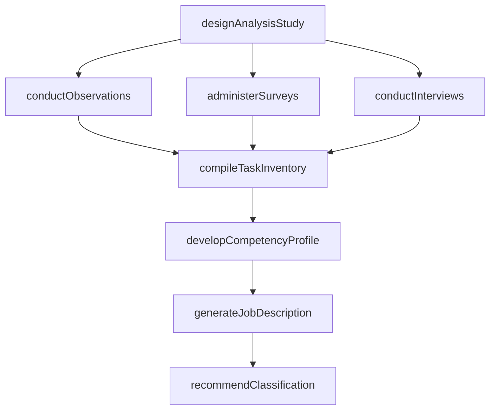
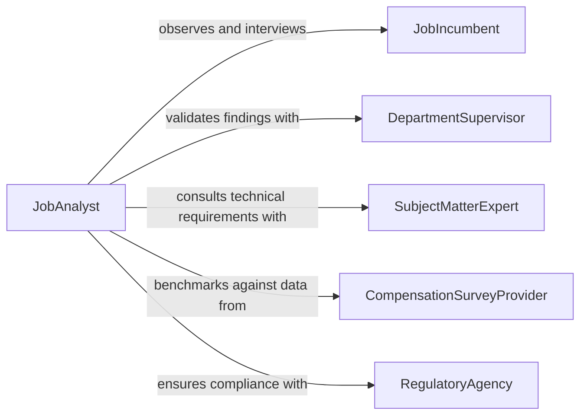

# Analyze Jobs Using Observation, Survey, or Interview Techniques

> Business-as-Code definition for analyzing jobs using observation, survey, or interview techniques. Models the systematic study of job content, responsibilities, competency requirements, and working conditions through structured data collection methods to support classification, compensation, workforce planning, and regulatory compliance.

## Overview

Analyzing jobs using observation, survey, or interview techniques involves designing data collection instruments, conducting on-site observations of work activities, administering structured questionnaires to incumbents and supervisors, performing subject matter expert interviews, and synthesizing findings into standardized job descriptions, competency models, and classification recommendations. This definition provides actions for study design, data collection, content analysis, and job documentation. It supports job analysts, compensation specialists, organizational development professionals, and compliance officers.

## Actors

| Actor | Description |
|-------|-------------|
| JobIncumbent | Performs the work being analyzed and provides firsthand task and responsibility data |
| DepartmentSupervisor | Validates job content observations and provides context on role expectations |
| SubjectMatterExpert | Offers specialized knowledge about technical requirements and industry standards |
| CompensationSurveyProvider | Supplies market data for benchmarking job analysis results against external roles |
| RegulatoryAgency | Establishes job classification and fair labor standards compliance requirements |
| LaborUnionRepresentative | Reviews job analysis findings for consistency with collective bargaining agreements |

## Roles

| Role | Description |
|------|-------------|
| JobAnalyst | Designs and conducts job analysis studies using multiple data collection methods |
| CompensationSpecialist | Uses job analysis data to evaluate roles for pay grade assignment |
| OrganizationalDevelopmentConsultant | Leverages job analysis to design competency frameworks and career paths |
| HRComplianceOfficer | Ensures job analysis outputs meet regulatory and ADA classification requirements |

## Entities

| Entity | Description |
|--------|-------------|
| JobAnalysisStudy | A planned investigation of one or more positions using defined research methods |
| ObservationRecord | A structured log of tasks, tools, and behaviors noted during on-site observation |
| SurveyInstrument | A questionnaire designed to collect job content data from incumbents and supervisors |
| InterviewTranscript | A documented record of responses from subject matter expert or incumbent interviews |
| TaskInventory | A comprehensive list of discrete tasks performed within a job |
| CompetencyProfile | A specification of knowledge, skills, abilities, and other characteristics required |
| JobDescription | A standardized document summarizing the duties, qualifications, and conditions of a role |
| ClassificationRecommendation | A proposed assignment of a job to a grade, family, or regulatory category |

## Actions

| Action | Description |
|--------|-------------|
| designAnalysisStudy | Define the scope, methods, and sample for a job analysis investigation |
| conductObservations | Perform structured on-site observation of workers performing job tasks |
| administerSurveys | Distribute and collect job analysis questionnaires from incumbents and supervisors |
| conductInterviews | Perform structured interviews with incumbents and subject matter experts |
| compileTaskInventory | Aggregate task data from all collection methods into a unified task list |
| developCompetencyProfile | Synthesize knowledge, skill, and ability requirements from analysis data |
| generateJobDescription | Produce a standardized job description from compiled analysis findings |
| recommendClassification | Propose job grade, family, or regulatory classification based on analysis |

## Events

| Event | Description |
|-------|-------------|
| analysisStudyDesigned | The scope, methods, and sample for the job analysis have been defined |
| observationsConducted | On-site observations of job tasks have been completed |
| surveysAdministered | Job analysis questionnaires have been distributed and collected |
| interviewsConducted | Structured interviews with incumbents and experts have been completed |
| taskInventoryCompiled | Task data from all methods has been aggregated into a unified list |
| competencyProfileDeveloped | Knowledge, skill, and ability requirements have been synthesized |
| jobDescriptionGenerated | A standardized job description has been produced |
| classificationRecommended | A job grade or regulatory classification has been proposed |

## Searches

| Search | Description |
|--------|-------------|
| findJobAnalyses | List job analysis studies by position, department, or status |
| getTaskInventories | Retrieve task inventories by job family or analysis date |
| getCompetencyProfiles | Access competency profiles by role, skill area, or criticality |
| getObservationRecords | View observation logs by study, position, or observer |
| getClassificationRecommendations | Locate classification proposals by grade, family, or approval status |

## Workflow



## Actor Relationships



## Usage

### Calling Actions

```typescript
import { analyzeJobsUsingObservationSurvey } from '@headlessly/analyze-jobs-using-observation-survey'

const analyst = analyzeJobsUsingObservationSurvey()

// Design and execute study
const study = await analyst.designAnalysisStudy({
  positions: ['senior-software-engineer', 'production-supervisor', 'customer-success-manager'],
  methods: ['observation', 'survey', 'interview'],
  sampleSize: { incumbents: 12, supervisors: 4, smes: 3 }
})

await analyst.conductObservations({
  studyId: study.id,
  sessions: [
    { positionId: 'senior-software-engineer', duration: '4-hours', observer: 'analyst-1' },
    { positionId: 'production-supervisor', duration: '6-hours', observer: 'analyst-2' }
  ]
})

await analyst.administerSurveys({ studyId: study.id, instrument: 'position-analysis-questionnaire' })
await analyst.conductInterviews({ studyId: study.id, format: 'structured-critical-incident' })

// Compile and produce outputs
await analyst.compileTaskInventory({ studyId: study.id })
await analyst.developCompetencyProfile({ studyId: study.id })
await analyst.generateJobDescription({ studyId: study.id })
await analyst.recommendClassification({ studyId: study.id })
```

### Event-Driven Automation

```typescript
// Notify compensation team when classifications are ready
analyst.classificationRecommended(async ({ studyId, recommendations }) => {
  await notify({
    to: 'compensation-team',
    message: `${recommendations.length} job classification recommendations ready for review from study ${studyId}`
  })
})

// Alert HR compliance when job descriptions are generated
analyst.jobDescriptionGenerated(async ({ studyId, positionId, descriptionId }) => {
  await notify({
    to: 'hr-compliance',
    message: `Updated job description for ${positionId} requires ADA and FLSA compliance review`
  })
})
```
