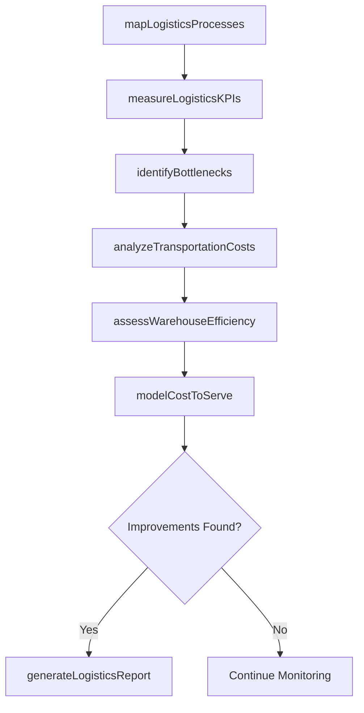
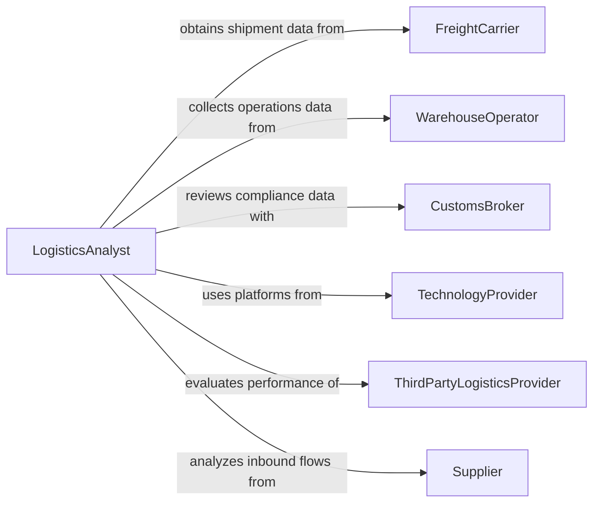

# Analyze Logistics Processes

> Business-as-Code definition for analyzing logistics processes. Models the evaluation of transportation, warehousing, inventory management, and order fulfillment operations to identify inefficiencies, reduce costs, improve service levels, and optimize end-to-end supply chain performance.

## Overview

Analyzing logistics processes involves mapping material and information flows across warehousing, transportation, inventory management, and order fulfillment operations, measuring cycle times and cost-per-unit metrics, identifying bottlenecks and waste, and recommending process improvements. This definition provides actions for process mapping, performance measurement, bottleneck identification, and logistics optimization reporting. It supports supply chain directors, logistics analysts, warehouse operations managers, and transportation planners.

## Actors

| Actor | Description |
|-------|-------------|
| FreightCarrier | Provides transportation services and shipment tracking data |
| WarehouseOperator | Manages storage, picking, packing, and shipping operations |
| CustomsBroker | Handles import/export documentation and compliance for cross-border shipments |
| TechnologyProvider | Supplies warehouse management, transportation management, and visibility platforms |
| ThirdPartyLogisticsProvider | Offers outsourced logistics services and operational performance data |
| Supplier | Ships inbound materials and provides advance shipping notifications |

## Roles

| Role | Description |
|------|-------------|
| LogisticsAnalyst | Evaluates logistics process data to identify inefficiencies and cost reduction opportunities |
| SupplyChainDirector | Makes strategic decisions about logistics network design and service level targets |
| WarehouseOperationsManager | Oversees day-to-day warehouse processes and implements improvement recommendations |
| TransportationPlanner | Optimizes routing, carrier selection, and shipment consolidation |

## Entities

| Entity | Description |
|--------|-------------|
| ProcessMap | A visual representation of material and information flows across logistics operations |
| LogisticsKPI | A quantified performance measure such as order cycle time, fill rate, or cost per order |
| BottleneckAnalysis | An assessment of process constraints that limit throughput or increase lead times |
| TransportationLane | A defined shipping route between origin and destination with cost and transit data |
| WarehouseLayout | A spatial arrangement of storage, staging, and processing areas within a facility |
| InventoryTurnoverAnalysis | A study of how frequently inventory is sold and replenished relative to carrying costs |
| CostToServeModel | A breakdown of total logistics cost by customer, channel, or product category |

## Actions

| Action | Description |
|--------|-------------|
| mapLogisticsProcesses | Document material and information flows across the logistics network |
| measureLogisticsKPIs | Calculate performance metrics for transportation, warehousing, and fulfillment |
| identifyBottlenecks | Locate process constraints that limit throughput or increase cycle times |
| analyzeTransportationCosts | Evaluate freight spend by lane, carrier, and mode for cost reduction opportunities |
| assessWarehouseEfficiency | Measure picking productivity, space utilization, and order accuracy rates |
| modelCostToServe | Calculate total logistics cost by customer segment, product, or channel |
| generateLogisticsReport | Produce a comprehensive logistics process analysis with improvement recommendations |

## Events

| Event | Description |
|-------|-------------|
| logisticsProcessesMapped | Material and information flows have been documented |
| logisticsKPIsMeasured | Performance metrics have been calculated for logistics operations |
| bottlenecksIdentified | Process constraints limiting throughput have been located |
| transportationCostsAnalyzed | Freight spend has been evaluated by lane, carrier, and mode |
| warehouseEfficiencyAssessed | Picking productivity and space utilization have been measured |
| costToServeModeled | Total logistics cost by segment has been calculated |
| logisticsReportGenerated | A comprehensive logistics analysis has been produced |

## Searches

| Search | Description |
|--------|-------------|
| findProcessMaps | List logistics process maps by facility, operation, or date |
| getLogisticsKPIs | Retrieve performance metrics by category, facility, or time period |
| getBottlenecks | Access identified bottlenecks by severity, location, or process stage |
| getTransportationLanes | View lane-level cost and performance data by origin, destination, or carrier |
| getCostToServeModels | Locate cost models by customer segment or product category |

## Workflow



## Actor Relationships



## Usage

### Calling Actions

```typescript
import { analyzeLogisticsProcesses } from '@headlessly/analyze-logistics-processes'

const analyst = analyzeLogisticsProcesses()

// Map and measure
const analysis = await analyst.mapLogisticsProcesses({
  scope: ['inbound-receiving', 'warehousing', 'order-fulfillment', 'outbound-shipping'],
  facilities: ['distribution-center-east', 'distribution-center-west']
})

await analyst.measureLogisticsKPIs({
  analysisId: analysis.id,
  kpis: ['order-cycle-time', 'perfect-order-rate', 'cost-per-order', 'inventory-turns'],
  period: { start: '2025-01-01', end: '2025-06-30' }
})

// Identify and analyze
await analyst.identifyBottlenecks({ analysisId: analysis.id })
await analyst.analyzeTransportationCosts({ analysisId: analysis.id })
await analyst.assessWarehouseEfficiency({ analysisId: analysis.id })

// Model and report
await analyst.modelCostToServe({
  analysisId: analysis.id,
  segments: ['wholesale', 'direct-to-consumer', 'marketplace']
})
await analyst.generateLogisticsReport({ analysisId: analysis.id })
```

### Event-Driven Automation

```typescript
// Alert operations on critical bottlenecks
analyst.bottlenecksIdentified(async ({ analysisId, bottlenecks }) => {
  const critical = bottlenecks.filter(b => b.throughputImpactPercent > 20)
  if (critical.length > 0) {
    await notify({
      to: 'supply-chain-leadership',
      message: `${critical.length} bottlenecks reducing throughput by over 20% identified`
    })
  }
})

// Distribute logistics reports
analyst.logisticsReportGenerated(async ({ analysisId, reportId }) => {
  await distribute({ reportId, recipients: ['supply-chain-director', 'warehouse-ops', 'finance'] })
})
```
