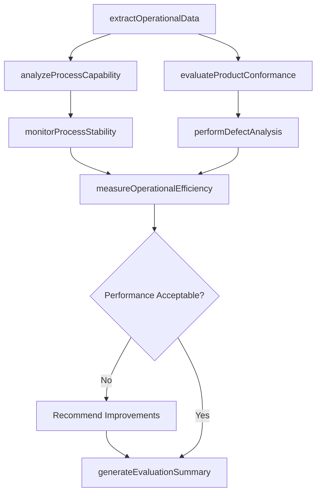
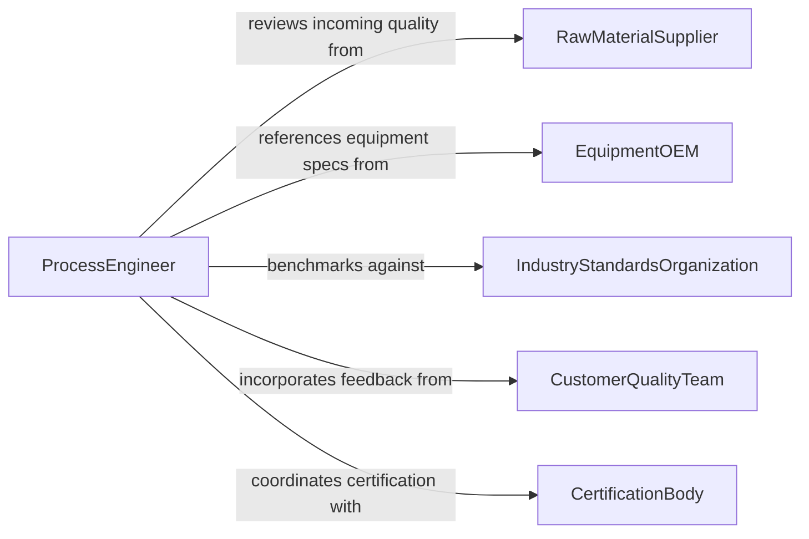

# Analyze Operational Data to Evaluate Operations, Processes, or Products

> Business-as-Code definition for analyzing operational data to evaluate operations, processes, or products. Models the systematic examination of production, quality, throughput, and yield data to assess how well operations, manufacturing processes, and products perform against specifications and standards.

## Overview

Analyzing operational data to evaluate operations, processes, or products involves extracting data from manufacturing execution systems, quality management platforms, and production databases, applying statistical process control and comparative analysis techniques, and generating evaluations that measure process capability, product conformance, and operational efficiency. This definition provides actions for data extraction, statistical analysis, conformance evaluation, and performance reporting. It supports production managers, quality assurance engineers, process engineers, and operations excellence leads.

## Actors

| Actor | Description |
|-------|-------------|
| RawMaterialSupplier | Provides incoming material quality data that affects process and product evaluation |
| EquipmentOEM | Supplies equipment performance specifications and diagnostic data |
| IndustryStandardsOrganization | Publishes quality and process standards used as evaluation benchmarks |
| CustomerQualityTeam | Reports product quality feedback and returns data from the field |
| CertificationBody | Conducts third-party evaluations of process and product compliance |
| LaboratoryService | Performs independent testing and analysis of product samples |

## Roles

| Role | Description |
|------|-------------|
| ProcessEngineer | Analyzes process data to identify capability gaps and optimization opportunities |
| QualityAssuranceEngineer | Evaluates product conformance data against specifications and standards |
| ProductionManager | Uses operational evaluations to adjust schedules, staffing, and resource allocation |
| OperationsExcellenceLead | Drives continuous improvement initiatives based on evaluation findings |
| DataAnalyst | Prepares and transforms operational data for statistical analysis |

## Entities

| Entity | Description |
|--------|-------------|
| ProcessCapabilityStudy | A statistical analysis of process variation relative to specification limits |
| ProductConformanceReport | An assessment of product attributes against defined quality specifications |
| OperationalEfficiencyMetric | A measure of resource utilization, throughput, or waste relative to targets |
| StatisticalControlChart | A time-series plot of process measurements with control limits for monitoring stability |
| YieldAnalysis | A calculation of good units produced relative to total units started |
| DefectPareto | A ranked analysis of defect types by frequency or cost impact |
| EvaluationSummary | A consolidated report of operational, process, and product performance findings |

## Actions

| Action | Description |
|--------|-------------|
| extractOperationalData | Gather production, quality, and throughput data from source systems |
| analyzeProcessCapability | Calculate Cp, Cpk, and other indices to assess process performance |
| evaluateProductConformance | Compare product measurements against specification limits and standards |
| measureOperationalEfficiency | Calculate throughput, utilization, and waste metrics against targets |
| performDefectAnalysis | Identify and rank defect types by frequency, severity, and cost |
| monitorProcessStability | Apply statistical control charts to detect process shifts and trends |
| generateEvaluationSummary | Produce a comprehensive assessment of operational and product performance |

## Events

| Event | Description |
|-------|-------------|
| operationalDataExtracted | Production, quality, and throughput data have been gathered |
| processCapabilityAnalyzed | Process performance indices have been calculated |
| productConformanceEvaluated | Product measurements have been compared against specifications |
| operationalEfficiencyMeasured | Throughput, utilization, and waste metrics have been calculated |
| defectAnalysisPerformed | Defect types have been ranked by frequency and cost |
| processStabilityMonitored | Statistical control charts have detected or confirmed process stability |
| evaluationSummaryGenerated | A comprehensive performance assessment has been produced |

## Searches

| Search | Description |
|--------|-------------|
| findCapabilityStudies | List process capability analyses by product line, process, or date |
| getConformanceReports | Retrieve product conformance evaluations by specification or batch |
| getEfficiencyMetrics | Access operational efficiency measures by facility, line, or period |
| getDefectAnalyses | View defect Pareto analyses by product, defect type, or severity |
| getControlCharts | Locate statistical control charts by process parameter or time range |

## Workflow



## Actor Relationships



## Usage

### Calling Actions

```typescript
import { analyzeOperationalDataEvaluateOperations } from '@headlessly/analyze-operational-data-evaluate-operations'

const analyst = analyzeOperationalDataEvaluateOperations()

// Extract and analyze
const evaluation = await analyst.extractOperationalData({
  sources: ['mes', 'quality-management-system', 'erp-production'],
  productLines: ['widget-assembly', 'component-fabrication'],
  period: { start: '2025-01-01', end: '2025-03-31' }
})

await analyst.analyzeProcessCapability({
  evaluationId: evaluation.id,
  parameters: ['dimension-tolerance', 'surface-finish', 'tensile-strength']
})

await analyst.evaluateProductConformance({
  evaluationId: evaluation.id,
  specifications: ['ISO-2768-fine', 'customer-spec-A1042']
})

// Measure and report
await analyst.performDefectAnalysis({ evaluationId: evaluation.id })
await analyst.monitorProcessStability({ evaluationId: evaluation.id })
await analyst.measureOperationalEfficiency({ evaluationId: evaluation.id })
await analyst.generateEvaluationSummary({ evaluationId: evaluation.id })
```

### Event-Driven Automation

```typescript
// Alert quality team on low process capability
analyst.processCapabilityAnalyzed(async ({ evaluationId, indices }) => {
  const substandard = indices.filter(i => i.cpk < 1.33)
  if (substandard.length > 0) {
    await notify({
      to: 'quality-engineering',
      message: `${substandard.length} process parameters below Cpk 1.33 threshold`
    })
  }
})

// Distribute evaluation summaries
analyst.evaluationSummaryGenerated(async ({ evaluationId, reportId }) => {
  await distribute({ reportId, recipients: ['production-manager', 'quality-director', 'operations-excellence'] })
})
```
