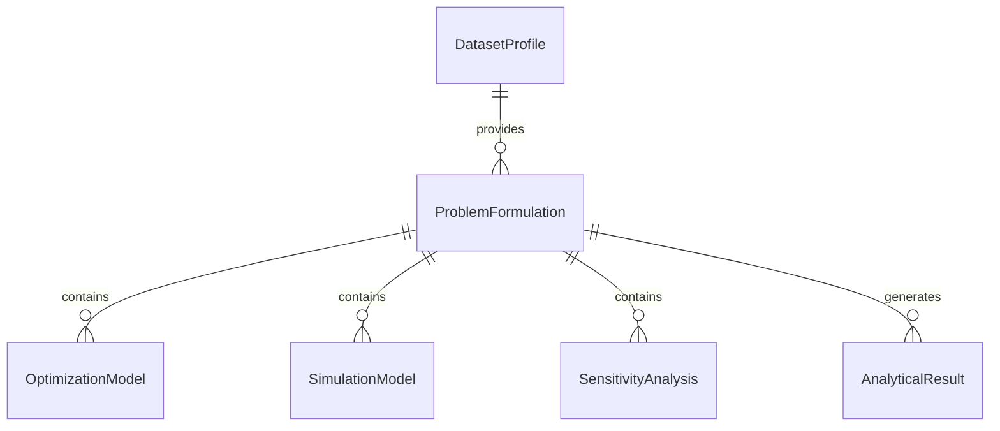
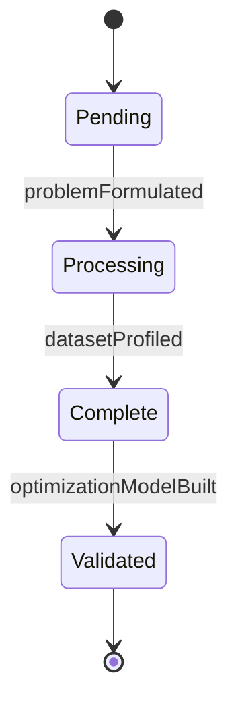
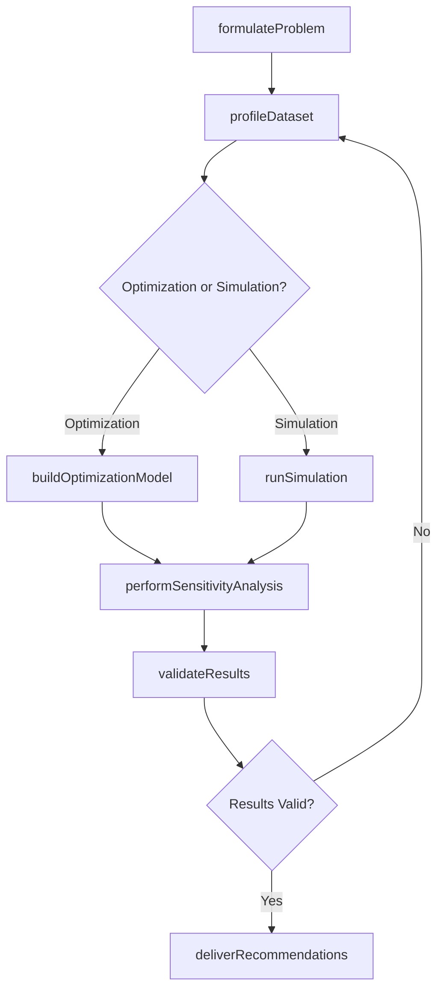
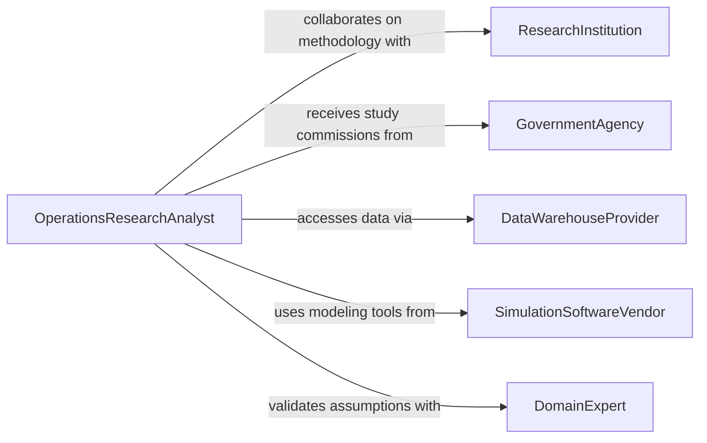

# Analyze Operational or Research Data

> Business-as-Code definition for analyzing operational or research data. Models the application of quantitative methods including optimization, simulation, queueing theory, and statistical modeling to operational and research datasets in order to improve resource allocation, system design, and strategic decision-making.

## Overview

Analyzing operational or research data involves applying operations research techniques such as linear programming, discrete event simulation, regression analysis, and Monte Carlo methods to datasets from production, logistics, healthcare, defense, and research environments, then translating analytical results into actionable recommendations for system improvement. This definition provides actions for problem formulation, model development, solution analysis, and recommendation delivery. It supports operations research analysts, management scientists, systems engineers, and research directors.

## Actors

| Actor | Description |
|-------|-------------|
| ResearchInstitution | Provides experimental datasets and collaborates on analytical methodology |
| GovernmentAgency | Commissions operational studies and provides public-sector operational data |
| DataWarehouseProvider | Supplies integrated data platforms for large-scale analytical workloads |
| SimulationSoftwareVendor | Provides modeling and simulation tools for operations research analysis |
| DomainExpert | Contributes subject-matter knowledge to validate model assumptions and results |
| FundingOrganization | Sponsors research initiatives and requires analytical deliverables |

## Roles

| Role | Description |
|------|-------------|
| OperationsResearchAnalyst | Formulates problems, builds quantitative models, and interprets solutions |
| ManagementScientist | Applies analytical methods to strategic management and organizational decisions |
| SystemsEngineer | Uses operational analysis to optimize complex system designs |
| ResearchDirector | Oversees research data analysis and ensures methodological rigor |
| StatisticalModeler | Develops and validates statistical models from operational and research data |

## Entities

| Entity | Description |
|--------|-------------|
| ProblemFormulation | A structured definition of the operational question, objectives, constraints, and variables |
| OptimizationModel | A mathematical model that maximizes or minimizes an objective function subject to constraints |
| SimulationModel | A computational representation of a system used to test scenarios and estimate outcomes |
| DatasetProfile | A statistical characterization of an operational or research dataset |
| SensitivityAnalysis | An evaluation of how model outputs change in response to variations in input parameters |
| AnalyticalResult | A quantified finding or solution produced by the operations research model |
| RecommendationReport | A document translating analytical results into actionable operational guidance |

## Actions

| Action | Description |
|--------|-------------|
| formulateProblem | Define the operational question, objectives, decision variables, and constraints |
| profileDataset | Characterize the structure, quality, and statistical properties of the input data |
| buildOptimizationModel | Construct a mathematical model to find optimal solutions for the formulated problem |
| runSimulation | Execute a simulation model to estimate system behavior under various scenarios |
| performSensitivityAnalysis | Evaluate how changes in key inputs affect model outputs and solution robustness |
| validateResults | Verify model outputs against historical data, expert judgment, or controlled experiments |
| deliverRecommendations | Present actionable findings and implementation guidance to stakeholders |

## Events

| Event | Description |
|-------|-------------|
| problemFormulated | The operational question, objectives, and constraints have been defined |
| datasetProfiled | Input data structure and statistical properties have been characterized |
| optimizationModelBuilt | A mathematical optimization model has been constructed |
| simulationCompleted | Simulation runs have been executed and results collected |
| sensitivityAnalysisPerformed | The impact of input variations on model outputs has been evaluated |
| resultsValidated | Model outputs have been verified against reference data or expert judgment |
| recommendationsDelivered | Actionable findings have been presented to stakeholders |

## Searches

| Search | Description |
|--------|-------------|
| findModels | List optimization or simulation models by problem type, domain, or date |
| getDatasetProfiles | Retrieve dataset characterizations by source, size, or quality score |
| getAnalyticalResults | Access model outputs by objective function value, scenario, or feasibility |
| getSensitivityAnalyses | View parameter sensitivity results by input variable or impact magnitude |
| getRecommendations | Locate recommendation reports by domain, priority, or implementation status |


## Entity Relationships



## State Diagram


## Workflow



## Actor Relationships



## Usage

### Calling Actions

```typescript
import { analyzeOperationalResearchData } from '@headlessly/analyze-operational-research-data'

const analyst = analyzeOperationalResearchData()

// Formulate and profile
const study = await analyst.formulateProblem({
  domain: 'logistics-network-design',
  objective: 'minimize-total-distribution-cost',
  constraints: ['service-level-98-percent', 'max-facilities-12', 'budget-cap-50M'],
  decisionVariables: ['facility-locations', 'allocation-volumes', 'transportation-modes']
})

await analyst.profileDataset({
  studyId: study.id,
  sources: ['shipment-history', 'facility-costs', 'demand-forecasts'],
  period: { start: '2022-01-01', end: '2025-12-31' }
})

// Build model and analyze
await analyst.buildOptimizationModel({
  studyId: study.id,
  technique: 'mixed-integer-linear-programming'
})

await analyst.performSensitivityAnalysis({
  studyId: study.id,
  parameters: ['demand-growth-rate', 'fuel-cost', 'facility-lease-cost']
})

// Validate and deliver
await analyst.validateResults({ studyId: study.id, method: 'historical-backtest' })
await analyst.deliverRecommendations({ studyId: study.id })
```

### Event-Driven Automation

```typescript
// Notify stakeholders when recommendations are ready
analyst.recommendationsDelivered(async ({ studyId, reportId, domain }) => {
  await notify({
    to: 'operations-leadership',
    message: `Operations research recommendations for ${domain} ready for review`
  })
})

// Alert on model validation failures
analyst.resultsValidated(async ({ studyId, validationScore, threshold }) => {
  if (validationScore < threshold) {
    await notify({
      to: 'analytics-team',
      message: `Model validation score ${validationScore} below threshold ${threshold} - review assumptions`
    })
  }
})
```
