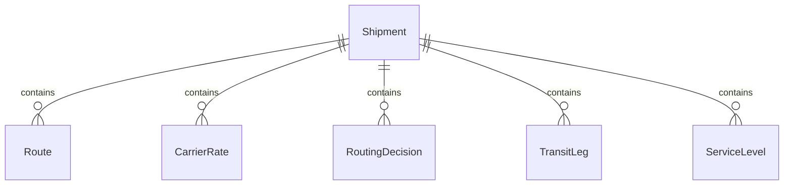
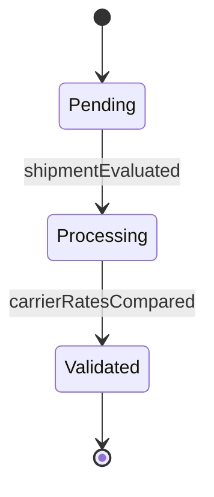
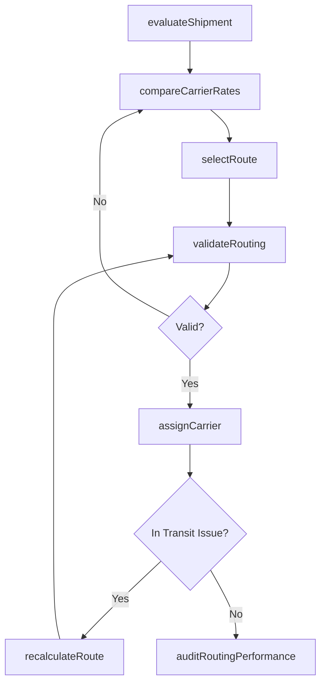
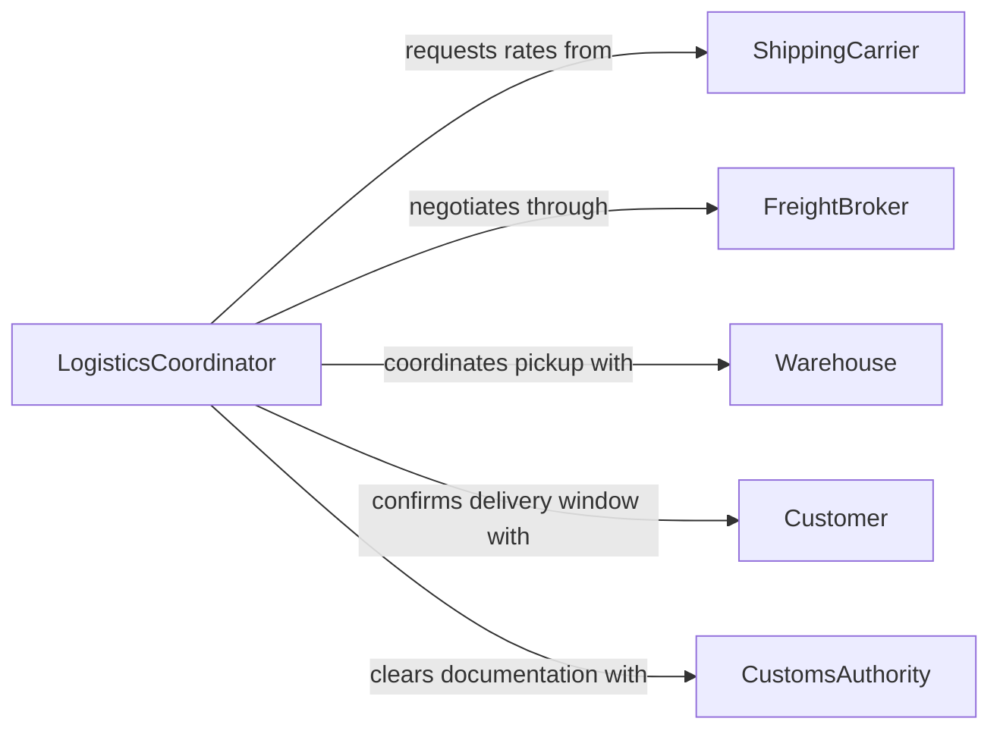

# Analyze Shipping Information Make Routing

> Business-as-Code definition for analyzing shipping information to make routing decisions. Models the process of evaluating shipment characteristics, carrier availability, and logistics constraints to determine optimal transport routes.

## Overview

Shipping routing analysis involves examining shipment details such as weight, dimensions, destination, delivery deadlines, and carrier capabilities to select the most cost-effective and timely transport routes. This process integrates real-time carrier rate data, transit time estimates, and service-level requirements to produce actionable routing recommendations. The definition exposes actions for route evaluation, events for shipment lifecycle tracking, and searches for historical routing performance.

## Actors

| Actor | Description |
|-------|-------------|
| ShippingCarrier | Provides transport services and publishes rate schedules |
| FreightBroker | Intermediary that connects shippers with available carriers |
| Warehouse | Origin facility that stages and releases shipments |
| Customer | Recipient who specifies delivery requirements and windows |
| CustomsAuthority | Government body that regulates cross-border shipments |

## Roles

| Role | Description |
|------|-------------|
| LogisticsCoordinator | Manages day-to-day routing decisions and carrier selection |
| ShippingAnalyst | Evaluates routing performance data and identifies optimization opportunities |
| TransportationManager | Oversees routing strategy and carrier relationship management |
| DispatchOperator | Executes routing assignments and coordinates pickup schedules |

## Entities

| Entity | Description |
|--------|-------------|
| Shipment | A package or freight consignment requiring transport |
| Route | A planned path from origin to destination with mode and carrier |
| CarrierRate | Pricing and transit time offered by a carrier for a lane |
| RoutingDecision | The selected route with justification and cost estimate |
| TransitLeg | A single segment within a multi-stop route |
| ServiceLevel | Delivery speed and handling requirements for a shipment |

## Actions

| Action | Description |
|--------|-------------|
| evaluateShipment | Assess shipment characteristics to determine routing constraints |
| compareCarrierRates | Retrieve and compare rates across available carriers for a lane |
| selectRoute | Choose the optimal route based on cost, time, and service criteria |
| validateRouting | Confirm the selected route meets delivery and compliance requirements |
| assignCarrier | Assign the chosen carrier and generate shipping documentation |
| recalculateRoute | Re-evaluate routing when conditions change mid-transit |
| auditRoutingPerformance | Review historical routing decisions against actual delivery outcomes |

## Events

| Event | Description |
|-------|-------------|
| shipmentEvaluated | Shipment characteristics have been assessed for routing |
| carrierRatesCompared | Rate comparison across carriers has been completed |
| routeSelected | An optimal route has been chosen for a shipment |
| routingValidated | The selected route has passed compliance and feasibility checks |
| carrierAssigned | A carrier has been assigned and documentation generated |
| routeRecalculated | Routing has been updated due to changed conditions |
| routingPerformanceAudited | Historical routing accuracy review is complete |

## Searches

| Search | Description |
|--------|-------------|
| findShipmentsByRoute | Retrieve shipments assigned to a specific route or lane |
| getCarrierRates | Look up current rates for a given origin-destination pair |
| getRoutingHistory | Retrieve past routing decisions and their delivery outcomes |
| findDelayedShipments | Identify shipments that missed their estimated delivery window |


## Entity Relationships



## State Diagram


## Workflow



## Actor Relationships



## Usage

### Calling Actions

```typescript
import { analyzeShippingInformationMakeRouting } from '@headlessly/analyze-shipping-information-make-routing'

const routing = analyzeShippingInformationMakeRouting()

// Evaluate a new shipment for routing
const evaluation = await routing.evaluateShipment({
  shipmentId: 'SHP-2026-04821',
  origin: 'Chicago, IL',
  destination: 'Miami, FL',
  weight: 2400,
  dimensions: { length: 48, width: 40, height: 48 },
  serviceLevel: 'standard',
  requiredDelivery: '2026-02-12'
})

// Compare carrier rates for the lane
const rates = await routing.compareCarrierRates({
  origin: evaluation.origin,
  destination: evaluation.destination,
  weight: evaluation.weight,
  serviceLevel: 'standard'
})

// Select the optimal route
const decision = await routing.selectRoute({
  shipmentId: 'SHP-2026-04821',
  candidates: rates.carriers,
  optimizeFor: 'cost'
})
```

### Event-Driven Automation

```typescript
// Alert when routing fails validation
routing.routingValidated(async ({ shipmentId, valid, issues }) => {
  if (!valid) {
    await notify({
      to: 'logistics-team',
      message: `Routing validation failed for ${shipmentId}: ${issues.join(', ')}`
    })
  }
})

// Trigger re-routing on transit delays
routing.carrierAssigned(async ({ shipmentId, carrier, estimatedDelivery }) => {
  monitorTransit(shipmentId, async (delay) => {
    if (delay.hours > 12) {
      await routing.recalculateRoute({ shipmentId, reason: 'transit-delay' })
    }
  })
})
```
