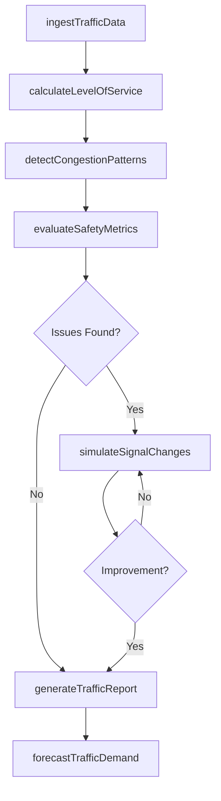
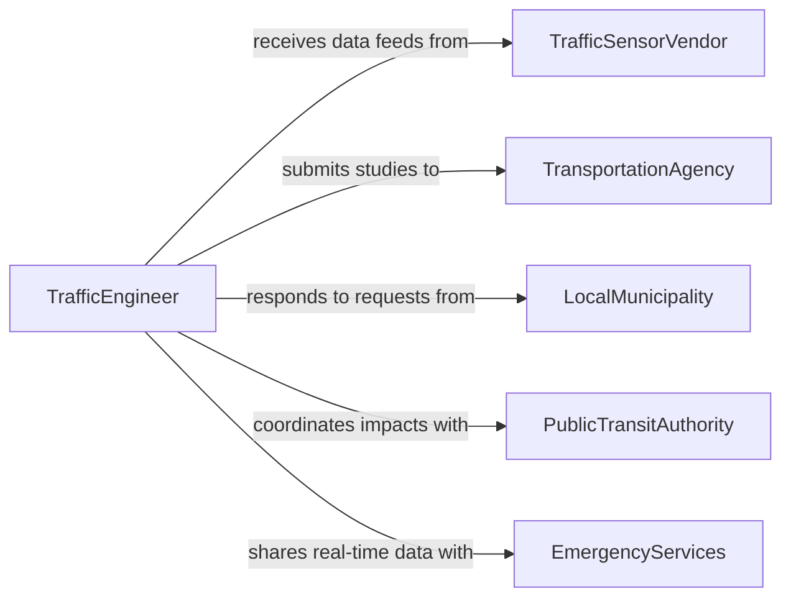

# Analyze Traffic Data

> Business-as-Code definition for analyzing traffic data. Models the collection, processing, and interpretation of vehicular and pedestrian traffic information to support transportation planning and safety improvements.

## Overview

Traffic data analysis involves collecting volume counts, speed measurements, and movement patterns from sensors, cameras, and other monitoring devices to evaluate roadway performance and identify congestion or safety issues. Analysts apply statistical methods and simulation models to forecast demand, assess intersection performance, and recommend signal timing or geometric improvements. This definition provides actions for data ingestion, pattern detection, and report generation, along with events for automated alerting on traffic anomalies.

## Actors

| Actor | Description |
|-------|-------------|
| TransportationAgency | Government body responsible for roadway planning and operations |
| TrafficSensorVendor | Supplier of detection hardware and raw traffic data feeds |
| LocalMunicipality | City or county government requesting traffic studies |
| PublicTransitAuthority | Agency managing bus and rail systems affected by road traffic |
| EmergencyServices | Fire, police, and EMS units requiring real-time traffic intelligence |

## Roles

| Role | Description |
|------|-------------|
| TrafficEngineer | Designs signal timing plans and geometric improvements based on data |
| TransportationPlanner | Uses traffic forecasts to guide long-range infrastructure investments |
| DataAnalyst | Processes raw sensor data and produces statistical summaries |
| FieldTechnician | Deploys and maintains traffic monitoring equipment |

## Entities

| Entity | Description |
|--------|-------------|
| TrafficCount | Volume measurement at a specific location over a time period |
| SpeedStudy | Recorded speed distribution data for a roadway segment |
| IntersectionAnalysis | Level-of-service evaluation for a signalized or unsignalized intersection |
| CrashRecord | Documented collision event with location, severity, and contributing factors |
| TrafficForecast | Projected future volumes based on growth models and land use changes |
| SignalTimingPlan | Configuration of traffic signal phases and cycle lengths |

## Actions

| Action | Description |
|--------|-------------|
| ingestTrafficData | Import raw counts, speeds, and classifications from sensors or manual studies |
| calculateLevelOfService | Compute intersection or corridor level-of-service grades |
| detectCongestionPatterns | Identify recurring bottlenecks and peak-hour delay patterns |
| forecastTrafficDemand | Project future volumes using growth rates and development data |
| evaluateSafetyMetrics | Analyze crash frequency and severity to identify high-risk locations |
| generateTrafficReport | Produce formatted study documents with findings and recommendations |
| simulateSignalChanges | Model the effects of proposed signal timing adjustments |

## Events

| Event | Description |
|-------|-------------|
| trafficDataIngested | Raw traffic data has been imported and validated |
| levelOfServiceCalculated | Intersection or segment performance grades are available |
| congestionPatternDetected | A recurring congestion bottleneck has been identified |
| trafficDemandForecasted | Future volume projections have been generated |
| safetyMetricsEvaluated | Crash analysis for a location is complete |
| trafficReportGenerated | A traffic study document has been finalized |
| signalChangeSimulated | Signal timing scenario modeling is complete |

## Searches

| Search | Description |
|--------|-------------|
| findTrafficCounts | Retrieve volume data by location, date range, or vehicle classification |
| getCrashRecords | Look up collision history for a corridor or intersection |
| getCongestedSegments | Identify roadway segments exceeding delay thresholds |
| getForecastsByArea | Retrieve traffic projections for a geographic planning area |

## Workflow



## Actor Relationships



## Usage

### Calling Actions

```typescript
import { analyzeTrafficData } from '@headlessly/analyze-traffic-data'

const traffic = analyzeTrafficData()

// Ingest sensor data for an intersection
const dataset = await traffic.ingestTrafficData({
  locationId: 'INT-0452',
  source: 'loop-detector',
  dateRange: { start: '2026-01-06', end: '2026-01-12' },
  interval: '15min'
})

// Calculate level of service
const los = await traffic.calculateLevelOfService({
  locationId: 'INT-0452',
  peakPeriod: 'PM',
  methodology: 'HCM-2022'
})

// Detect congestion patterns across a corridor
const patterns = await traffic.detectCongestionPatterns({
  corridor: 'US-41-North',
  dateRange: { start: '2026-01-01', end: '2026-01-31' },
  delayThreshold: 45
})
```

### Event-Driven Automation

```typescript
// Alert on newly detected congestion patterns
traffic.congestionPatternDetected(async ({ segmentId, peakDelay, frequency }) => {
  if (peakDelay > 60 && frequency > 3) {
    await notify({
      to: 'traffic-operations',
      message: `Recurring congestion on ${segmentId}: ${peakDelay}s delay, ${frequency} days/week`
    })
  }
})

// Auto-generate reports when safety analysis completes
traffic.safetyMetricsEvaluated(async ({ locationId, crashRate, severity }) => {
  if (crashRate > 2.5) {
    await traffic.generateTrafficReport({
      locationId,
      type: 'safety-study',
      priority: 'high'
    })
  }
})
```
