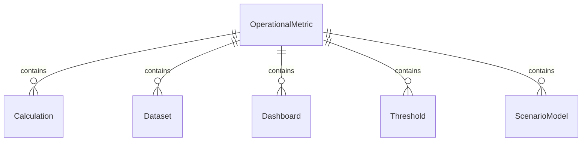
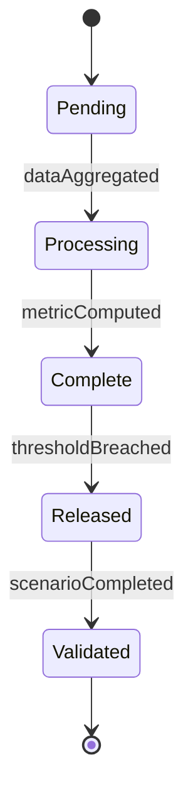
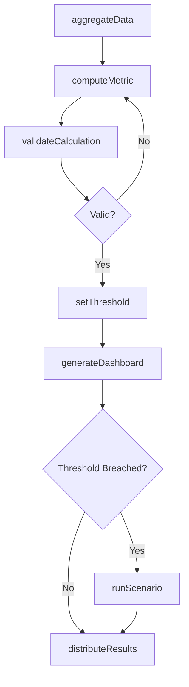
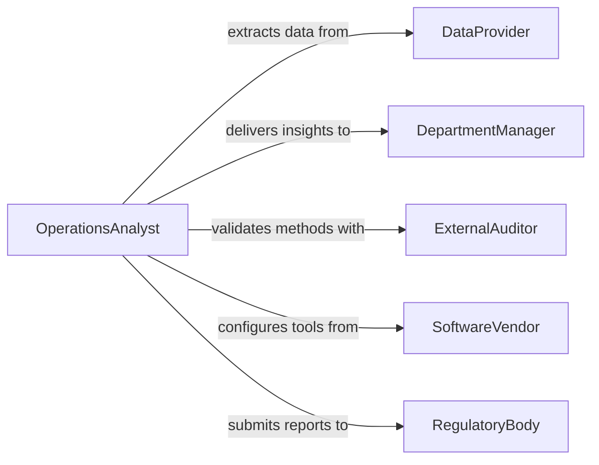

# Calculate Data Inform Organizational Operations

> Business-as-Code definition for calculating data to inform organizational operations. Models the quantitative analysis of operational metrics, resource utilization, and performance indicators that drive management decisions.

## Overview

Calculating data to inform organizational operations involves performing quantitative analyses on production volumes, staffing levels, resource consumption, and service metrics to produce actionable intelligence for decision-makers. Analysts aggregate data from multiple business systems, apply formulas and statistical methods, and present results as dashboards, scorecards, and reports. This definition exposes actions for metric computation, threshold monitoring, and scenario modeling to support continuous operational improvement.

## Actors

| Actor | Description |
|-------|-------------|
| DataProvider | Internal systems and databases that supply raw operational data |
| DepartmentManager | Business unit leader who consumes calculated metrics for decisions |
| ExternalAuditor | Independent reviewer who validates calculation accuracy and methodology |
| SoftwareVendor | Supplier of analytics platforms and business intelligence tools |
| RegulatoryBody | Authority requiring specific operational calculations for compliance |

## Roles

| Role | Description |
|------|-------------|
| OperationsAnalyst | Performs calculations and builds models from operational data |
| BusinessIntelligenceSpecialist | Designs dashboards and automated reporting pipelines |
| OperationsManager | Uses calculated results to adjust staffing, scheduling, and resources |
| QualityAssuranceReviewer | Validates calculation logic and data integrity |

## Entities

| Entity | Description |
|--------|-------------|
| OperationalMetric | A quantified measure of business performance such as throughput or cycle time |
| Calculation | A defined formula or procedure applied to raw data |
| Dataset | A structured collection of operational records used as calculation input |
| Dashboard | A visual display of key metrics and trends |
| Threshold | A boundary value that triggers alerts or escalations |
| ScenarioModel | A what-if analysis projecting outcomes under different assumptions |

## Actions

| Action | Description |
|--------|-------------|
| aggregateData | Collect and consolidate raw data from multiple operational sources |
| computeMetric | Apply formulas to produce a specific operational measurement |
| setThreshold | Define alert boundaries for a metric based on business rules |
| runScenario | Execute a what-if model with specified parameter variations |
| generateDashboard | Build or refresh a visual summary of calculated metrics |
| validateCalculation | Verify calculation accuracy against known benchmarks or audit standards |
| distributeResults | Deliver calculated outputs to stakeholders via reports or notifications |

## Events

| Event | Description |
|-------|-------------|
| dataAggregated | Raw operational data has been consolidated from all sources |
| metricComputed | A specific operational metric calculation is complete |
| thresholdBreached | A metric value has crossed its defined alert boundary |
| scenarioCompleted | A what-if analysis has finished producing projected outcomes |
| dashboardGenerated | A metrics dashboard has been built or refreshed |
| calculationValidated | Calculation logic and outputs have passed quality review |
| resultsDistributed | Calculated results have been delivered to stakeholders |

## Searches

| Search | Description |
|--------|-------------|
| findMetrics | Retrieve operational metrics by type, department, or date range |
| getThresholdAlerts | List metrics currently exceeding their defined thresholds |
| getScenarioResults | Retrieve projected outcomes from completed what-if analyses |
| getCalculationHistory | Look up past calculations and their input parameters |


## Entity Relationships



## State Diagram


## Workflow



## Actor Relationships



## Usage

### Calling Actions

```typescript
import { calculateDataInformOrganizationalOperations } from '@headlessly/calculate-data-inform-organizational-operations'

const ops = calculateDataInformOrganizationalOperations()

// Aggregate data from production systems
const dataset = await ops.aggregateData({
  sources: ['erp', 'wms', 'hr-system'],
  dateRange: { start: '2026-01-01', end: '2026-01-31' },
  department: 'Manufacturing'
})

// Compute throughput metric
const metric = await ops.computeMetric({
  datasetId: dataset.id,
  formula: 'unitsProduced / laborHours',
  name: 'Labor Productivity',
  unit: 'units/hour'
})

// Run a what-if scenario
const scenario = await ops.runScenario({
  baseMetric: metric.id,
  parameters: [
    { name: 'laborHours', change: '+10%' },
    { name: 'machineUptime', change: '+5%' }
  ]
})
```

### Event-Driven Automation

```typescript
// Alert when a metric breaches its threshold
ops.thresholdBreached(async ({ metricName, value, threshold, department }) => {
  await notify({
    to: `${department}-managers`,
    message: `${metricName} at ${value} has exceeded threshold of ${threshold}`
  })
})

// Auto-distribute dashboard when metrics are refreshed
ops.dashboardGenerated(async ({ dashboardId, metrics }) => {
  await ops.distributeResults({
    dashboardId,
    recipients: ['operations-leadership', 'finance-team'],
    format: 'pdf'
  })
})
```
