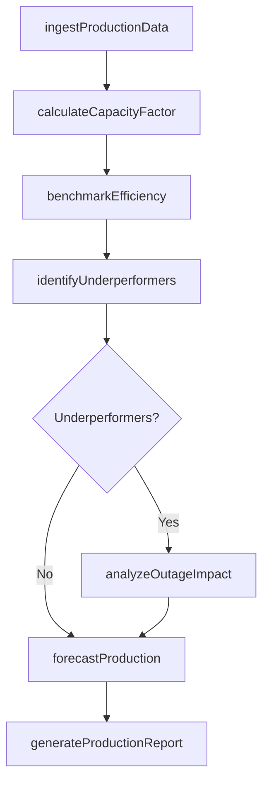
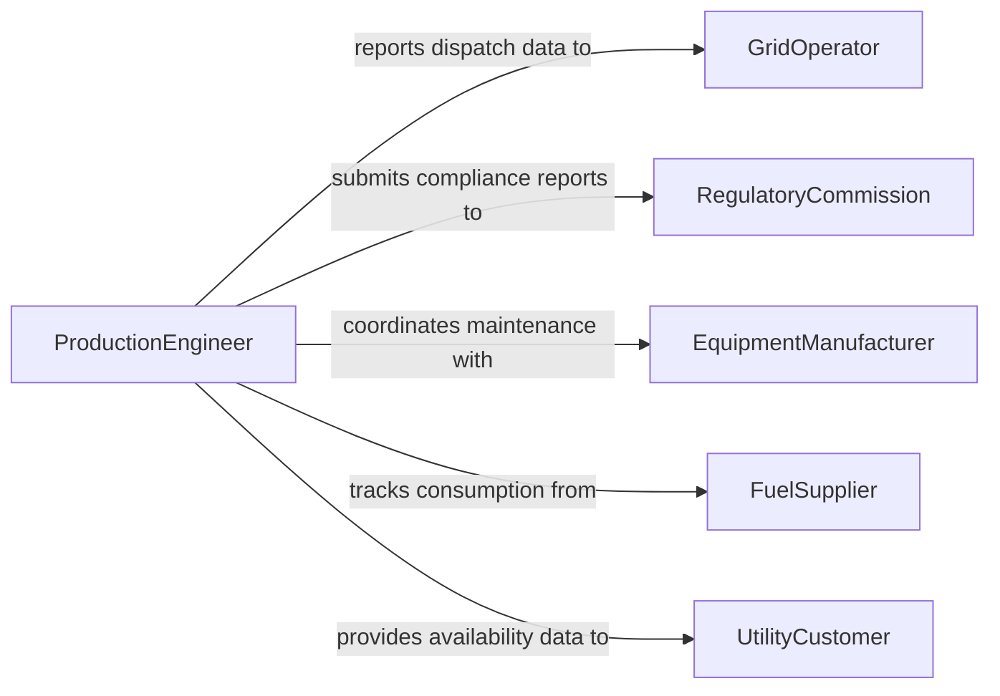

# Evaluate Energy Production Data

> Business-as-Code definition for evaluating energy production data. Models the analysis of generation output, capacity utilization, and efficiency metrics across power plants and renewable energy facilities.

## Overview

Evaluating energy production data involves reviewing generation output, fuel consumption, equipment availability, and capacity factors to assess how effectively energy facilities are performing. Engineers and analysts compare actual production against forecasted output, identify underperforming assets, and recommend maintenance or operational adjustments to improve yield. This definition provides actions for production assessment, efficiency benchmarking, and outage impact analysis across conventional and renewable energy sources.

## Actors

| Actor | Description |
|-------|-------------|
| GridOperator | Independent system operator that manages transmission and dispatch |
| RegulatoryCommission | Government authority overseeing energy production standards and reporting |
| EquipmentManufacturer | Supplier of turbines, inverters, and generation equipment |
| FuelSupplier | Provider of natural gas, coal, or other input fuels |
| UtilityCustomer | End consumer or distribution company purchasing generated power |

## Roles

| Role | Description |
|------|-------------|
| ProductionEngineer | Monitors generation output and optimizes plant performance |
| EnergyAnalyst | Analyzes production trends and prepares performance reports |
| PlantManager | Oversees facility operations and makes resource allocation decisions |
| MaintenancePlanner | Schedules equipment maintenance based on production and reliability data |

## Entities

| Entity | Description |
|--------|-------------|
| GenerationUnit | A specific turbine, solar array, or other power-producing asset |
| ProductionRecord | Timestamped output measurement from a generation unit |
| CapacityFactor | Ratio of actual output to maximum possible output over a period |
| OutageEvent | A planned or unplanned period when a generation unit is offline |
| FuelConsumption | Volume of fuel used by a generation unit during a production period |
| EfficiencyBenchmark | Target performance standard for a generation technology type |

## Actions

| Action | Description |
|--------|-------------|
| ingestProductionData | Import generation output and fuel consumption records from SCADA systems |
| calculateCapacityFactor | Compute capacity utilization ratios for generation units |
| benchmarkEfficiency | Compare unit performance against industry standards and historical baselines |
| analyzeOutageImpact | Quantify lost production and revenue from planned and unplanned outages |
| forecastProduction | Project future generation based on weather, demand, and maintenance schedules |
| identifyUnderperformers | Flag generation units operating below expected output thresholds |
| generateProductionReport | Produce periodic performance summaries for management and regulators |

## Events

| Event | Description |
|-------|-------------|
| productionDataIngested | Generation and fuel data have been imported and validated |
| capacityFactorCalculated | Capacity utilization metrics are available for review |
| efficiencyBenchmarked | Unit performance has been compared against standards |
| outageImpactAnalyzed | Production losses from outages have been quantified |
| productionForecasted | Future generation projections have been generated |
| underperformerIdentified | A generation unit has been flagged for below-threshold performance |
| productionReportGenerated | A performance report has been finalized and distributed |

## Searches

| Search | Description |
|--------|-------------|
| findProductionRecords | Retrieve generation output by unit, fuel type, or date range |
| getOutageHistory | Look up planned and unplanned outage events for a facility |
| getCapacityFactors | Retrieve capacity utilization metrics by unit or plant |
| findUnderperformingUnits | List generation units below their efficiency benchmarks |

## Workflow



## Actor Relationships



## Usage

### Calling Actions

```typescript
import { evaluateEnergyProductionData } from '@headlessly/evaluate-energy-production-data'

const energy = evaluateEnergyProductionData()

// Ingest SCADA data for a wind farm
const dataset = await energy.ingestProductionData({
  facilityId: 'WF-RIDGE-04',
  source: 'scada',
  dateRange: { start: '2026-01-01', end: '2026-01-31' },
  units: ['WT-01', 'WT-02', 'WT-03', 'WT-04']
})

// Calculate capacity factors
const factors = await energy.calculateCapacityFactor({
  facilityId: 'WF-RIDGE-04',
  period: '2026-01',
  ratedCapacity: { 'WT-01': 3.0, 'WT-02': 3.0, 'WT-03': 3.0, 'WT-04': 3.0 }
})

// Benchmark against industry standards
const benchmark = await energy.benchmarkEfficiency({
  facilityId: 'WF-RIDGE-04',
  technology: 'onshore-wind',
  region: 'Midwest'
})
```

### Event-Driven Automation

```typescript
// Alert when underperforming units are detected
energy.underperformerIdentified(async ({ unitId, capacityFactor, benchmark }) => {
  await notify({
    to: 'plant-operations',
    message: `${unitId} capacity factor ${capacityFactor}% is below benchmark of ${benchmark}%`
  })
})

// Auto-generate reports at end of production period
energy.capacityFactorCalculated(async ({ facilityId, period }) => {
  await energy.generateProductionReport({
    facilityId,
    period,
    recipients: ['management', 'regulatory-compliance']
  })
})
```
