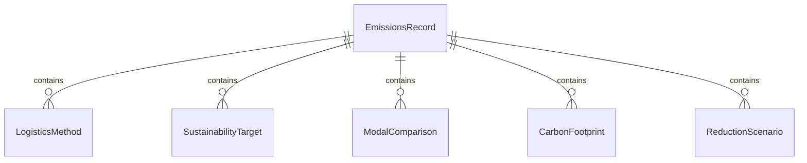
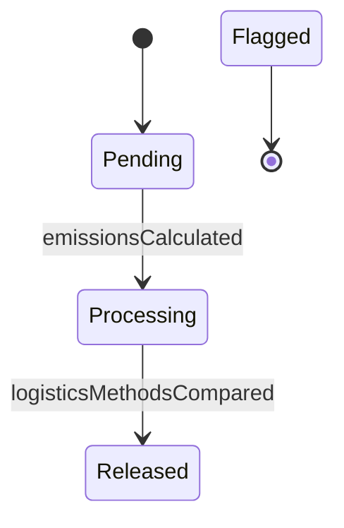
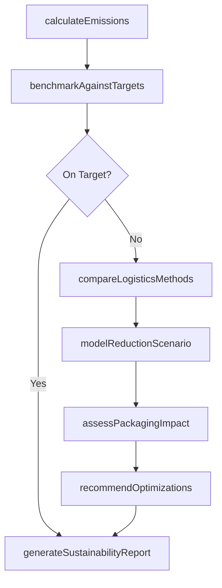
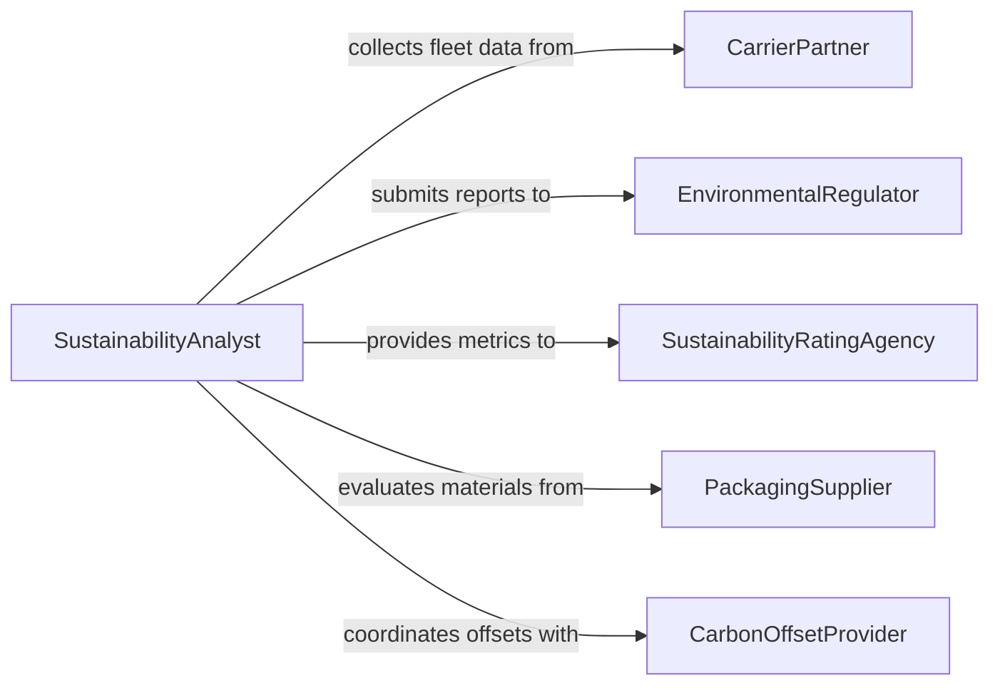

# Evaluate Logistics Methods Reduce Environmental

> Business-as-Code definition for evaluating logistics methods to reduce environmental impact. Models the assessment of supply chain transportation, warehousing, and distribution practices against sustainability targets.

## Overview

Evaluating logistics methods for environmental impact reduction involves analyzing carbon emissions, fuel consumption, packaging waste, and modal split across the supply chain to identify greener alternatives. Analysts benchmark current practices against sustainability targets, model the effects of route optimization, mode shifting, and fleet electrification, and produce recommendations for reducing the environmental footprint. This definition provides actions for emissions calculation, alternative method comparison, and sustainability reporting to support corporate environmental goals.

## Actors

| Actor | Description |
|-------|-------------|
| CarrierPartner | Transportation provider whose fleet emissions are being evaluated |
| EnvironmentalRegulator | Government agency enforcing emissions standards and reporting requirements |
| SustainabilityRatingAgency | Third-party organization scoring corporate environmental performance |
| PackagingSupplier | Vendor providing packaging materials with varying environmental profiles |
| CarbonOffsetProvider | Organization selling verified carbon credits for emissions mitigation |

## Roles

| Role | Description |
|------|-------------|
| SustainabilityAnalyst | Evaluates logistics emissions data and models reduction scenarios |
| SupplyChainManager | Oversees logistics operations and implements green logistics changes |
| EnvironmentalComplianceOfficer | Ensures logistics practices meet regulatory emissions standards |
| FleetManager | Manages vehicle operations and evaluates alternative fuel options |

## Entities

| Entity | Description |
|--------|-------------|
| EmissionsRecord | Calculated greenhouse gas output for a logistics activity or route |
| LogisticsMethod | A specific transportation mode, route, or distribution approach |
| SustainabilityTarget | A defined goal for emissions reduction over a specific timeframe |
| ModalComparison | Side-by-side evaluation of transport modes on environmental criteria |
| CarbonFootprint | Total emissions attributed to a product, shipment, or supply chain segment |
| ReductionScenario | A modeled outcome showing projected emissions under proposed changes |

## Actions

| Action | Description |
|--------|-------------|
| calculateEmissions | Compute greenhouse gas output for logistics activities using emission factors |
| compareLogisticsMethods | Evaluate environmental performance of alternative transport and distribution options |
| modelReductionScenario | Simulate emissions impact of proposed logistics changes |
| assessPackagingImpact | Evaluate environmental footprint of current and alternative packaging materials |
| benchmarkAgainstTargets | Compare current emissions against corporate sustainability goals |
| generateSustainabilityReport | Produce compliance and progress reports on logistics emissions reduction |
| recommendOptimizations | Identify and prioritize logistics changes with the greatest environmental benefit |

## Events

| Event | Description |
|-------|-------------|
| emissionsCalculated | Greenhouse gas output for a logistics activity has been quantified |
| logisticsMethodsCompared | Environmental comparison of alternative methods is complete |
| reductionScenarioModeled | Projected emissions under proposed changes are available |
| packagingImpactAssessed | Environmental footprint of packaging options has been evaluated |
| targetsBenchmarked | Current emissions have been compared against sustainability goals |
| sustainabilityReportGenerated | An environmental logistics report has been finalized |
| optimizationsRecommended | Prioritized list of green logistics improvements has been produced |

## Searches

| Search | Description |
|--------|-------------|
| findEmissionsRecords | Retrieve emissions data by route, carrier, or time period |
| getMethodComparisons | Look up completed environmental evaluations of logistics alternatives |
| getSustainabilityProgress | Track cumulative emissions reduction against targets over time |
| findHighEmissionsRoutes | Identify logistics routes with the largest carbon footprint |


## Entity Relationships



## State Diagram


## Workflow



## Actor Relationships



## Usage

### Calling Actions

```typescript
import { evaluateLogisticsMethodsReduceEnvironmental } from '@headlessly/evaluate-logistics-methods-reduce-environmental'

const greenLogistics = evaluateLogisticsMethodsReduceEnvironmental()

// Calculate emissions for current logistics operations
const emissions = await greenLogistics.calculateEmissions({
  scope: 'outbound-distribution',
  dateRange: { start: '2026-01-01', end: '2026-03-31' },
  carriers: ['carrier-a', 'carrier-b'],
  emissionFactorSource: 'EPA-2025'
})

// Compare alternative logistics methods
const comparison = await greenLogistics.compareLogisticsMethods({
  route: 'Los Angeles to Seattle',
  methods: ['truck-ftl', 'rail-intermodal', 'truck-ltl-consolidated'],
  metrics: ['co2e', 'fuel-consumption', 'cost-per-unit']
})

// Model a reduction scenario
const scenario = await greenLogistics.modelReductionScenario({
  baseline: emissions.id,
  changes: [
    { method: 'shift-20pct-to-rail', routes: ['LA-SEA', 'LA-PDX'] },
    { method: 'electric-last-mile', zones: ['urban-seattle'] }
  ]
})
```

### Event-Driven Automation

```typescript
// Alert when emissions exceed sustainability targets
greenLogistics.targetsBenchmarked(async ({ scope, actual, target, gap }) => {
  if (gap > 0) {
    await notify({
      to: 'sustainability-team',
      message: `${scope} emissions ${actual} tCO2e exceed target of ${target} tCO2e by ${gap} tCO2e`
    })
  }
})

// Auto-generate quarterly sustainability report
greenLogistics.emissionsCalculated(async ({ scope, period }) => {
  if (isQuarterEnd(period)) {
    await greenLogistics.generateSustainabilityReport({
      scope,
      period,
      recipients: ['cso', 'board-esg-committee']
    })
  }
})
```
