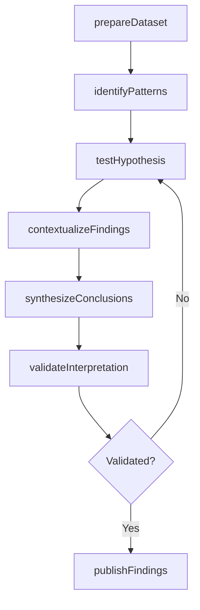
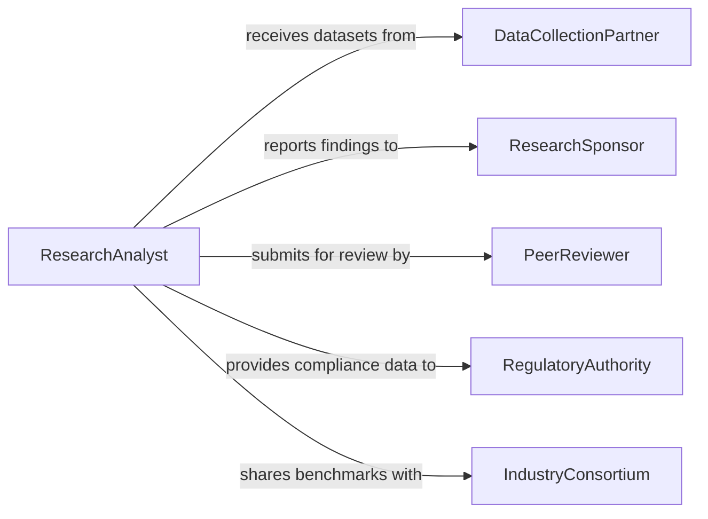

# Interpret Research Operational Data

> Business-as-Code definition for interpreting research or operational data. Models the process of translating raw research findings and operational datasets into meaningful conclusions that guide organizational strategy.

## Overview

Interpreting research or operational data involves examining experimental results, survey findings, field observations, and performance datasets to extract patterns, validate hypotheses, and draw conclusions that inform business or scientific decisions. Analysts apply statistical tests, contextualize findings against existing literature or benchmarks, and synthesize results into actionable recommendations. This definition provides actions for data interpretation, significance testing, and findings dissemination to support evidence-based decision-making.

## Actors

| Actor | Description |
|-------|-------------|
| ResearchSponsor | Organization or agency funding the research and expecting actionable findings |
| PeerReviewer | External subject matter expert who validates interpretation methodology |
| DataCollectionPartner | Field team or laboratory that produces raw datasets for interpretation |
| RegulatoryAuthority | Government body that may require specific data interpretations for compliance |
| IndustryConsortium | Group of organizations sharing benchmarking data for comparative analysis |

## Roles

| Role | Description |
|------|-------------|
| ResearchAnalyst | Applies statistical methods and domain expertise to interpret data |
| PrincipalInvestigator | Leads the research effort and validates final conclusions |
| OperationsDirector | Consumes interpreted findings to make strategic operational decisions |
| DataScientist | Builds models and applies advanced analytics to support interpretation |

## Entities

| Entity | Description |
|--------|-------------|
| Dataset | A structured collection of research or operational observations |
| StatisticalTest | A mathematical procedure used to evaluate hypotheses against data |
| Finding | A validated conclusion drawn from data interpretation |
| Hypothesis | A proposed explanation to be tested against the data |
| InterpretationReport | A document presenting findings, methodology, and recommendations |
| Benchmark | A reference standard used for comparative interpretation |

## Actions

| Action | Description |
|--------|-------------|
| prepareDataset | Clean, transform, and structure raw data for analysis |
| testHypothesis | Apply statistical tests to evaluate proposed explanations against data |
| identifyPatterns | Detect trends, correlations, and anomalies in the dataset |
| contextualizeFindings | Compare results against benchmarks, literature, or historical data |
| synthesizeConclusions | Combine multiple findings into coherent actionable recommendations |
| validateInterpretation | Submit interpretation for peer review or quality assurance |
| publishFindings | Distribute the interpretation report to stakeholders |

## Events

| Event | Description |
|-------|-------------|
| datasetPrepared | Raw data has been cleaned and structured for analysis |
| hypothesisTested | Statistical evaluation of a hypothesis is complete |
| patternsIdentified | Trends or anomalies in the data have been detected |
| findingsContextualized | Results have been compared against relevant benchmarks |
| conclusionsSynthesized | Actionable recommendations have been formulated from findings |
| interpretationValidated | Peer review or quality check of the interpretation is complete |
| findingsPublished | The interpretation report has been distributed to stakeholders |

## Searches

| Search | Description |
|--------|-------------|
| findDatasets | Retrieve datasets by research project, date range, or data source |
| getFindings | Look up validated findings by topic, significance level, or project |
| getBenchmarks | Retrieve relevant benchmarks for comparative interpretation |
| getInterpretationHistory | Access past interpretation reports and their conclusions |

## Workflow



## Actor Relationships



## Usage

### Calling Actions

```typescript
import { interpretResearchOperationalData } from '@headlessly/interpret-research-operational-data'

const research = interpretResearchOperationalData()

// Prepare a dataset for interpretation
const dataset = await research.prepareDataset({
  projectId: 'PRJ-2026-0087',
  source: 'field-observations',
  cleaningRules: ['remove-nulls', 'normalize-units', 'flag-outliers'],
  outputFormat: 'tabular'
})

// Test a hypothesis
const result = await research.testHypothesis({
  datasetId: dataset.id,
  hypothesis: 'Process modification reduces defect rate by at least 15%',
  test: 'two-sample-t-test',
  confidenceLevel: 0.95
})

// Synthesize conclusions from multiple findings
const conclusions = await research.synthesizeConclusions({
  projectId: 'PRJ-2026-0087',
  findings: [result.findingId, 'FND-0042', 'FND-0043'],
  context: 'manufacturing-process-improvement'
})
```

### Event-Driven Automation

```typescript
// Notify stakeholders when significant findings are validated
research.interpretationValidated(async ({ projectId, findings, significance }) => {
  const significant = findings.filter(f => f.pValue < 0.05)
  if (significant.length > 0) {
    await notify({
      to: 'research-leadership',
      message: `Project ${projectId}: ${significant.length} statistically significant findings validated`
    })
  }
})

// Auto-publish when conclusions are synthesized
research.conclusionsSynthesized(async ({ projectId, recommendations }) => {
  await research.publishFindings({
    projectId,
    format: 'executive-summary',
    recipients: ['operations-director', 'research-sponsor']
  })
})
```
