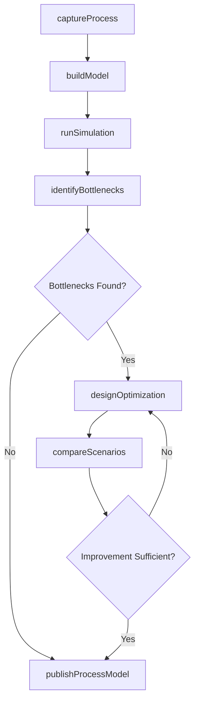
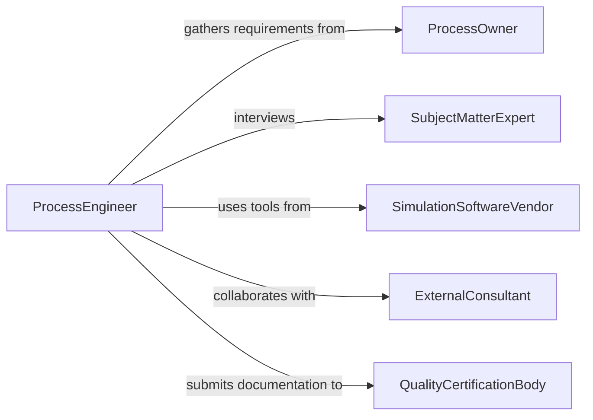

# Model Operational Processes

> Business-as-Code definition for modeling operational processes. Covers the creation, simulation, and optimization of process models that represent how work flows through an organization.

## Overview

Modeling operational processes involves creating formal representations of business workflows, manufacturing sequences, and service delivery procedures to understand throughput, identify bottlenecks, and test improvement scenarios before implementation. Analysts use process mapping, discrete-event simulation, and queuing theory to quantify cycle times, resource utilization, and capacity constraints. This definition provides actions for process capture, simulation execution, and optimization analysis to support continuous improvement initiatives.

## Actors

| Actor | Description |
|-------|-------------|
| ProcessOwner | Business stakeholder responsible for the process being modeled |
| SubjectMatterExpert | Individual with deep knowledge of actual process steps and variations |
| SimulationSoftwareVendor | Provider of process modeling and simulation tools |
| ExternalConsultant | Third-party specialist engaged for complex process redesign |
| QualityCertificationBody | Organization that audits process documentation for standards compliance |

## Roles

| Role | Description |
|------|-------------|
| ProcessEngineer | Designs and builds formal process models from observations and data |
| SimulationAnalyst | Configures and runs simulation experiments on process models |
| ContinuousImprovementManager | Prioritizes process optimization initiatives based on model findings |
| OperationsResearcher | Applies mathematical optimization techniques to process constraints |

## Entities

| Entity | Description |
|--------|-------------|
| ProcessModel | A formal representation of a workflow including steps, decisions, and resources |
| SimulationRun | An execution of the process model with specific input parameters |
| Bottleneck | A constraint point where throughput is limited by capacity or resources |
| CycleTime | The total elapsed time from process start to completion |
| ResourcePool | A set of workers, machines, or tools available for process steps |
| OptimizationScenario | A proposed process change evaluated through simulation |

## Actions

| Action | Description |
|--------|-------------|
| captureProcess | Document current-state process steps, decision points, and resource requirements |
| buildModel | Create a formal simulation-ready model from captured process data |
| runSimulation | Execute the model with specified parameters to project performance metrics |
| identifyBottlenecks | Analyze simulation results to locate capacity constraints |
| designOptimization | Create alternative process configurations to address identified constraints |
| compareScenarios | Evaluate multiple optimization scenarios against baseline performance |
| publishProcessModel | Release the validated process model for organizational use |

## Events

| Event | Description |
|-------|-------------|
| processCaptured | Current-state process documentation has been completed |
| modelBuilt | A simulation-ready process model has been created |
| simulationCompleted | A simulation run has finished producing performance metrics |
| bottleneckIdentified | A capacity constraint in the process has been located |
| optimizationDesigned | An alternative process configuration has been created |
| scenariosCompared | Multiple process scenarios have been evaluated against baseline |
| processModelPublished | The validated process model has been released for use |

## Searches

| Search | Description |
|--------|-------------|
| findProcessModels | Retrieve models by process name, department, or creation date |
| getSimulationResults | Look up performance metrics from completed simulation runs |
| getBottlenecks | List identified constraints across active process models |
| getOptimizationScenarios | Retrieve proposed process improvements and their projected impacts |

## Workflow



## Actor Relationships



## Usage

### Calling Actions

```typescript
import { modelOperationalProcesses } from '@headlessly/model-operational-processes'

const processes = modelOperationalProcesses()

// Capture the current order fulfillment process
const capture = await processes.captureProcess({
  name: 'Order Fulfillment',
  department: 'Warehouse Operations',
  steps: [
    { name: 'Order Receipt', duration: { avg: 2, unit: 'min' } },
    { name: 'Pick Items', duration: { avg: 12, unit: 'min' }, resources: ['picker'] },
    { name: 'Pack Shipment', duration: { avg: 8, unit: 'min' }, resources: ['packer'] },
    { name: 'Ship Order', duration: { avg: 3, unit: 'min' }, resources: ['dock-worker'] }
  ]
})

// Build a simulation model
const model = await processes.buildModel({
  processId: capture.id,
  resourcePools: [
    { name: 'picker', count: 5 },
    { name: 'packer', count: 3 },
    { name: 'dock-worker', count: 2 }
  ],
  arrivalRate: { ordersPerHour: 40 }
})

// Run the simulation
const results = await processes.runSimulation({
  modelId: model.id,
  duration: { value: 8, unit: 'hours' },
  replications: 100
})
```

### Event-Driven Automation

```typescript
// Alert when bottlenecks are identified
processes.bottleneckIdentified(async ({ modelName, step, utilization }) => {
  await notify({
    to: 'operations-improvement',
    message: `Bottleneck in ${modelName} at "${step}": ${utilization}% utilization`
  })
})

// Auto-publish models when optimization meets targets
processes.scenariosCompared(async ({ modelId, bestScenario, improvement }) => {
  if (improvement.throughput > 20) {
    await processes.publishProcessModel({
      modelId,
      scenario: bestScenario.id,
      status: 'recommended'
    })
  }
})
```
