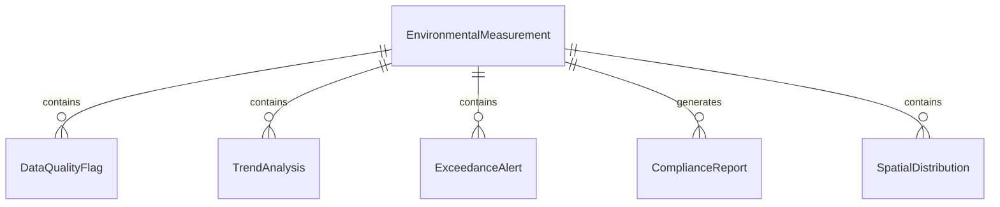
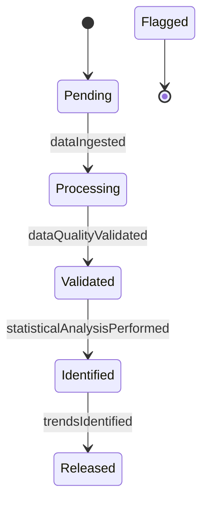
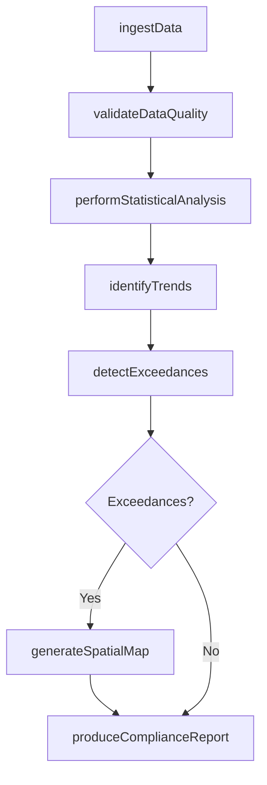
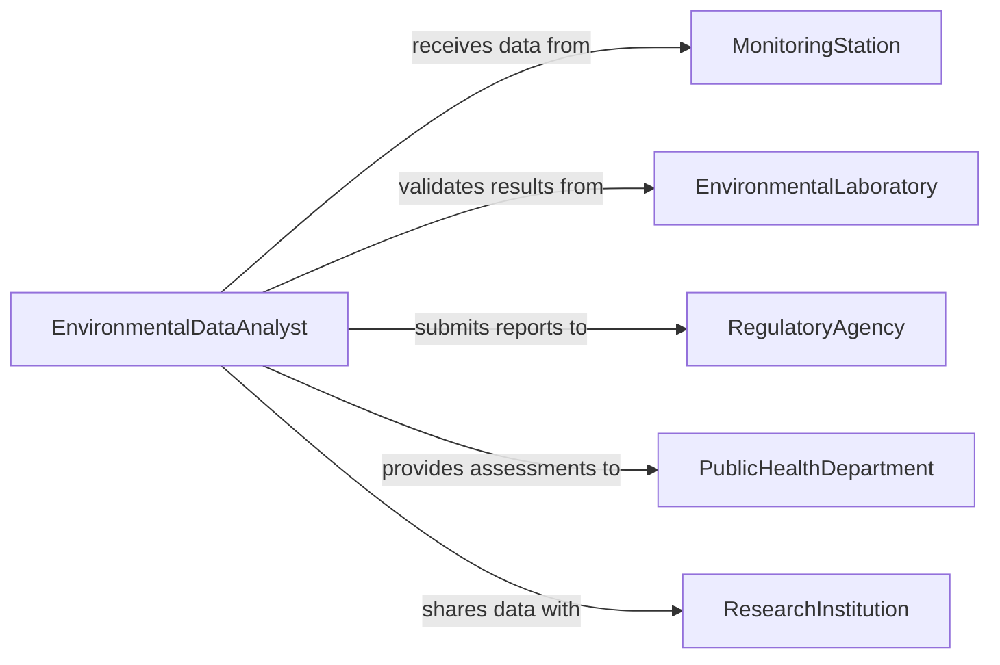

# Analyze Environmental Data

> Business-as-Code definition for analyzing environmental data. Models the processing and interpretation of air quality measurements, water quality samples, soil contamination levels, noise monitoring data, and ecological survey results to assess environmental conditions and support regulatory decisions.

## Overview

Analyzing environmental data involves processing measurements from air quality monitors, water sampling stations, soil test kits, noise meters, and ecological field surveys to characterize environmental conditions, identify contamination, track trends, and support compliance reporting. This definition provides actions for data ingestion, quality assurance, statistical analysis, trend identification, and report generation. It supports environmental scientists, data analysts, regulatory compliance teams, and public health departments.

## Actors

| Actor | Description |
|-------|-------------|
| MonitoringStation | Collects raw environmental measurements from field instruments |
| EnvironmentalLaboratory | Performs analytical testing on environmental samples |
| RegulatoryAgency | Sets environmental quality standards and receives compliance data |
| PublicHealthDepartment | Uses environmental data to assess community health risks |
| ResearchInstitution | Conducts environmental studies using analyzed data |

## Roles

| Role | Description |
|------|-------------|
| EnvironmentalDataAnalyst | Processes and interprets environmental monitoring data |
| QualityAssuranceSpecialist | Validates data integrity and applies quality control procedures |
| StatisticalModeler | Applies statistical methods to identify trends and patterns |
| EnvironmentalReportingOfficer | Prepares regulatory compliance reports from analyzed data |

## Entities

| Entity | Description |
|--------|-------------|
| EnvironmentalMeasurement | A data point from a monitoring instrument or laboratory analysis |
| DataQualityFlag | An indicator of the reliability or validity of a measurement |
| TrendAnalysis | A statistical assessment of environmental conditions over time |
| ExceedanceAlert | A notification that a measurement exceeds a regulatory threshold |
| ComplianceReport | A document summarizing environmental data for regulatory submission |
| SpatialDistribution | A geographic representation of environmental conditions |
| BaselineAssessment | A characterization of environmental conditions before an activity |

## Actions

| Action | Description |
|--------|-------------|
| ingestData | Import raw environmental measurements from monitoring sources |
| validateDataQuality | Apply quality assurance checks and flag suspect measurements |
| performStatisticalAnalysis | Calculate summary statistics, correlations, and distributions |
| identifyTrends | Detect temporal patterns and changes in environmental conditions |
| detectExceedances | Compare measurements against regulatory thresholds |
| generateSpatialMap | Create geographic visualizations of environmental conditions |
| produceComplianceReport | Compile analyzed data into regulatory reporting formats |

## Events

| Event | Description |
|-------|-------------|
| dataIngested | Raw environmental measurements have been imported |
| dataQualityValidated | Quality assurance checks have been applied to measurements |
| statisticalAnalysisPerformed | Summary statistics and distributions have been calculated |
| trendsIdentified | Temporal patterns in environmental data have been detected |
| exceedanceDetected | A measurement exceeding a regulatory threshold has been found |
| spatialMapGenerated | A geographic visualization of conditions has been created |
| complianceReportProduced | Analyzed data has been compiled for regulatory submission |

## Searches

| Search | Description |
|--------|-------------|
| findDatasets | List environmental datasets by parameter, location, or date range |
| getExceedances | Retrieve measurements exceeding regulatory thresholds |
| getTrends | View trend analyses by monitoring station or parameter |
| getDataQualityFlags | Find flagged measurements requiring review |
| getComplianceReports | Locate submitted regulatory reports by period or facility |


## Entity Relationships



## State Diagram


## Workflow



## Actor Relationships



## Usage

### Calling Actions

```typescript
import { analyzeEnvironmentalData } from '@headlessly/analyze-environmental-data'

const analyzer = analyzeEnvironmentalData()

// Ingest monitoring data
const dataset = await analyzer.ingestData({
  source: 'air-quality-monitoring-network',
  parameters: ['PM2.5', 'ozone', 'NO2', 'SO2'],
  stations: ['station-north-01', 'station-downtown-03', 'station-industrial-07'],
  period: { start: '2025-01-01', end: '2025-12-31' }
})

// Validate and analyze
await analyzer.validateDataQuality({ datasetId: dataset.id })
await analyzer.performStatisticalAnalysis({ datasetId: dataset.id })
await analyzer.identifyTrends({ datasetId: dataset.id })
await analyzer.detectExceedances({
  datasetId: dataset.id,
  thresholds: { 'PM2.5': 35, ozone: 70, NO2: 100 }
})

// Produce compliance report
await analyzer.produceComplianceReport({ datasetId: dataset.id, format: 'EPA-AQS' })
```

### Event-Driven Automation

```typescript
// Alert on air quality exceedances
analyzer.exceedanceDetected(async ({ parameter, value, threshold, station }) => {
  await notify({
    to: 'environmental-compliance',
    message: `${parameter} exceedance at ${station}: ${value} (limit: ${threshold})`
  })
})

// Auto-submit compliance reports
analyzer.complianceReportProduced(async ({ reportId, regulatoryFormat }) => {
  await submitToRegulator({ reportId, format: regulatoryFormat })
})
```
