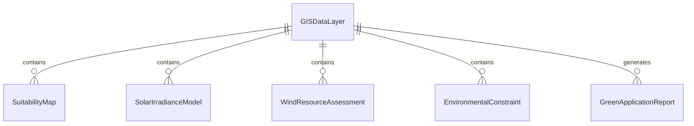
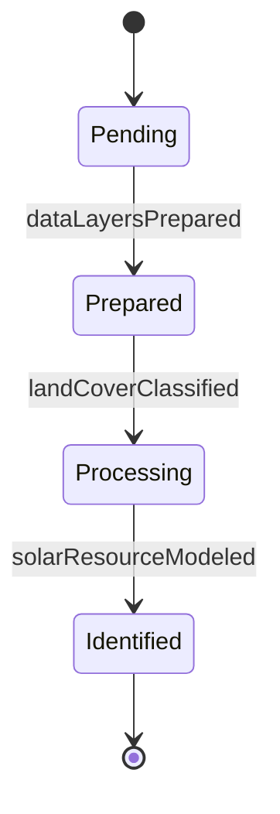
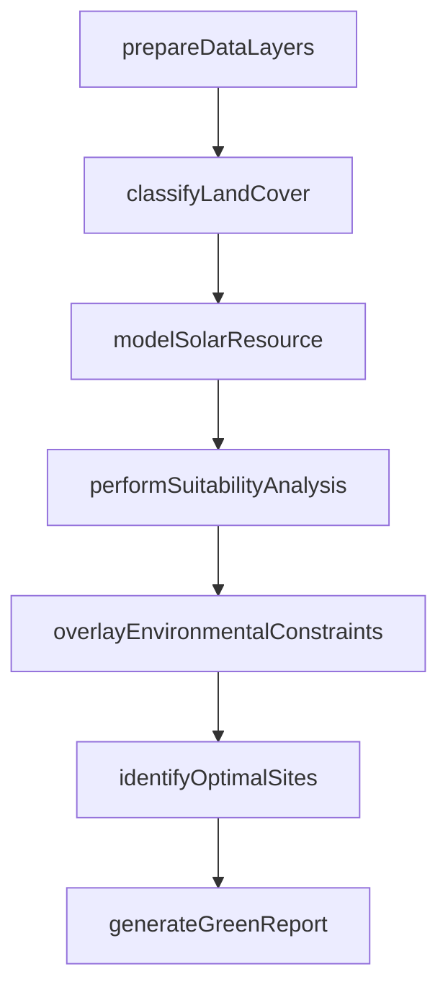
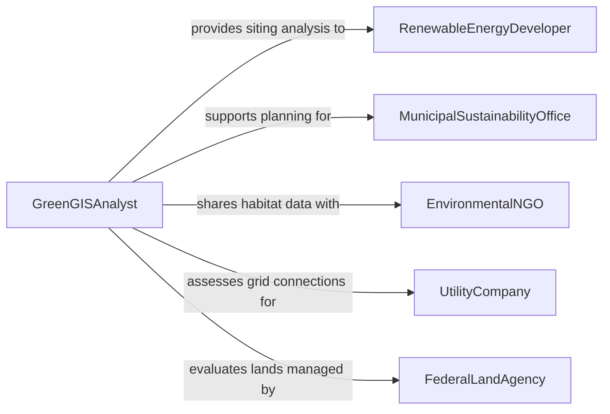

# Analyze Geographic Information Systems (GIS) Data for Use in Green Applications

> Business-as-Code definition for analyzing GIS data for green applications. Models the use of spatial analysis, land cover classification, solar irradiance mapping, and environmental overlay techniques to support renewable energy siting, green infrastructure planning, and sustainable development decisions.

## Overview

Analyzing GIS data for use in green applications involves processing geospatial datasets including land cover maps, solar radiation models, wind resource assessments, green infrastructure inventories, and environmental constraint layers to support renewable energy project siting, urban greening strategies, and sustainable land use planning. This definition provides actions for data layer preparation, spatial suitability analysis, environmental overlay, and green application reporting. It supports GIS specialists, sustainability planners, renewable energy developers, and urban ecologists.

## Actors

| Actor | Description |
|-------|-------------|
| RenewableEnergyDeveloper | Uses GIS analysis to identify optimal sites for solar, wind, or geothermal projects |
| MunicipalSustainabilityOffice | Directs green infrastructure planning using spatial analysis |
| EnvironmentalNGO | Advocates for conservation and uses GIS data for habitat assessment |
| UtilityCompany | Plans grid connections and assesses distributed energy resource potential |
| FederalLandAgency | Manages public lands where green energy projects may be sited |

## Roles

| Role | Description |
|------|-------------|
| GreenGISAnalyst | Performs spatial analysis specifically for sustainability and green applications |
| SolarResourceModeler | Analyzes solar irradiance data to assess photovoltaic potential |
| GreenInfrastructurePlanner | Uses GIS to design urban green spaces and stormwater management |
| SpatialDataEngineer | Prepares and maintains GIS data layers for green analysis workflows |

## Entities

| Entity | Description |
|--------|-------------|
| GISDataLayer | A georeferenced dataset representing a specific environmental attribute |
| SuitabilityMap | A spatial analysis output showing areas ranked for green application potential |
| SolarIrradianceModel | A dataset of solar energy availability across a geographic area |
| WindResourceAssessment | A spatial analysis of wind speed and direction patterns |
| EnvironmentalConstraint | A GIS layer representing areas restricted for development or conservation |
| GreenApplicationReport | A document presenting spatial analysis findings for sustainability decisions |

## Actions

| Action | Description |
|--------|-------------|
| prepareDataLayers | Compile and process GIS data layers for green application analysis |
| classifyLandCover | Categorize land surfaces by vegetation, impervious area, and water features |
| modelSolarResource | Calculate solar irradiance values across a geographic area |
| performSuitabilityAnalysis | Rank areas for green application potential using weighted spatial criteria |
| overlayEnvironmentalConstraints | Apply conservation and regulatory restriction layers to the analysis |
| identifyOptimalSites | Select the best locations for green infrastructure or energy projects |
| generateGreenReport | Produce a report of spatial analysis findings for green applications |

## Events

| Event | Description |
|-------|-------------|
| dataLayersPrepared | GIS data layers have been compiled and processed |
| landCoverClassified | Land surfaces have been categorized by type |
| solarResourceModeled | Solar irradiance values have been calculated |
| suitabilityAnalysisPerformed | Areas have been ranked for green application potential |
| environmentalConstraintsOverlaid | Restriction layers have been applied to the analysis |
| optimalSitesIdentified | Best locations for green projects have been selected |
| greenReportGenerated | A green application analysis report has been produced |

## Searches

| Search | Description |
|--------|-------------|
| findAnalyses | List green GIS analyses by project, application type, or status |
| getSuitabilityMaps | Retrieve spatial suitability rankings by area or application |
| getSolarResources | View solar irradiance data by location or time period |
| getEnvironmentalConstraints | Access restriction layers by regulation or conservation area |
| getOptimalSites | List identified sites ranked by green application potential |


## Entity Relationships



## State Diagram


## Workflow



## Actor Relationships



## Usage

### Calling Actions

```typescript
import { analyzeGeographicInformationSystemsGis } from '@headlessly/analyze-geographic-information-systems-gis'

const analyst = analyzeGeographicInformationSystemsGis()

// Prepare data layers for a solar farm siting study
const analysis = await analyst.prepareDataLayers({
  projectId: 'solar-farm-siting-county-12',
  layers: ['land-cover-NLCD', 'digital-elevation-model', 'solar-irradiance-NSRDB', 'wetlands-NWI', 'transmission-lines'],
  boundingBox: { north: 35.2, south: 34.8, east: -82.0, west: -82.5 }
})

// Analyze and identify sites
await analyst.classifyLandCover({ analysisId: analysis.id })
await analyst.modelSolarResource({ analysisId: analysis.id })
await analyst.performSuitabilityAnalysis({
  analysisId: analysis.id,
  criteria: { slope: 0.3, solarIrradiance: 0.4, landCover: 0.2, proximity: 0.1 }
})
await analyst.overlayEnvironmentalConstraints({ analysisId: analysis.id })
await analyst.identifyOptimalSites({ analysisId: analysis.id, maxSites: 5 })

// Generate report
await analyst.generateGreenReport({ analysisId: analysis.id })
```

### Event-Driven Automation

```typescript
// Notify developer of optimal sites
analyst.optimalSitesIdentified(async ({ analysisId, sites, projectId }) => {
  await notify({
    to: 'renewable-energy-development',
    message: `${sites.length} optimal sites identified for ${projectId}`
  })
})

// Archive completed analyses
analyst.greenReportGenerated(async ({ analysisId, reportId }) => {
  await archive({ reportId, repository: 'green-gis-library' })
})
```
