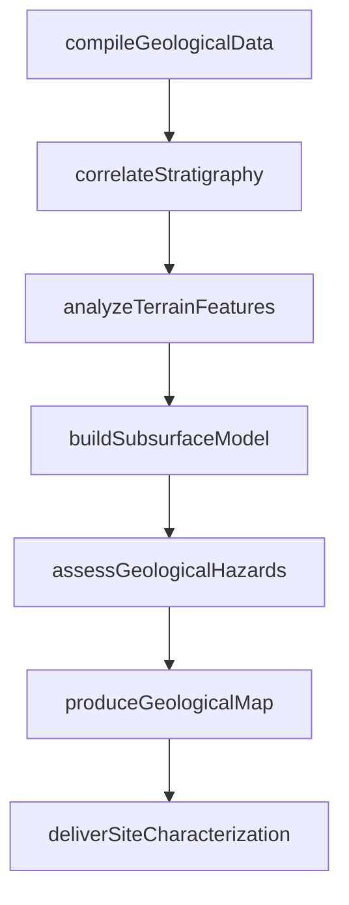
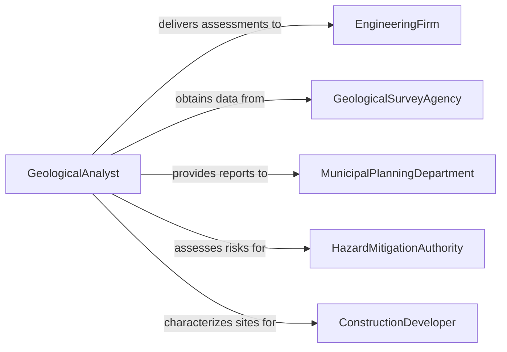

# Analyze Geological or Geographical Data

> Business-as-Code definition for analyzing geological and geographical data. Models the interpretation of stratigraphic logs, topographic surveys, subsurface models, and terrain datasets to characterize landforms, assess geological hazards, and support infrastructure planning.

## Overview

Analyzing geological or geographical data involves interpreting stratigraphic columns, topographic maps, digital elevation models, subsurface cross-sections, and seismic profiles to characterize geological formations, identify natural hazards, and support engineering and land use decisions. This definition provides actions for data compilation, stratigraphic correlation, terrain analysis, hazard assessment, and map production. It supports geologists, geomorphologists, civil engineers, and urban planners.

## Actors

| Actor | Description |
|-------|-------------|
| EngineeringFirm | Requires geological and geographic analysis for infrastructure projects |
| GeologicalSurveyAgency | Provides regional geological maps and subsurface data |
| MunicipalPlanningDepartment | Uses geological data for zoning and development decisions |
| HazardMitigationAuthority | Assesses geological risks for emergency preparedness |
| ConstructionDeveloper | Needs site characterization data for foundation design |

## Roles

| Role | Description |
|------|-------------|
| GeologicalAnalyst | Interprets geological data and constructs subsurface models |
| GeographicDataSpecialist | Processes topographic and terrain datasets for analysis |
| GeohazardAssessor | Evaluates geological risks including landslides, earthquakes, and subsidence |
| CartographicSpecialist | Produces geological and geographic maps from analyzed data |

## Entities

| Entity | Description |
|--------|-------------|
| StratigraphicLog | A record of geological layers encountered during drilling or excavation |
| TopographicSurvey | A dataset of elevation measurements across a terrain surface |
| SubsurfaceModel | A three-dimensional representation of underground geological conditions |
| GeologicalMap | A cartographic product showing rock types, faults, and structural features |
| HazardAssessment | An evaluation of geological risks for a specific area |
| TerrainAnalysis | A characterization of landform features and slope conditions |

## Actions

| Action | Description |
|--------|-------------|
| compileGeologicalData | Gather stratigraphic logs, maps, and subsurface data for analysis |
| correlateStratigraphy | Match geological layers across multiple data points |
| analyzeTerrainFeatures | Characterize landforms, slopes, and drainage patterns from elevation data |
| buildSubsurfaceModel | Construct a three-dimensional model of underground conditions |
| assessGeologicalHazards | Evaluate risks from landslides, faults, liquefaction, or subsidence |
| produceGeologicalMap | Generate a cartographic representation of geological findings |
| deliverSiteCharacterization | Provide a comprehensive geological assessment for a project site |

## Events

| Event | Description |
|-------|-------------|
| geologicalDataCompiled | Stratigraphic and geographic data have been gathered |
| stratigraphyCorrelated | Geological layers have been matched across data points |
| terrainFeaturesAnalyzed | Landforms and slope conditions have been characterized |
| subsurfaceModelBuilt | A three-dimensional geological model has been constructed |
| geologicalHazardsAssessed | Geological risks have been evaluated |
| geologicalMapProduced | A cartographic representation has been generated |
| siteCharacterizationDelivered | A comprehensive geological assessment has been provided |

## Searches

| Search | Description |
|--------|-------------|
| findAnalyses | List geological analyses by project, region, or status |
| getStratigraphicData | Retrieve stratigraphic logs by location or formation |
| getHazardAssessments | View geological hazard evaluations by area or risk type |
| getSubsurfaceModels | Locate three-dimensional geological models by project |
| getTerrainData | Access topographic and terrain analysis datasets |

## Workflow



## Actor Relationships



## Usage

### Calling Actions

```typescript
import { analyzeGeologicalGeographicalData } from '@headlessly/analyze-geological-geographical-data'

const analyzer = analyzeGeologicalGeographicalData()

// Compile data for a highway corridor study
const analysis = await analyzer.compileGeologicalData({
  projectId: 'interstate-bypass-corridor',
  dataSources: ['usgs-geological-quadrangles', 'state-well-database', 'lidar-dem'],
  region: 'piedmont-transition-zone'
})

// Analyze and model
await analyzer.correlateStratigraphy({ analysisId: analysis.id })
await analyzer.analyzeTerrainFeatures({ analysisId: analysis.id })
await analyzer.buildSubsurfaceModel({ analysisId: analysis.id })
await analyzer.assessGeologicalHazards({ analysisId: analysis.id })

// Produce deliverables
await analyzer.produceGeologicalMap({ analysisId: analysis.id })
await analyzer.deliverSiteCharacterization({ analysisId: analysis.id })
```

### Event-Driven Automation

```typescript
// Alert on identified geological hazards
analyzer.geologicalHazardsAssessed(async ({ analysisId, hazards, projectId }) => {
  const criticalHazards = hazards.filter(h => h.risk === 'high')
  if (criticalHazards.length > 0) {
    await notify({
      to: 'engineering-project-manager',
      message: `${criticalHazards.length} high-risk geological hazards identified for ${projectId}`
    })
  }
})

// Distribute completed maps
analyzer.geologicalMapProduced(async ({ analysisId, mapId }) => {
  await distribute({ mapId, recipients: ['engineering-team', 'planning-department'] })
})
```
