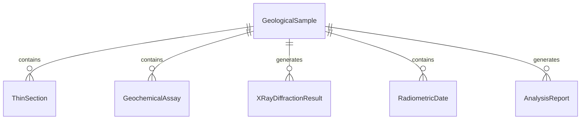
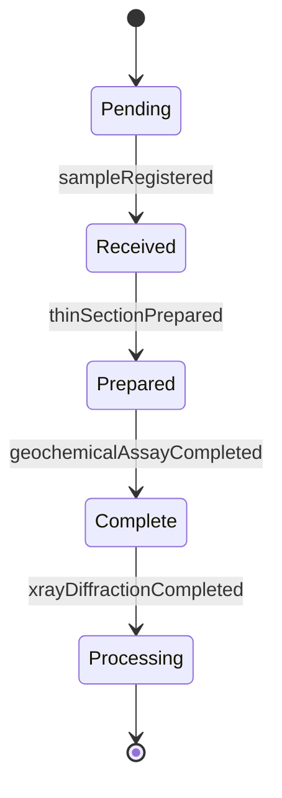
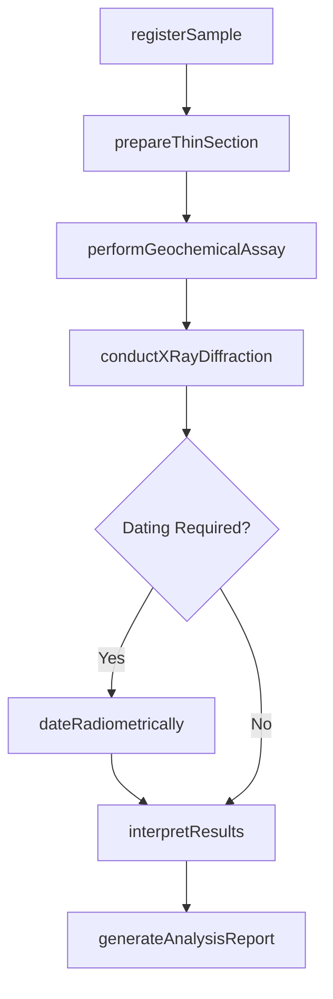
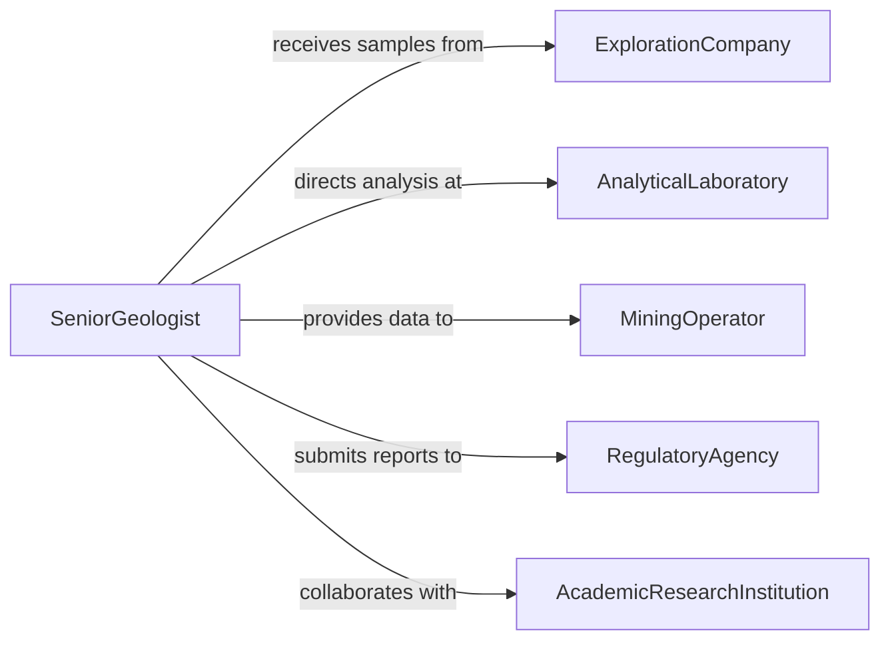

# Analyze Geological Samples

> Business-as-Code definition for analyzing geological samples. Models the laboratory examination of rock cores, soil specimens, mineral samples, and sediment cores using petrographic, geochemical, and mineralogical techniques to determine composition, age, and resource potential.

## Overview

Analyzing geological samples involves examining rock cores, soil specimens, mineral samples, and sediment cores through petrographic microscopy, X-ray diffraction, geochemical assay, and radiometric dating to determine mineral composition, formation age, porosity, permeability, and economic potential. This definition provides actions for sample registration, laboratory analysis, data interpretation, and reporting. It supports geologists, petrographers, mining engineers, and petroleum geoscientists.

## Actors

| Actor | Description |
|-------|-------------|
| ExplorationCompany | Submits geological samples for analysis to support resource evaluation |
| AnalyticalLaboratory | Performs geochemical assays and mineralogical testing |
| MiningOperator | Uses analysis results to plan extraction and processing operations |
| RegulatoryAgency | Requires geological data for environmental and resource permit reviews |
| AcademicResearchInstitution | Conducts geological research using sample analysis data |

## Roles

| Role | Description |
|------|-------------|
| Petrographer | Examines thin sections of rock under microscope to identify minerals |
| Geochemist | Performs chemical analyses to determine elemental composition |
| SampleManager | Handles sample chain of custody, storage, and cataloging |
| SeniorGeologist | Interprets analytical results and prepares geological assessments |

## Entities

| Entity | Description |
|--------|-------------|
| GeologicalSample | A rock, soil, or sediment specimen collected for laboratory analysis |
| ThinSection | A polished slice of rock mounted on glass for microscopic examination |
| GeochemicalAssay | A quantitative analysis of elemental or mineral composition |
| XRayDiffractionResult | Mineral identification data from X-ray crystallography |
| RadiometricDate | An age determination based on radioactive isotope decay |
| AnalysisReport | A document summarizing laboratory findings and geological interpretation |
| SampleCatalog | A registry of all samples with location, depth, and analysis status |

## Actions

| Action | Description |
|--------|-------------|
| registerSample | Log a geological sample into the catalog with metadata |
| prepareThinSection | Cut and polish a rock specimen for microscopic examination |
| performGeochemicalAssay | Analyze elemental composition using ICP, XRF, or fire assay methods |
| conductXRayDiffraction | Identify mineral phases using X-ray crystallographic techniques |
| dateRadiometrically | Determine the age of a sample using isotope decay methods |
| interpretResults | Assess the geological significance of laboratory findings |
| generateAnalysisReport | Produce a comprehensive report of sample analysis results |

## Events

| Event | Description |
|-------|-------------|
| sampleRegistered | A geological sample has been logged into the catalog |
| thinSectionPrepared | A rock specimen has been cut and polished for microscopy |
| geochemicalAssayCompleted | Elemental composition analysis has been completed |
| xrayDiffractionCompleted | Mineral phase identification has been performed |
| radiometricDatingCompleted | The sample age has been determined |
| resultsInterpreted | Laboratory findings have been geologically assessed |
| analysisReportGenerated | A comprehensive analysis report has been produced |

## Searches

| Search | Description |
|--------|-------------|
| findSamples | List geological samples by location, depth, rock type, or analysis status |
| getAssayResults | Retrieve geochemical analysis data by element or sample |
| getMineralIdentifications | View mineral compositions from XRD analysis |
| getRadiometricDates | Look up age determinations by sample or formation |
| getAnalysisReports | Locate completed analysis reports by project or date |


## Entity Relationships



## State Diagram


## Workflow



## Actor Relationships



## Usage

### Calling Actions

```typescript
import { analyzeGeologicalSamples } from '@headlessly/analyze-geological-samples'

const analyzer = analyzeGeologicalSamples()

// Register a drill core sample
const sample = await analyzer.registerSample({
  sampleId: 'DDH-2026-047-C12',
  type: 'drill-core',
  location: { latitude: 46.8721, longitude: -111.0349 },
  depth: { from: 145.5, to: 147.0, unit: 'meters' },
  rockType: 'quartz-monzonite'
})

// Perform laboratory analyses
await analyzer.prepareThinSection({ sampleId: sample.id })
await analyzer.performGeochemicalAssay({
  sampleId: sample.id,
  method: 'ICP-MS',
  elements: ['Au', 'Ag', 'Cu', 'Mo', 'As']
})
await analyzer.conductXRayDiffraction({ sampleId: sample.id })

// Interpret and report
await analyzer.interpretResults({ sampleId: sample.id })
await analyzer.generateAnalysisReport({ sampleId: sample.id })
```

### Event-Driven Automation

```typescript
// Alert exploration team on significant assay results
analyzer.geochemicalAssayCompleted(async ({ sampleId, results }) => {
  if (results.Au > 1.0) {
    await notify({
      to: 'exploration-manager',
      message: `High gold assay: ${results.Au} g/t in sample ${sampleId}`
    })
  }
})

// Archive reports to project database
analyzer.analysisReportGenerated(async ({ sampleId, reportId, projectId }) => {
  await archive({ reportId, projectId, repository: 'geological-analysis-library' })
})
```
