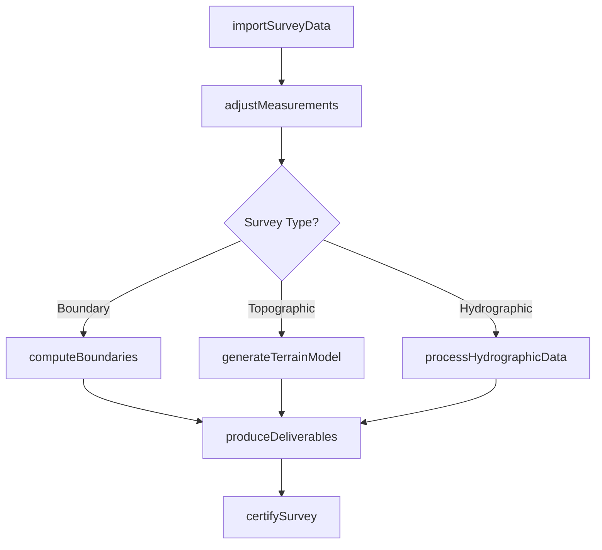
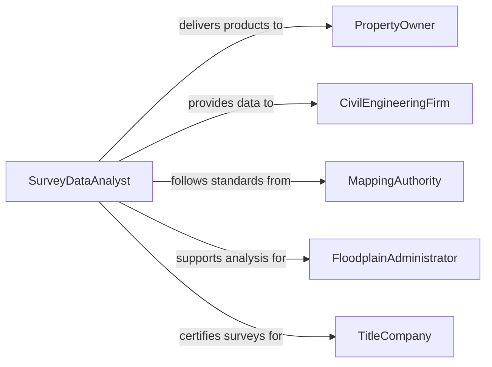

# Analyze Physical, Survey, or Geographic Data

> Business-as-Code definition for analyzing physical, survey, and geographic data. Models the processing of land surveys, hydrographic measurements, geodetic observations, and physical site data to produce boundary determinations, elevation models, and spatial datasets for engineering and development projects.

## Overview

Analyzing physical, survey, or geographic data involves processing field measurements from land surveys, hydrographic soundings, geodetic observations, and physical site investigations to produce boundary descriptions, contour maps, digital terrain models, and spatial datasets. This definition provides actions for data import, measurement adjustment, boundary computation, surface modeling, and deliverable production. It supports land surveyors, hydrographic surveyors, civil engineers, and land development professionals.

## Actors

| Actor | Description |
|-------|-------------|
| PropertyOwner | Commissions surveys to determine property boundaries and site conditions |
| CivilEngineeringFirm | Requires analyzed survey data for design and construction projects |
| MappingAuthority | Publishes official survey standards and cadastral records |
| FloodplainAdministrator | Uses survey data for floodplain delineation and management |
| TitleCompany | Requires boundary surveys for property transfer documentation |

## Roles

| Role | Description |
|------|-------------|
| SurveyDataAnalyst | Processes and adjusts raw survey measurements for accuracy |
| BoundarySpecialist | Computes property boundaries from survey evidence and legal descriptions |
| TerrainModeler | Creates digital elevation and surface models from survey data |
| HydrographicAnalyst | Processes underwater survey measurements for navigation and engineering |

## Entities

| Entity | Description |
|--------|-------------|
| SurveyMeasurement | A raw observation from field survey instruments |
| BoundaryDetermination | A computed property line based on survey evidence and legal descriptions |
| DigitalTerrainModel | A three-dimensional representation of ground surface elevations |
| HydrographicSounding | An underwater depth measurement for navigation or engineering |
| AdjustmentResult | Corrected measurements after mathematical least-squares processing |
| SurveyPlat | A scaled drawing showing boundaries, dimensions, and survey markers |

## Actions

| Action | Description |
|--------|-------------|
| importSurveyData | Load raw field measurements into the analysis system |
| adjustMeasurements | Apply mathematical adjustments to minimize measurement errors |
| computeBoundaries | Determine property lines from adjusted measurements and legal descriptions |
| generateTerrainModel | Create a digital surface model from elevation measurements |
| processHydrographicData | Analyze underwater soundings for depth and bottom characteristics |
| produceDeliverables | Generate survey plats, maps, and spatial datasets |
| certifySurvey | Sign and seal the survey products as professionally certified |

## Events

| Event | Description |
|-------|-------------|
| surveyDataImported | Raw field measurements have been loaded for analysis |
| measurementsAdjusted | Mathematical corrections have been applied to measurements |
| boundariesComputed | Property lines have been determined from survey evidence |
| terrainModelGenerated | A digital surface model has been created |
| hydrographicDataProcessed | Underwater soundings have been analyzed |
| deliverablesProduced | Survey plats and spatial datasets have been generated |
| surveyCertified | Survey products have been professionally signed and sealed |

## Searches

| Search | Description |
|--------|-------------|
| findSurveys | List survey projects by client, location, or type |
| getBoundaryData | Retrieve computed boundary coordinates and dimensions |
| getTerrainModels | Access digital elevation models by project area |
| getAdjustmentStatistics | View measurement accuracy and adjustment quality metrics |
| getCertifiedSurveys | Locate professionally certified survey products |

## Workflow



## Actor Relationships



## Usage

### Calling Actions

```typescript
import { analyzePhysicalSurveyGeographicData } from '@headlessly/analyze-physical-survey-geographic-data'

const analyzer = analyzePhysicalSurveyGeographicData()

// Import and adjust survey measurements
const survey = await analyzer.importSurveyData({
  projectId: 'subdivision-plat-oak-ridge',
  dataFiles: ['total-station-obs.raw', 'gnss-vectors.xml'],
  controlPoints: ['CP-1001', 'CP-1002', 'CP-1003']
})

await analyzer.adjustMeasurements({
  surveyId: survey.id,
  method: 'least-squares',
  confidenceLevel: 95
})

// Compute boundaries and produce deliverables
await analyzer.computeBoundaries({
  surveyId: survey.id,
  legalDescription: 'deed-book-412-page-88'
})

await analyzer.produceDeliverables({ surveyId: survey.id })
await analyzer.certifySurvey({ surveyId: survey.id, licensee: 'PLS-12847' })
```

### Event-Driven Automation

```typescript
// Notify client when survey is certified
analyzer.surveyCertified(async ({ surveyId, clientId, platNumber }) => {
  await notify({
    to: clientId,
    message: `Survey ${platNumber} has been certified and is ready for recording`
  })
})

// Flag low-accuracy adjustments for review
analyzer.measurementsAdjusted(async ({ surveyId, worstResidual, threshold }) => {
  if (worstResidual > threshold) {
    await notify({
      to: 'survey-project-manager',
      message: `Adjustment residuals exceed threshold. Re-observation may be needed.`
    })
  }
})
```
