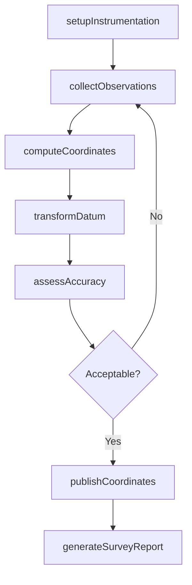
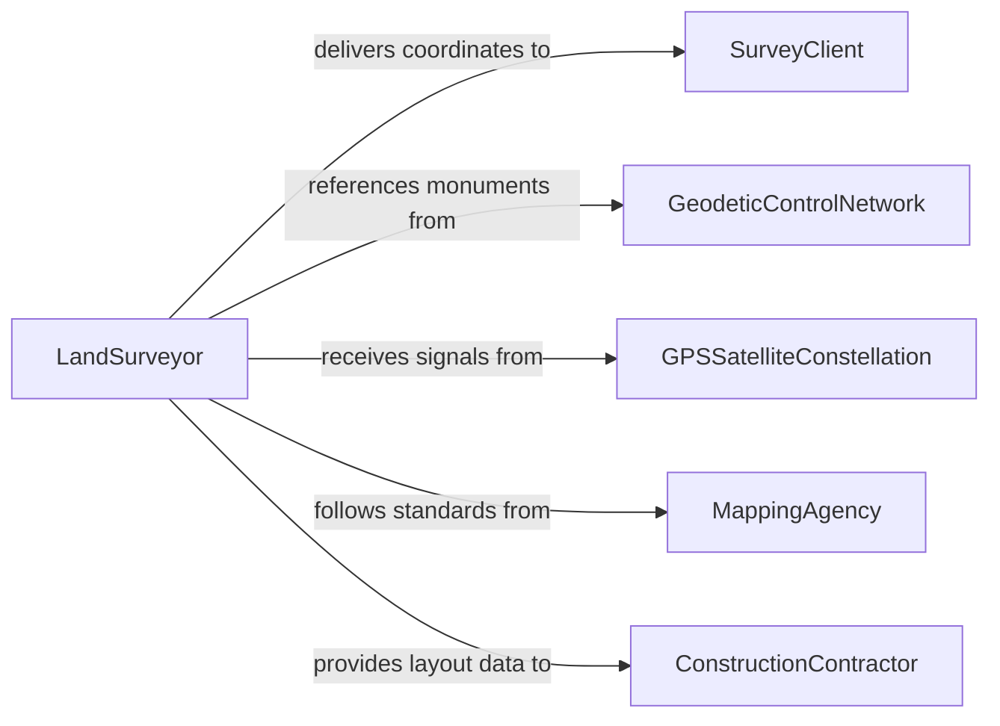

# Determine Geographic Coordinates

> Business-as-Code definition for determining geographic coordinates. Models the use of GPS instruments, geodetic surveys, reference datums, and coordinate transformation systems to establish precise latitude, longitude, and elevation values for mapping, navigation, and spatial referencing.

## Overview

Determining geographic coordinates involves using GPS receivers, total stations, geodetic control networks, and coordinate reference systems to establish precise spatial positions for survey markers, infrastructure, property boundaries, and other geographic features. This definition provides actions for instrument setup, observation collection, coordinate computation, and datum transformation. It supports land surveyors, geodesists, cartographers, and GIS professionals.

## Actors

| Actor | Description |
|-------|-------------|
| SurveyClient | Commissions coordinate determination for a project or property |
| GeodeticControlNetwork | Provides reference monuments with known coordinates |
| GPSSatelliteConstellation | Transmits positioning signals used for coordinate computation |
| MappingAgency | Publishes official coordinate reference systems and datums |
| ConstructionContractor | Requires precise coordinates for site layout and construction |

## Roles

| Role | Description |
|------|-------------|
| LandSurveyor | Collects field observations and computes geographic coordinates |
| Geodesist | Establishes reference frameworks and performs datum transformations |
| GISTechnician | Integrates computed coordinates into spatial databases and maps |
| SurveyProjectManager | Plans and coordinates surveying field campaigns |

## Entities

| Entity | Description |
|--------|-------------|
| CoordinatePair | A latitude and longitude value defining a geographic position |
| ElevationValue | A height measurement relative to a vertical datum |
| GeodeticDatum | A mathematical model of the Earth used as a reference for coordinates |
| SurveyObservation | A raw measurement from a GPS receiver or total station |
| ControlPoint | A monument with precisely known coordinates used as a reference |
| CoordinateTransformation | A mathematical conversion between coordinate reference systems |
| SurveyReport | A document presenting computed coordinates and accuracy estimates |

## Actions

| Action | Description |
|--------|-------------|
| setupInstrumentation | Configure GPS receivers or survey instruments for observation |
| collectObservations | Record field measurements from satellites or reference points |
| computeCoordinates | Calculate geographic positions from collected observations |
| transformDatum | Convert coordinates between different reference systems |
| assessAccuracy | Evaluate the precision and reliability of computed coordinates |
| publishCoordinates | Record finalized coordinates in official databases or reports |
| generateSurveyReport | Produce a document with computed coordinates and methodology |

## Events

| Event | Description |
|-------|-------------|
| instrumentationSetUp | Survey instruments have been configured for observation |
| observationsCollected | Field measurements have been recorded |
| coordinatesComputed | Geographic positions have been calculated from observations |
| datumTransformed | Coordinates have been converted to the target reference system |
| accuracyAssessed | The precision of computed coordinates has been evaluated |
| coordinatesPublished | Finalized coordinates have been recorded in official databases |
| surveyReportGenerated | A coordinate determination report has been produced |

## Searches

| Search | Description |
|--------|-------------|
| findSurveys | List coordinate determination projects by client, location, or date |
| getControlPoints | Retrieve reference control points near a project area |
| getCoordinates | Look up computed coordinates by point ID or geographic area |
| getAccuracyEstimates | View precision data for specific coordinate determinations |
| getDatumParameters | Retrieve transformation parameters between reference systems |

## Workflow



## Actor Relationships



## Usage

### Calling Actions

```typescript
import { determineGeographicCoordinates } from '@headlessly/determine-geographic-coordinates'

const surveyor = determineGeographicCoordinates()

// Set up and collect observations
const survey = await surveyor.setupInstrumentation({
  projectId: 'highway-corridor-survey-2026',
  instruments: ['trimble-R12i-gnss', 'leica-TS16-total-station'],
  datum: 'NAD83-2011'
})

await surveyor.collectObservations({
  surveyId: survey.id,
  points: ['BM-101', 'BM-102', 'BM-103'],
  observationDuration: 30
})

// Compute and transform
await surveyor.computeCoordinates({ surveyId: survey.id })
await surveyor.transformDatum({ surveyId: survey.id, targetDatum: 'WGS84' })
await surveyor.assessAccuracy({ surveyId: survey.id })

// Publish results
await surveyor.publishCoordinates({ surveyId: survey.id })
await surveyor.generateSurveyReport({ surveyId: survey.id })
```

### Event-Driven Automation

```typescript
// Notify client when coordinates are published
surveyor.coordinatesPublished(async ({ surveyId, clientId, pointCount }) => {
  await notify({
    to: clientId,
    message: `${pointCount} coordinates published for survey ${surveyId}`
  })
})

// Re-observe if accuracy is insufficient
surveyor.accuracyAssessed(async ({ surveyId, worstAccuracy, threshold }) => {
  if (worstAccuracy > threshold) {
    await notify({
      to: 'field-crew',
      message: `Re-observation needed: accuracy ${worstAccuracy}m exceeds ${threshold}m threshold`
    })
  }
})
```
