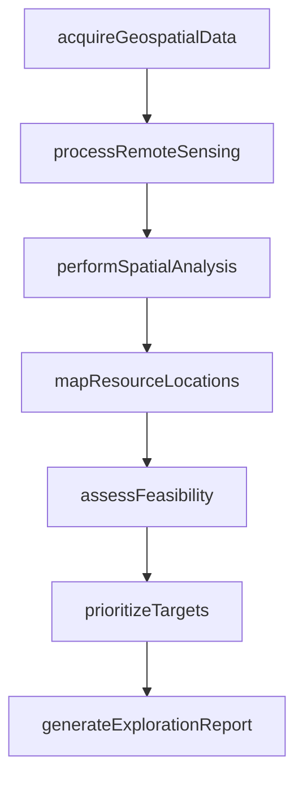
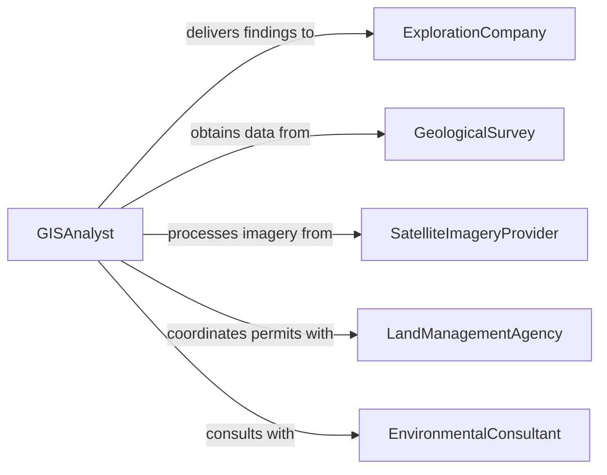

# Locate Natural Resources Using Geospatial or Other Environmental Data

> Business-as-Code definition for locating natural resources using geospatial and environmental data. Models the analysis of satellite imagery, geological surveys, GIS layers, and remote sensing data to identify mineral deposits, water sources, timber stands, and energy resources.

## Overview

Locating natural resources using geospatial or other environmental data involves analyzing satellite imagery, aerial photography, geological surveys, GIS datasets, and remote sensing outputs to identify the location, extent, and accessibility of mineral deposits, groundwater aquifers, timber stands, petroleum reserves, and renewable energy sites. This definition provides actions for data acquisition, spatial analysis, resource mapping, and feasibility assessment. It supports geologists, GIS analysts, natural resource managers, and exploration companies.

## Actors

| Actor | Description |
|-------|-------------|
| ExplorationCompany | Commissions resource location studies for extraction planning |
| GeologicalSurvey | Provides regional geological data and maps |
| SatelliteImageryProvider | Supplies remote sensing and satellite data for analysis |
| LandManagementAgency | Manages public lands and grants resource exploration permits |
| EnvironmentalConsultant | Assesses ecological constraints on resource access |

## Roles

| Role | Description |
|------|-------------|
| GISAnalyst | Processes and analyzes geospatial data to identify resource indicators |
| ResourceGeologist | Interprets geological data to assess resource potential |
| RemoteSensingSpecialist | Processes satellite and aerial imagery for resource identification |
| ExplorationManager | Directs resource location activities and prioritizes target areas |

## Entities

| Entity | Description |
|--------|-------------|
| GeospatialDataset | A collection of georeferenced data layers for analysis |
| ResourceIndicator | A geophysical or geological signature suggesting resource presence |
| SpatialAnalysisResult | The output of GIS processing identifying potential resource locations |
| ResourceMap | A geographic visualization of identified natural resource locations |
| FeasibilityAssessment | An evaluation of the viability of accessing an identified resource |
| ExplorationTarget | A prioritized location recommended for field verification |
| RemoteSensingImage | Satellite or aerial imagery processed for resource analysis |

## Actions

| Action | Description |
|--------|-------------|
| acquireGeospatialData | Obtain satellite imagery, geological surveys, and GIS layers |
| processRemoteSensing | Analyze satellite and aerial data for resource signatures |
| performSpatialAnalysis | Apply GIS techniques to identify potential resource locations |
| mapResourceLocations | Generate geographic maps of identified resource sites |
| assessFeasibility | Evaluate the accessibility and extraction viability of identified resources |
| prioritizeTargets | Rank exploration targets by probability and economic potential |
| generateExplorationReport | Produce a comprehensive report of resource location findings |

## Events

| Event | Description |
|-------|-------------|
| geospatialDataAcquired | Satellite imagery and GIS data have been obtained |
| remoteSensingProcessed | Satellite and aerial data have been analyzed for resource signatures |
| spatialAnalysisCompleted | GIS analysis identifying potential resource locations is complete |
| resourceLocationsMapped | Geographic maps of identified sites have been generated |
| feasibilityAssessed | Resource accessibility and extraction viability have been evaluated |
| targetsPrioritized | Exploration targets have been ranked by potential |
| explorationReportGenerated | A comprehensive findings report has been produced |

## Searches

| Search | Description |
|--------|-------------|
| findAnalyses | List resource location analyses by region, resource type, or status |
| getResourceIndicators | Retrieve identified resource signatures by type or confidence level |
| getExplorationTargets | View prioritized targets by region or resource category |
| getDatasetCoverage | Check available geospatial data for a specific geographic area |
| getFeasibilityResults | Retrieve feasibility assessments for identified resource sites |

## Workflow



## Actor Relationships



## Usage

### Calling Actions

```typescript
import { locateNaturalResourcesUsingGeospatial } from '@headlessly/locate-natural-resources-using-geospatial'

const locator = locateNaturalResourcesUsingGeospatial()

// Acquire geospatial data for a region
const analysis = await locator.acquireGeospatialData({
  region: 'appalachian-basin-sector-7',
  dataSources: ['landsat-9', 'usgs-geological-maps', 'state-well-logs'],
  resourceType: 'natural-gas'
})

// Process and analyze
await locator.processRemoteSensing({ analysisId: analysis.id })
await locator.performSpatialAnalysis({ analysisId: analysis.id })
await locator.mapResourceLocations({ analysisId: analysis.id })

// Assess feasibility and prioritize
await locator.assessFeasibility({ analysisId: analysis.id })
await locator.prioritizeTargets({ analysisId: analysis.id })
await locator.generateExplorationReport({ analysisId: analysis.id })
```

### Event-Driven Automation

```typescript
// Notify exploration team of high-priority targets
locator.targetsPrioritized(async ({ analysisId, topTargets }) => {
  await notify({
    to: 'exploration-team',
    message: `${topTargets.length} high-priority targets identified for field verification`
  })
})

// Archive completed analyses
locator.explorationReportGenerated(async ({ analysisId, reportId }) => {
  await archive({ reportId, repository: 'resource-exploration-library' })
})
```
