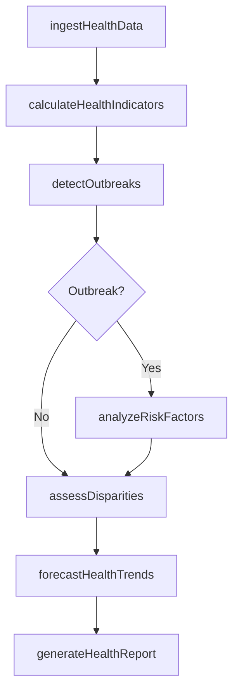
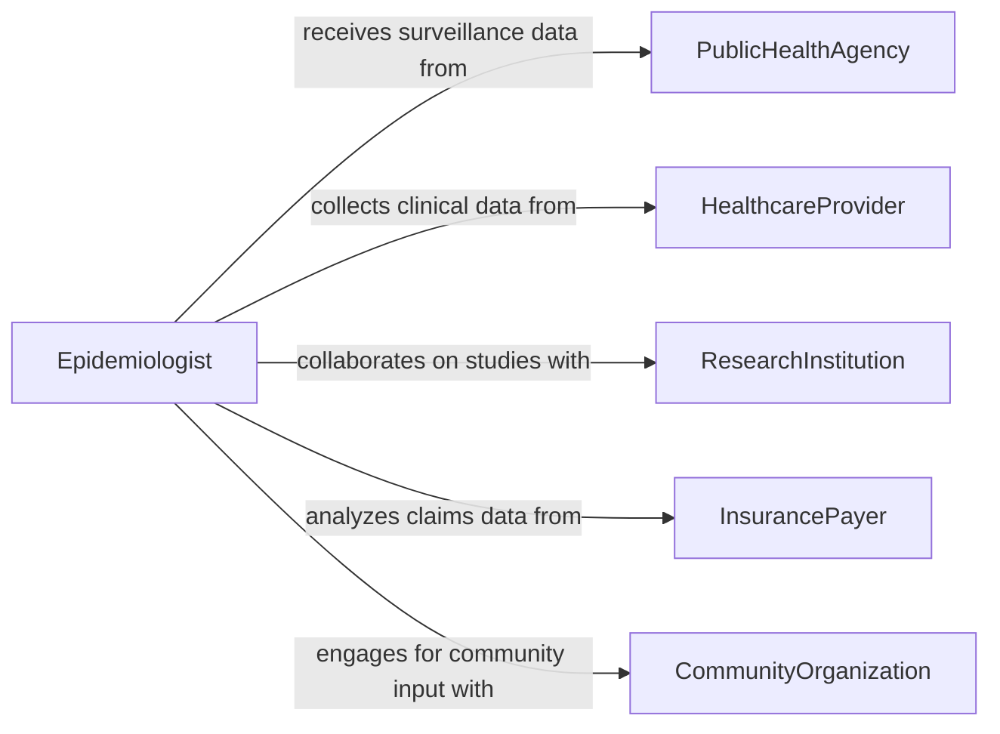

# Analyze Health-related Data

> Business-as-Code definition for analyzing health-related data. Models the systematic examination of population health metrics, epidemiological trends, and public health surveillance data to inform health policy and intervention strategies.

## Overview

Analyzing health-related data involves examining disease incidence, mortality rates, risk factor prevalence, and health service utilization patterns across populations to identify trends and disparities. Epidemiologists and public health analysts apply statistical methods to surveillance datasets, vital records, and health surveys to generate evidence for program planning and policy decisions. This definition provides actions for data ingestion, trend analysis, disparity detection, and public health reporting to support evidence-based health initiatives.

## Actors

| Actor | Description |
|-------|-------------|
| PublicHealthAgency | Government body collecting and disseminating population health data |
| HealthcareProvider | Hospitals and clinics contributing clinical and utilization data |
| ResearchInstitution | University or lab conducting health studies and sharing datasets |
| InsurancePayer | Health plan providing claims data on service utilization and costs |
| CommunityOrganization | Local group representing populations affected by health disparities |

## Roles

| Role | Description |
|------|-------------|
| Epidemiologist | Investigates disease patterns and risk factors in populations |
| PublicHealthAnalyst | Processes surveillance data and produces health indicator reports |
| BiostatisticianRole | Applies advanced statistical methods to health datasets |
| HealthPolicyAdvisor | Translates data findings into policy recommendations |

## Entities

| Entity | Description |
|--------|-------------|
| HealthIndicator | A measurable metric such as mortality rate, prevalence, or incidence |
| SurveillanceDataset | A collection of ongoing health monitoring data from reporting sources |
| DiseaseOutbreak | A cluster of cases exceeding expected baseline for a condition |
| RiskFactor | A behavioral, environmental, or genetic variable associated with disease |
| HealthDisparity | A measurable difference in health outcomes across population groups |
| PopulationCohort | A defined group of individuals tracked for health outcomes over time |

## Actions

| Action | Description |
|--------|-------------|
| ingestHealthData | Import datasets from surveillance systems, registries, and surveys |
| calculateHealthIndicators | Compute rates, ratios, and prevalence measures from raw data |
| detectOutbreaks | Identify unusual clusters of disease activity above expected baselines |
| analyzeRiskFactors | Evaluate associations between risk variables and health outcomes |
| assessDisparities | Compare health indicators across demographic and geographic groups |
| forecastHealthTrends | Project future disease burden based on current trajectory and interventions |
| generateHealthReport | Produce summary reports for policymakers and public health stakeholders |

## Events

| Event | Description |
|-------|-------------|
| healthDataIngested | Population health data has been imported and validated |
| healthIndicatorsCalculated | Rates and prevalence measures have been computed |
| outbreakDetected | An unusual disease cluster has been identified |
| riskFactorsAnalyzed | Associations between risk variables and outcomes are available |
| disparitiesAssessed | Differences in health outcomes across groups have been quantified |
| healthTrendsForecasted | Future disease burden projections have been generated |
| healthReportGenerated | A public health summary report has been finalized |

## Searches

| Search | Description |
|--------|-------------|
| findHealthIndicators | Retrieve health metrics by condition, geography, or time period |
| getOutbreakAlerts | List active or recent disease outbreak detections |
| getDisparities | Look up health outcome differences by demographic group |
| getSurveillanceDatasets | Find available datasets by source, condition, or reporting period |

## Workflow



## Actor Relationships



## Usage

### Calling Actions

```typescript
import { analyzeHealthRelatedData } from '@headlessly/analyze-health-related-data'

const health = analyzeHealthRelatedData()

// Ingest surveillance data
const dataset = await health.ingestHealthData({
  source: 'state-notifiable-diseases',
  conditions: ['influenza', 'covid-19', 'rsv'],
  dateRange: { start: '2025-10-01', end: '2026-01-31' },
  geography: 'county'
})

// Calculate health indicators
const indicators = await health.calculateHealthIndicators({
  datasetId: dataset.id,
  metrics: ['incidence-rate', 'case-fatality-ratio', 'hospitalization-rate'],
  stratifyBy: ['age-group', 'county']
})

// Assess disparities across demographics
const disparities = await health.assessDisparities({
  indicators: indicators.map(i => i.id),
  comparisons: ['race-ethnicity', 'income-quartile'],
  significanceLevel: 0.05
})
```

### Event-Driven Automation

```typescript
// Alert on outbreak detection
health.outbreakDetected(async ({ condition, geography, caseCount, expectedBaseline }) => {
  await notify({
    to: 'epidemiology-team',
    message: `Outbreak alert: ${caseCount} ${condition} cases in ${geography} (baseline: ${expectedBaseline})`
  })
})

// Auto-generate reports when health indicators are updated
health.healthIndicatorsCalculated(async ({ datasetId, period }) => {
  await health.generateHealthReport({
    datasetId,
    period,
    audience: 'public-health-leadership',
    format: 'dashboard'
  })
})
```
