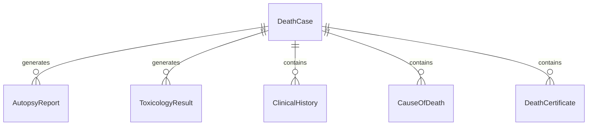
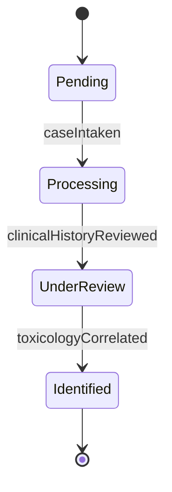
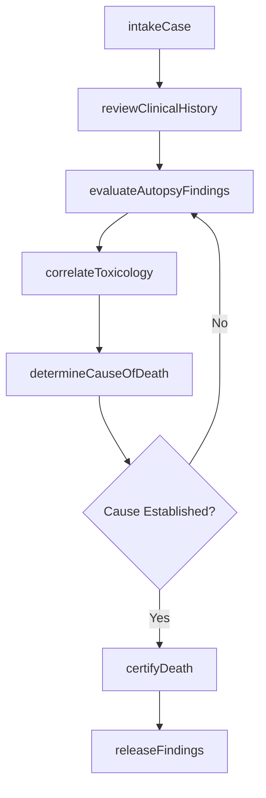
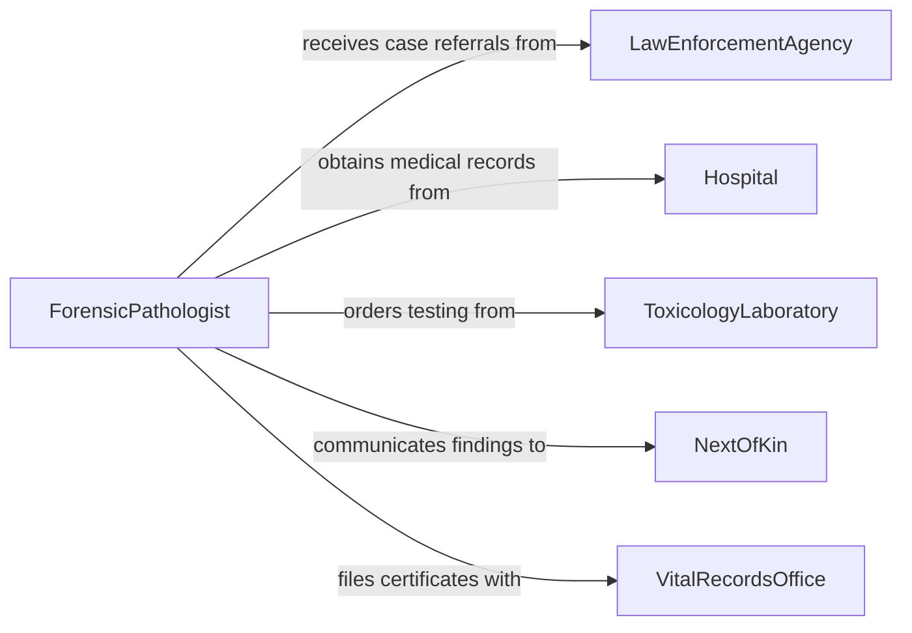

# Analyze Medical Data Determine Cause

> Business-as-Code definition for analyzing medical data to determine cause of death. Models the forensic and clinical investigation process of reviewing autopsy findings, medical records, and toxicology results to establish manner and cause of death.

## Overview

Analyzing medical data to determine cause of death involves examining autopsy reports, clinical histories, toxicology screens, histopathology results, and scene investigation findings to establish the chain of events leading to death. Medical examiners and forensic pathologists correlate physical findings with medical records, apply diagnostic criteria, and certify the cause and manner of death on official documents. This definition provides actions for case intake, evidence correlation, cause determination, and death certification to support medicolegal investigations.

## Actors

| Actor | Description |
|-------|-------------|
| LawEnforcementAgency | Police or investigative body requesting cause-of-death determination |
| Hospital | Healthcare facility providing the decedent's clinical records |
| ToxicologyLaboratory | Lab performing drug and poison screening on specimens |
| NextOfKin | Family members who may provide medical history and request findings |
| VitalRecordsOffice | Government office that receives and registers death certificates |

## Roles

| Role | Description |
|------|-------------|
| ForensicPathologist | Performs autopsies and determines cause and manner of death |
| MedicalExaminer | Oversees death investigations and certifies official cause of death |
| DeathInvestigator | Conducts scene investigations and gathers circumstantial evidence |
| HistopathologyTechnician | Prepares and examines tissue samples for microscopic analysis |

## Entities

| Entity | Description |
|--------|-------------|
| DeathCase | A medicolegal investigation initiated upon a reportable death |
| AutopsyReport | Documented findings from the postmortem examination |
| ToxicologyResult | Laboratory analysis of bodily fluids for drugs and toxins |
| ClinicalHistory | Medical records documenting the decedent's health conditions and treatments |
| CauseOfDeath | The certified chain of events and conditions leading to death |
| DeathCertificate | Official legal document recording cause and manner of death |

## Actions

| Action | Description |
|--------|-------------|
| intakeCase | Register a new death investigation and collect initial information |
| reviewClinicalHistory | Examine the decedent's medical records for relevant conditions |
| correlateToxicology | Integrate toxicology screening results with autopsy findings |
| evaluateAutopsyFindings | Analyze gross and microscopic examination results |
| determineCauseOfDeath | Establish the causal chain and manner of death from all evidence |
| certifyDeath | Complete and sign the official death certificate |
| releaseFindings | Distribute the final report to law enforcement and next of kin |

## Events

| Event | Description |
|-------|-------------|
| caseIntaken | A new death investigation has been registered |
| clinicalHistoryReviewed | The decedent's medical records have been examined |
| toxicologyCorrelated | Toxicology results have been integrated with other findings |
| autopsyFindingsEvaluated | Postmortem examination results have been analyzed |
| causeOfDeathDetermined | The causal chain and manner of death have been established |
| deathCertified | The official death certificate has been completed and signed |
| findingsReleased | The investigation report has been distributed to authorized parties |

## Searches

| Search | Description |
|--------|-------------|
| findDeathCases | Retrieve cases by decedent, jurisdiction, date, or manner of death |
| getToxicologyResults | Look up toxicology findings by case or substance detected |
| getCauseOfDeathRecords | Search certified cause-of-death determinations by condition or category |
| getPendingCases | List cases awaiting toxicology, histology, or final certification |


## Entity Relationships



## State Diagram


## Workflow



## Actor Relationships



## Usage

### Calling Actions

```typescript
import { analyzeMedicalDataDetermineCause } from '@headlessly/analyze-medical-data-determine-cause'

const forensic = analyzeMedicalDataDetermineCause()

// Intake a new death investigation
const deathCase = await forensic.intakeCase({
  decedentId: 'DEC-2026-00412',
  jurisdiction: 'Cook County',
  dateOfDeath: '2026-02-01',
  referralSource: 'law-enforcement',
  circumstances: 'found-unresponsive'
})

// Review clinical history
const history = await forensic.reviewClinicalHistory({
  caseId: deathCase.id,
  sources: ['memorial-hospital', 'primary-care-clinic'],
  conditions: ['hypertension', 'diabetes-type-2']
})

// Determine cause of death after all evidence is gathered
const determination = await forensic.determineCauseOfDeath({
  caseId: deathCase.id,
  immediateCause: 'acute myocardial infarction',
  underlyingCause: 'coronary artery disease',
  contributingConditions: ['hypertension', 'diabetes-mellitus'],
  manner: 'natural'
})
```

### Event-Driven Automation

```typescript
// Notify law enforcement when cause is determined for suspicious cases
forensic.causeOfDeathDetermined(async ({ caseId, manner, immediateCause }) => {
  if (manner !== 'natural') {
    await notify({
      to: 'detective-bureau',
      message: `Case ${caseId} determined: ${immediateCause}, manner: ${manner}`
    })
  }
})

// Auto-file death certificate when case is certified
forensic.deathCertified(async ({ caseId, certificateData }) => {
  await forensic.releaseFindings({
    caseId,
    recipients: ['vital-records-office', 'next-of-kin'],
    format: 'official-certificate'
  })
})
```
