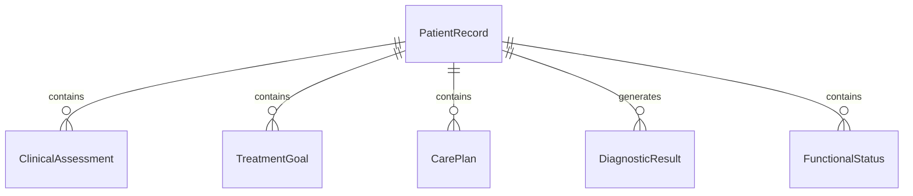
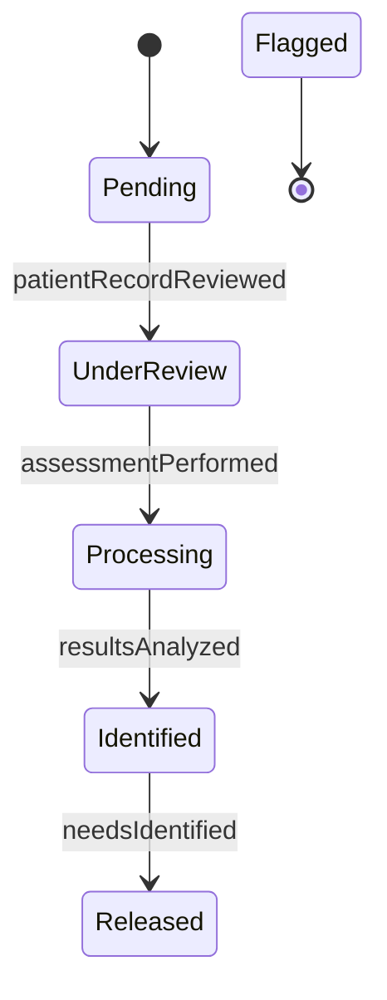
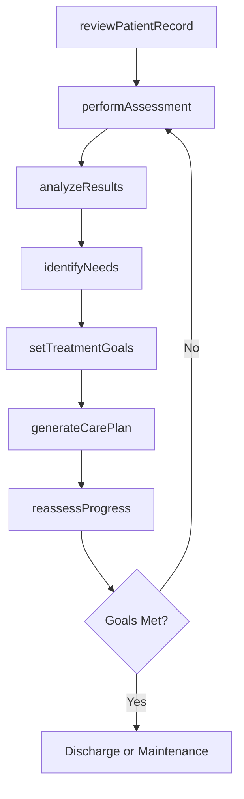
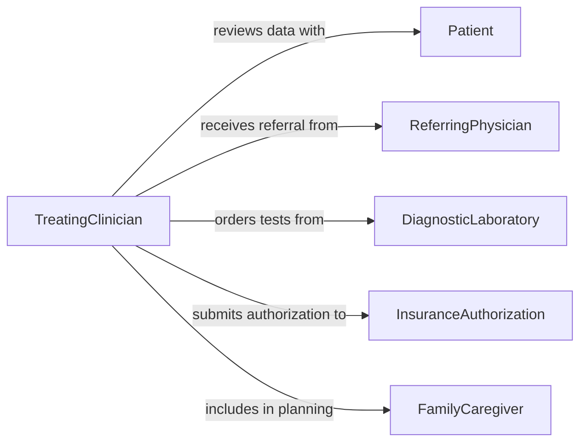

# Analyze Patient Data Determine Patient

> Business-as-Code definition for analyzing patient data to determine patient needs or treatment goals. Models the clinical process of reviewing medical histories, assessments, and diagnostic results to establish individualized care plans.

## Overview

Analyzing patient data to determine needs and treatment goals involves reviewing medical histories, physical examination findings, laboratory results, and functional assessments to identify clinical priorities and establish measurable therapeutic objectives. Clinicians synthesize information from multiple sources, apply clinical practice guidelines, and collaborate with patients to set realistic recovery milestones or disease management targets. This definition provides actions for data review, needs assessment, goal setting, and care plan generation to support patient-centered treatment planning.

## Actors

| Actor | Description |
|-------|-------------|
| Patient | Individual whose health data is being analyzed for treatment planning |
| ReferringPhysician | Provider who initiated the referral and supplies clinical context |
| DiagnosticLaboratory | Facility producing lab results and test reports for clinical review |
| InsuranceAuthorization | Payer organization that pre-authorizes treatments based on clinical need |
| FamilyCaregiver | Patient's support person who participates in care planning discussions |

## Roles

| Role | Description |
|------|-------------|
| TreatingClinician | Reviews patient data and establishes treatment goals |
| CareCoordinator | Organizes multidisciplinary input and tracks goal progress |
| ClinicalPharmacist | Reviews medication data and advises on pharmacotherapy goals |
| RehabilitationSpecialist | Assesses functional status and defines recovery milestones |

## Entities

| Entity | Description |
|--------|-------------|
| PatientRecord | Comprehensive medical history including diagnoses, medications, and allergies |
| ClinicalAssessment | Structured evaluation of a patient's current health status |
| TreatmentGoal | A measurable objective for a patient's therapeutic outcome |
| CarePlan | A documented set of goals, interventions, and timelines for patient care |
| DiagnosticResult | Laboratory, imaging, or test output informing clinical decisions |
| FunctionalStatus | A rating of a patient's ability to perform daily activities |

## Actions

| Action | Description |
|--------|-------------|
| reviewPatientRecord | Examine the patient's medical history, medications, and prior treatments |
| performAssessment | Conduct a structured clinical evaluation of current health status |
| analyzeResults | Interpret diagnostic and laboratory findings in clinical context |
| identifyNeeds | Determine clinical priorities based on assessment and diagnostic data |
| setTreatmentGoals | Establish measurable therapeutic objectives with target timelines |
| generateCarePlan | Create a comprehensive plan linking goals to specific interventions |
| reassessProgress | Evaluate patient outcomes against established treatment goals |

## Events

| Event | Description |
|-------|-------------|
| patientRecordReviewed | The patient's medical history has been examined |
| assessmentPerformed | A structured clinical evaluation has been completed |
| resultsAnalyzed | Diagnostic and laboratory findings have been interpreted |
| needsIdentified | Clinical priorities for the patient have been determined |
| treatmentGoalsSet | Measurable therapeutic objectives have been established |
| carePlanGenerated | A comprehensive treatment plan has been created |
| progressReassessed | Patient outcomes have been evaluated against treatment goals |

## Searches

| Search | Description |
|--------|-------------|
| findPatientRecords | Retrieve patient records by identifier, condition, or provider |
| getTreatmentGoals | Look up active treatment goals by patient or clinical program |
| getCarePlans | Retrieve care plans by status, provider, or treatment category |
| findPatientsForReassessment | List patients due for progress evaluation based on goal timelines |


## Entity Relationships



## State Diagram


## Workflow



## Actor Relationships



## Usage

### Calling Actions

```typescript
import { analyzePatientDataDeterminePatient } from '@headlessly/analyze-patient-data-determine-patient'

const clinical = analyzePatientDataDeterminePatient()

// Review patient record
const record = await clinical.reviewPatientRecord({
  patientId: 'PT-2026-08341',
  includeHistory: true,
  includeMedications: true,
  includeAllergies: true
})

// Perform a clinical assessment
const assessment = await clinical.performAssessment({
  patientId: 'PT-2026-08341',
  type: 'comprehensive-geriatric',
  domains: ['cognitive', 'functional', 'nutritional', 'psychosocial']
})

// Set treatment goals based on identified needs
const goals = await clinical.setTreatmentGoals({
  patientId: 'PT-2026-08341',
  goals: [
    { domain: 'mobility', target: 'independent-ambulation-50ft', timeframe: '6-weeks' },
    { domain: 'nutrition', target: 'bmi-above-22', timeframe: '3-months' },
    { domain: 'cognitive', target: 'mmse-score-above-24', timeframe: '3-months' }
  ]
})
```

### Event-Driven Automation

```typescript
// Notify care team when new needs are identified
clinical.needsIdentified(async ({ patientId, needs, priority }) => {
  const urgent = needs.filter(n => n.priority === 'high')
  if (urgent.length > 0) {
    await notify({
      to: 'care-team',
      message: `Patient ${patientId}: ${urgent.length} high-priority needs identified`
    })
  }
})

// Schedule reassessment when care plan is generated
clinical.carePlanGenerated(async ({ patientId, goals }) => {
  const earliestReassessment = goals.reduce((min, g) =>
    g.reassessDate < min ? g.reassessDate : min, goals[0].reassessDate
  )
  await scheduleTask({
    action: 'reassessProgress',
    patientId,
    date: earliestReassessment
  })
})
```
