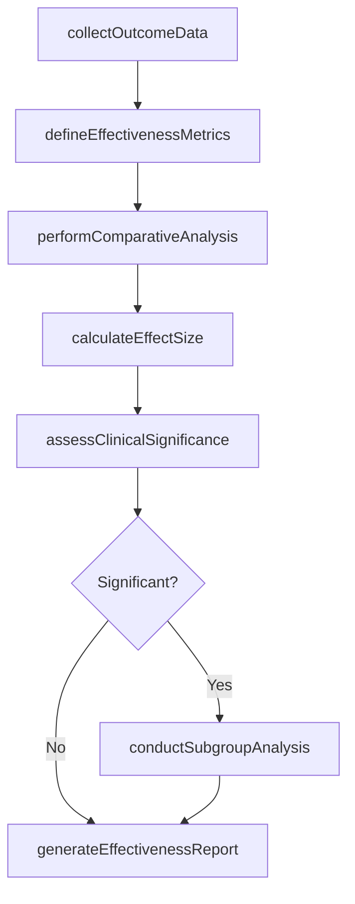
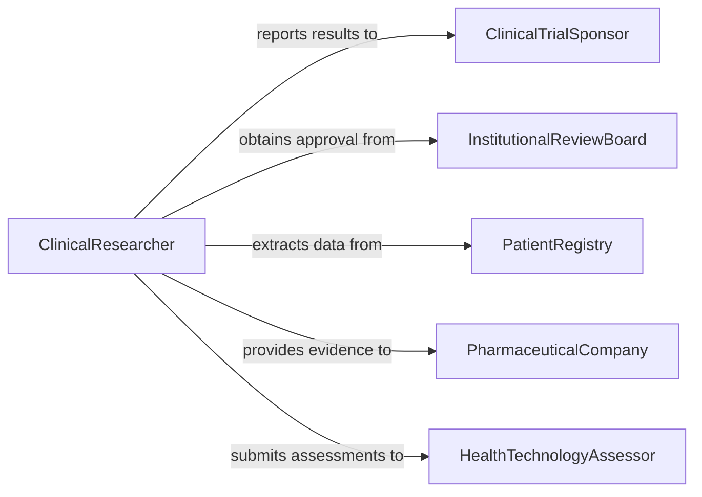

# Analyze Quantitative Data Determine Effectiveness

> Business-as-Code definition for analyzing quantitative data to determine effectiveness of treatments or therapies. Models the statistical evaluation of clinical outcomes data to assess whether interventions achieve their intended therapeutic results.

## Overview

Analyzing quantitative data to determine treatment effectiveness involves applying statistical methods to clinical trial results, patient outcome registries, and quality measure datasets to assess whether treatments produce meaningful improvements. Researchers and quality analysts compare treatment groups, calculate effect sizes, evaluate dose-response relationships, and determine statistical and clinical significance. This definition provides actions for outcome data collection, comparative analysis, and effectiveness reporting to support evidence-based clinical practice and quality improvement.

## Actors

| Actor | Description |
|-------|-------------|
| ClinicalTrialSponsor | Organization funding the study and awaiting effectiveness data |
| InstitutionalReviewBoard | Ethics committee that approved the research protocol |
| PatientRegistry | Database collecting longitudinal patient outcomes for analysis |
| PharmaceuticalCompany | Drug manufacturer seeking effectiveness evidence for regulatory submissions |
| HealthTechnologyAssessor | Agency evaluating treatments for coverage and reimbursement decisions |

## Roles

| Role | Description |
|------|-------------|
| ClinicalResearcher | Designs studies and analyzes outcome data to assess effectiveness |
| Biostatistician | Applies statistical methods and validates analytical conclusions |
| QualityImprovementAnalyst | Evaluates treatment effectiveness within care delivery settings |
| OutcomesResearchDirector | Oversees effectiveness research programs and directs publication |

## Entities

| Entity | Description |
|--------|-------------|
| OutcomeDataset | A structured collection of patient outcomes for a treatment cohort |
| EffectivenessMetric | A quantitative measure of treatment impact such as response rate or survival |
| TreatmentComparison | A statistical analysis contrasting outcomes between intervention groups |
| EffectSize | A standardized measure of the magnitude of treatment effect |
| ConfidenceInterval | A range expressing the precision of an effectiveness estimate |
| ClinicalSignificance | A determination of whether the effect size is meaningful in practice |

## Actions

| Action | Description |
|--------|-------------|
| collectOutcomeData | Aggregate patient outcomes from clinical databases and registries |
| defineEffectivenessMetrics | Specify the primary and secondary endpoints for analysis |
| performComparativeAnalysis | Apply statistical tests to compare treatment and control groups |
| calculateEffectSize | Quantify the magnitude of treatment impact using standardized measures |
| assessClinicalSignificance | Determine whether statistical results are clinically meaningful |
| conductSubgroupAnalysis | Evaluate treatment effectiveness across patient subpopulations |
| generateEffectivenessReport | Produce a comprehensive report of findings for stakeholders |

## Events

| Event | Description |
|-------|-------------|
| outcomeDataCollected | Patient outcome data has been aggregated and validated |
| effectivenessMetricsDefined | Primary and secondary endpoints have been specified |
| comparativeAnalysisPerformed | Statistical comparison between treatment groups is complete |
| effectSizeCalculated | The magnitude of treatment effect has been quantified |
| clinicalSignificanceAssessed | Determination of clinical meaningfulness is complete |
| subgroupAnalysisConducted | Effectiveness evaluation across subpopulations is available |
| effectivenessReportGenerated | A comprehensive findings report has been finalized |

## Searches

| Search | Description |
|--------|-------------|
| findOutcomeDatasets | Retrieve outcome data by treatment, condition, or study period |
| getEffectivenessResults | Look up completed analyses by treatment, metric, or significance level |
| getSubgroupFindings | Retrieve effectiveness results for specific patient subpopulations |
| getPendingAnalyses | List studies awaiting outcome data or statistical evaluation |

## Workflow



## Actor Relationships



## Usage

### Calling Actions

```typescript
import { analyzeQuantitativeDataDetermineEffectiveness } from '@headlessly/analyze-quantitative-data-determine-effectiveness'

const effectiveness = analyzeQuantitativeDataDetermineEffectiveness()

// Collect outcome data for a treatment study
const dataset = await effectiveness.collectOutcomeData({
  studyId: 'TRIAL-2025-0193',
  treatment: 'Drug-X-200mg',
  controlGroup: 'placebo',
  outcomes: ['pain-score-reduction', 'functional-improvement', 'adverse-events'],
  enrollmentPeriod: { start: '2025-01-01', end: '2025-12-31' }
})

// Perform comparative analysis
const analysis = await effectiveness.performComparativeAnalysis({
  datasetId: dataset.id,
  primaryEndpoint: 'pain-score-reduction',
  method: 'mixed-effects-model',
  adjustments: ['age', 'baseline-severity', 'comorbidities']
})

// Calculate effect size
const effect = await effectiveness.calculateEffectSize({
  analysisId: analysis.id,
  measure: 'cohens-d',
  confidenceLevel: 0.95
})
```

### Event-Driven Automation

```typescript
// Alert sponsor when significant results are found
effectiveness.clinicalSignificanceAssessed(async ({ studyId, endpoint, significant, effectSize }) => {
  if (significant) {
    await notify({
      to: 'trial-sponsor',
      message: `Study ${studyId}: ${endpoint} shows clinically significant effect (d=${effectSize})`
    })
  }
})

// Auto-generate report when all analyses are complete
effectiveness.subgroupAnalysisConducted(async ({ studyId, subgroups }) => {
  await effectiveness.generateEffectivenessReport({
    studyId,
    sections: ['primary-analysis', 'subgroup-analysis', 'safety-profile'],
    recipients: ['sponsor', 'irb', 'regulatory']
  })
})
```
