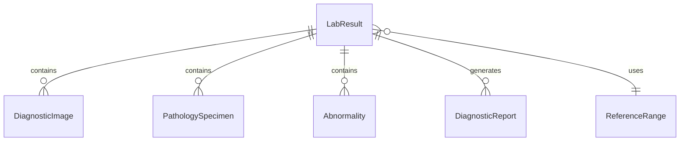
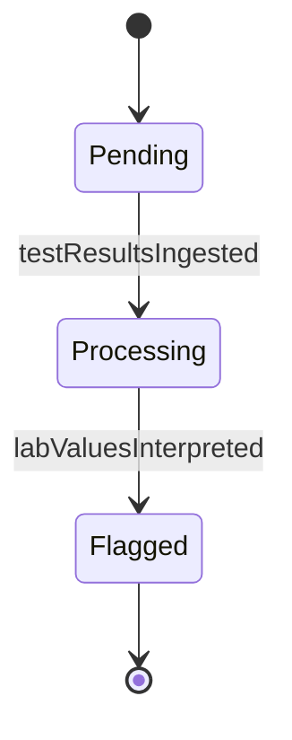
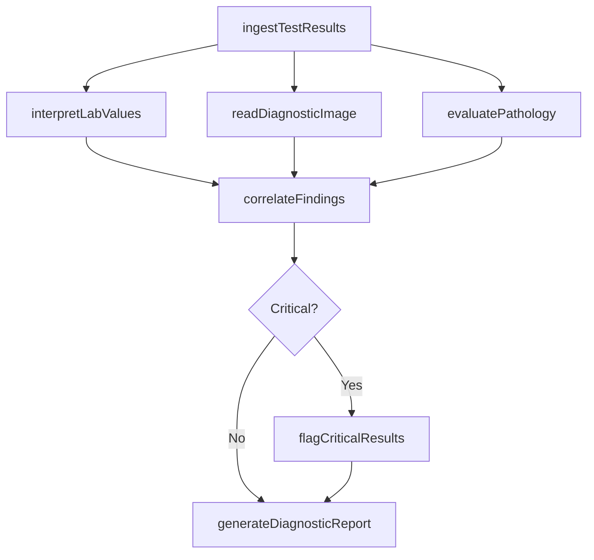
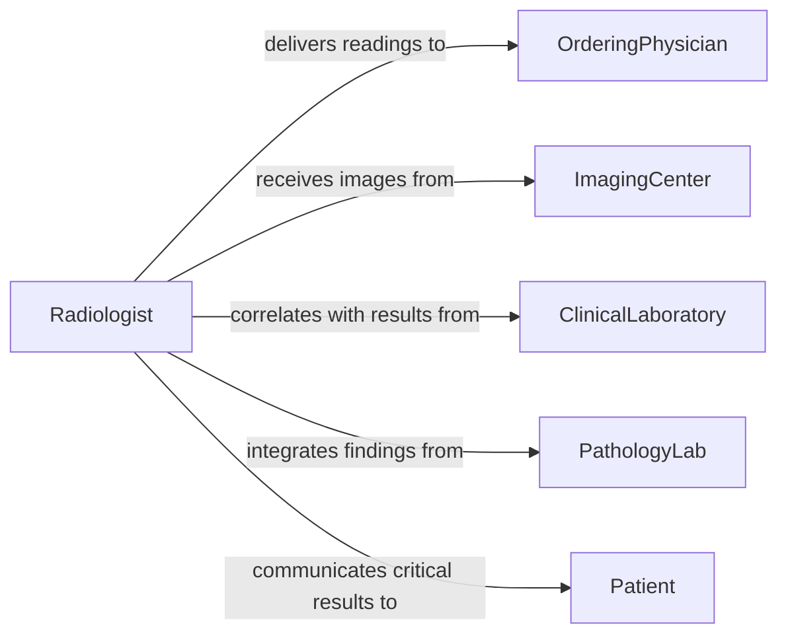

# Analyze Test Data Images Inform

> Business-as-Code definition for analyzing test data or images to inform diagnosis or treatment. Models the clinical interpretation of laboratory results, diagnostic imaging, and pathology specimens to guide medical decision-making.

## Overview

Analyzing test data and images to inform diagnosis or treatment involves interpreting laboratory panels, radiographic images, electrodiagnostic tracings, and pathology slides to identify abnormalities, confirm diagnoses, and guide therapeutic interventions. Clinicians correlate findings across multiple test modalities, compare results against reference ranges, and integrate diagnostic conclusions into the patient's clinical picture. This definition provides actions for result ingestion, image interpretation, abnormality detection, and diagnostic reporting to support timely and accurate clinical decisions.

## Actors

| Actor | Description |
|-------|-------------|
| OrderingPhysician | Clinician who requested the tests and will act on the results |
| ClinicalLaboratory | Facility performing blood work, cultures, and biochemical analyses |
| ImagingCenter | Radiology department or facility producing diagnostic images |
| PathologyLab | Laboratory processing tissue biopsies and cytology specimens |
| Patient | Individual whose test data and images are being analyzed |

## Roles

| Role | Description |
|------|-------------|
| Radiologist | Interprets diagnostic images and produces reading reports |
| Pathologist | Examines tissue specimens and renders histological diagnoses |
| LaboratoryDirector | Oversees clinical test accuracy and validates critical results |
| DiagnosticsCoordinator | Manages the flow of test orders, specimens, and results |

## Entities

| Entity | Description |
|--------|-------------|
| LabResult | A structured report of values from a clinical laboratory test |
| DiagnosticImage | A radiograph, CT scan, MRI, or ultrasound image for interpretation |
| PathologySpecimen | A tissue or cytology sample submitted for microscopic analysis |
| Abnormality | A finding that deviates from normal reference ranges or expected appearance |
| DiagnosticReport | A formal interpretation document with findings and clinical impression |
| ReferenceRange | Normal value boundaries for a specific laboratory test |

## Actions

| Action | Description |
|--------|-------------|
| ingestTestResults | Import laboratory values, images, and pathology reports into the clinical system |
| interpretLabValues | Compare laboratory results against reference ranges and clinical context |
| readDiagnosticImage | Analyze radiographic or cross-sectional images for abnormalities |
| evaluatePathology | Examine tissue specimens and render histological or cytological diagnoses |
| correlateFindings | Integrate results across lab, imaging, and pathology for a unified clinical picture |
| flagCriticalResults | Identify and escalate results requiring immediate clinical attention |
| generateDiagnosticReport | Produce a formal interpretation with findings and recommendations |

## Events

| Event | Description |
|-------|-------------|
| testResultsIngested | Laboratory and imaging data have been imported into the system |
| labValuesInterpreted | Laboratory results have been compared against reference ranges |
| diagnosticImageRead | A radiographic image interpretation has been completed |
| pathologyEvaluated | Tissue specimen analysis and diagnosis are available |
| findingsCorrelated | Multi-modality test results have been integrated |
| criticalResultFlagged | A result requiring immediate clinical attention has been escalated |
| diagnosticReportGenerated | A formal interpretation report has been finalized |

## Searches

| Search | Description |
|--------|-------------|
| findTestResults | Retrieve lab values or imaging reports by patient, test type, or date |
| getCriticalResults | List results flagged as critical or requiring immediate follow-up |
| getAbnormalFindings | Look up test results outside normal reference ranges |
| getDiagnosticReports | Retrieve completed interpretation reports by clinician or patient |


## Entity Relationships



## State Diagram


## Workflow



## Actor Relationships



## Usage

### Calling Actions

```typescript
import { analyzeTestDataImagesInform } from '@headlessly/analyze-test-data-images-inform'

const diagnostics = analyzeTestDataImagesInform()

// Ingest test results for a patient
const results = await diagnostics.ingestTestResults({
  patientId: 'PT-2026-05127',
  tests: [
    { type: 'cbc', source: 'central-lab', orderId: 'ORD-8841' },
    { type: 'chest-ct', source: 'radiology-dept', orderId: 'ORD-8842' },
    { type: 'biopsy', source: 'pathology-lab', orderId: 'ORD-8843' }
  ]
})

// Read the diagnostic image
const imageReading = await diagnostics.readDiagnosticImage({
  imageId: results.images[0].id,
  modality: 'CT',
  bodyRegion: 'chest',
  clinicalIndication: 'persistent-cough-weight-loss'
})

// Correlate all findings
const correlation = await diagnostics.correlateFindings({
  patientId: 'PT-2026-05127',
  labResultIds: results.labs.map(l => l.id),
  imageReadingIds: [imageReading.id],
  pathologyIds: results.pathology.map(p => p.id)
})
```

### Event-Driven Automation

```typescript
// Immediately notify ordering physician on critical results
diagnostics.criticalResultFlagged(async ({ patientId, testType, value, criticalRange }) => {
  await notify({
    to: 'ordering-physician',
    priority: 'urgent',
    message: `CRITICAL: Patient ${patientId} ${testType} result ${value} (critical range: ${criticalRange})`
  })
})

// Auto-generate report when all modalities are correlated
diagnostics.findingsCorrelated(async ({ patientId, findingsSummary }) => {
  await diagnostics.generateDiagnosticReport({
    patientId,
    findings: findingsSummary,
    format: 'structured-report',
    recipients: ['ordering-physician', 'patient-portal']
  })
})
```
