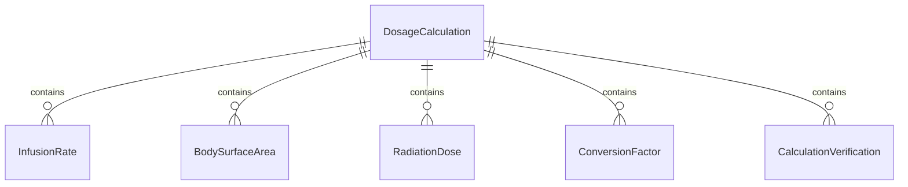
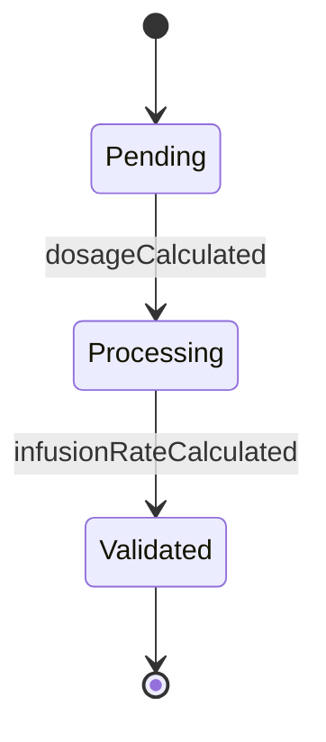
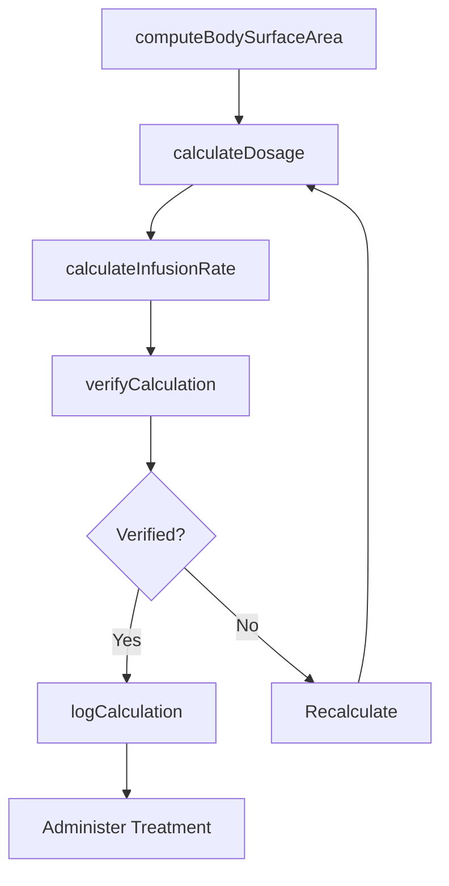
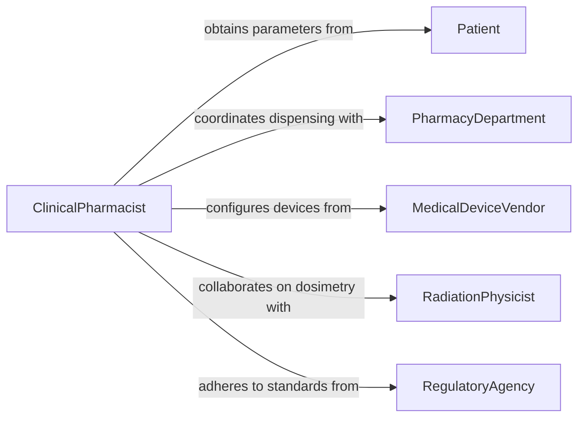

# Calculate Numerical Data Medical Activities

> Business-as-Code definition for calculating numerical data for medical activities. Models the quantitative computations required for drug dosing, fluid management, radiation planning, and other clinical procedures that depend on precise numerical calculations.

## Overview

Calculating numerical data for medical activities involves performing precise computations for medication dosages, intravenous drip rates, body surface area, radiation doses, and laboratory dilutions that are essential for safe patient care. Clinicians, pharmacists, and technicians apply weight-based formulas, conversion factors, and calibration equations to ensure treatments are administered accurately. This definition provides actions for dosage calculation, unit conversion, and calculation verification to support clinical safety and regulatory compliance.

## Actors

| Actor | Description |
|-------|-------------|
| Patient | Individual whose physiological parameters drive the calculations |
| PharmacyDepartment | Dispenses medications and verifies dosage calculations |
| MedicalDeviceVendor | Supplier of infusion pumps and equipment requiring calibrated settings |
| RadiationPhysicist | Specialist who computes and verifies radiation treatment doses |
| RegulatoryAgency | Authority mandating calculation accuracy standards in clinical settings |

## Roles

| Role | Description |
|------|-------------|
| ClinicalPharmacist | Performs and verifies medication dosage calculations |
| NursingProfessional | Calculates drip rates, fluid volumes, and bedside medication doses |
| RadiationTherapist | Computes treatment delivery parameters based on prescribed doses |
| LaboratoryScientist | Performs dilution and concentration calculations for specimen analysis |

## Entities

| Entity | Description |
|--------|-------------|
| DosageCalculation | A computed medication dose based on patient weight, age, or body surface area |
| InfusionRate | The calculated flow rate for intravenous fluid or medication delivery |
| BodySurfaceArea | A derived measurement used for dose indexing in chemotherapy and other treatments |
| RadiationDose | The computed energy delivery for radiation therapy treatment |
| ConversionFactor | A multiplier for translating between units of measurement |
| CalculationVerification | A documented independent check of a completed medical calculation |

## Actions

| Action | Description |
|--------|-------------|
| calculateDosage | Compute medication dose based on patient parameters and prescribing guidelines |
| calculateInfusionRate | Determine drip rate or pump settings for intravenous administration |
| computeBodySurfaceArea | Calculate BSA from height and weight for dose indexing |
| calculateRadiationDose | Compute treatment delivery parameters for radiation therapy |
| convertUnits | Translate values between measurement systems used in clinical practice |
| verifyCalculation | Perform an independent check to confirm calculation accuracy |
| logCalculation | Record the calculation details, inputs, and results for clinical documentation |

## Events

| Event | Description |
|-------|-------------|
| dosageCalculated | A medication dose computation has been completed |
| infusionRateCalculated | An IV drip rate or pump setting has been determined |
| bodySurfaceAreaComputed | BSA has been calculated for a patient |
| radiationDoseCalculated | Radiation treatment parameters have been computed |
| unitsConverted | A measurement conversion has been completed |
| calculationVerified | An independent verification of a calculation has passed |
| calculationLogged | Calculation details have been recorded in the clinical record |

## Searches

| Search | Description |
|--------|-------------|
| findCalculations | Retrieve calculations by patient, medication, or date |
| getVerificationStatus | Check whether a specific calculation has been independently verified |
| getDosageHistory | Look up past dosage calculations for a patient and medication |
| getPendingVerifications | List calculations awaiting independent verification |


## Entity Relationships



## State Diagram


## Workflow



## Actor Relationships



## Usage

### Calling Actions

```typescript
import { calculateNumericalDataMedicalActivities } from '@headlessly/calculate-numerical-data-medical-activities'

const medCalc = calculateNumericalDataMedicalActivities()

// Compute body surface area
const bsa = await medCalc.computeBodySurfaceArea({
  patientId: 'PT-2026-03291',
  height: { value: 175, unit: 'cm' },
  weight: { value: 82, unit: 'kg' },
  formula: 'Mosteller'
})

// Calculate chemotherapy dosage
const dosage = await medCalc.calculateDosage({
  patientId: 'PT-2026-03291',
  medication: 'Carboplatin',
  dosingMethod: 'AUC-based',
  targetAUC: 5,
  gfr: 78,
  bsa: bsa.value
})

// Verify the calculation independently
const verification = await medCalc.verifyCalculation({
  calculationId: dosage.id,
  verifier: 'pharmacist-johnson',
  method: 'independent-recalculation'
})
```

### Event-Driven Automation

```typescript
// Alert when a calculation fails verification
medCalc.calculationVerified(async ({ calculationId, verified, discrepancy }) => {
  if (!verified) {
    await notify({
      to: 'pharmacy-supervisor',
      priority: 'urgent',
      message: `Calculation ${calculationId} failed verification: ${discrepancy}% discrepancy`
    })
  }
})

// Auto-log verified calculations to the clinical record
medCalc.calculationVerified(async ({ calculationId, verified, patientId }) => {
  if (verified) {
    await medCalc.logCalculation({
      calculationId,
      patientId,
      destination: 'electronic-health-record'
    })
  }
})
```
