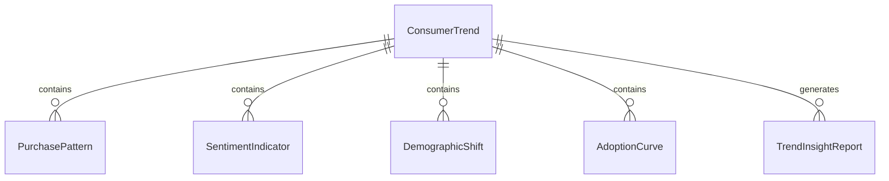
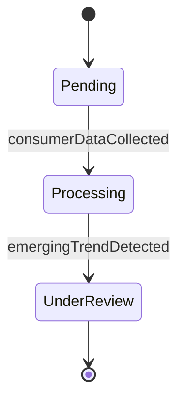
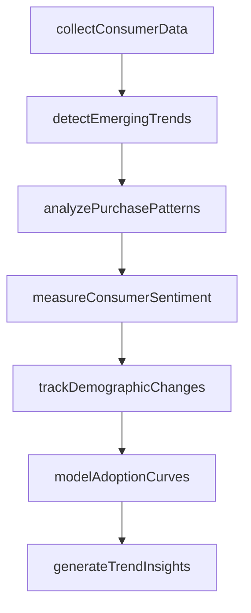
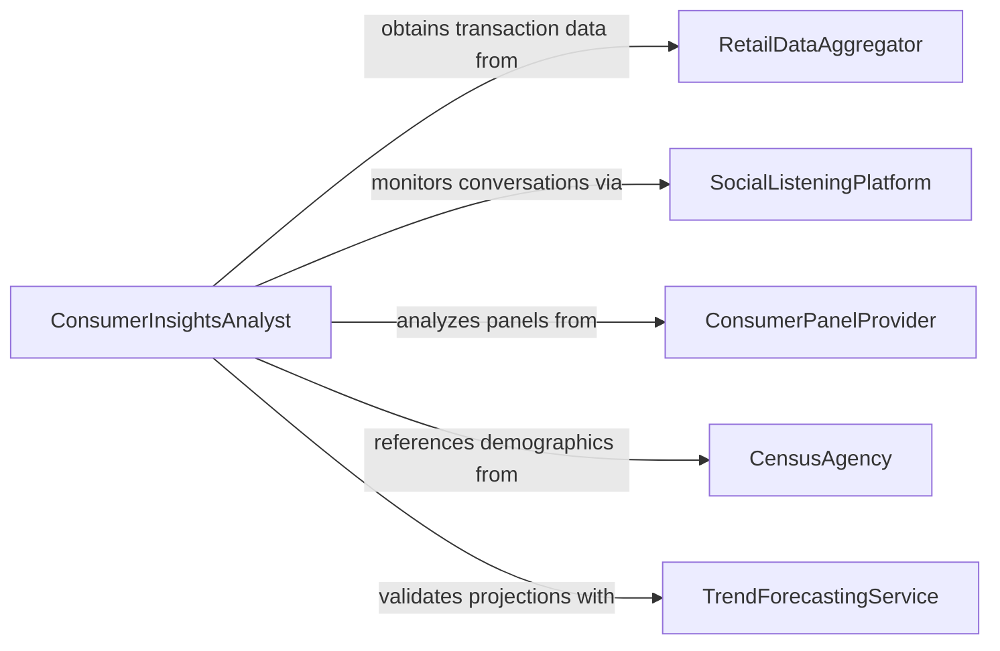

# Analyze Consumer Trends

> Business-as-Code definition for analyzing consumer trends. Models the tracking and interpretation of shifting consumer preferences, purchasing patterns, lifestyle changes, and adoption behaviors to anticipate market demand and guide product development, marketing, and retail strategies.

## Overview

Analyzing consumer trends involves monitoring changes in purchasing behavior, brand preferences, media consumption, lifestyle adoption, and demographic shifts to detect emerging patterns that affect product demand and market positioning. This definition provides actions for trend data collection, pattern detection, sentiment analysis, and consumer insight reporting. It supports consumer insights analysts, brand strategists, retail planners, and product development teams.

## Actors

| Actor | Description |
|-------|-------------|
| RetailDataAggregator | Provides point-of-sale and e-commerce transaction data across retailers |
| SocialListeningPlatform | Monitors consumer conversations and sentiment across social channels |
| ConsumerPanelProvider | Supplies longitudinal purchase and lifestyle data from panelist households |
| CensusAgency | Publishes demographic and household composition data |
| TrendForecastingService | Produces forward-looking reports on emerging consumer behaviors |

## Roles

| Role | Description |
|------|-------------|
| ConsumerInsightsAnalyst | Identifies and interprets shifts in consumer behavior and preferences |
| BrandStrategist | Translates consumer trend data into brand positioning recommendations |
| TrendForecaster | Projects emerging consumer behaviors and their market implications |
| RetailPlanner | Uses consumer trend analysis to optimize product assortment and merchandising |

## Entities

| Entity | Description |
|--------|-------------|
| ConsumerTrend | A sustained shift in consumer behavior, preference, or lifestyle |
| PurchasePattern | A recurring sequence of consumer buying decisions by category or channel |
| SentimentIndicator | A quantified measure of consumer attitude toward a brand, product, or category |
| DemographicShift | A measurable change in population composition affecting consumer markets |
| AdoptionCurve | A model of how consumers embrace new products, services, or behaviors |
| TrendInsightReport | A document presenting consumer trend findings and strategic recommendations |
| LifestyleSegment | A consumer group defined by shared values, habits, and media preferences |

## Actions

| Action | Description |
|--------|-------------|
| collectConsumerData | Gather purchase, survey, and social data reflecting consumer behavior |
| detectEmergingTrends | Identify new or accelerating shifts in consumer preferences |
| analyzePurchasePatterns | Examine buying frequency, basket composition, and channel preferences |
| measureConsumerSentiment | Quantify consumer attitudes through survey and social listening data |
| trackDemographicChanges | Monitor population shifts affecting consumer market composition |
| modelAdoptionCurves | Project the rate at which consumers adopt new products or behaviors |
| generateTrendInsights | Produce an analysis report with strategic consumer trend recommendations |

## Events

| Event | Description |
|-------|-------------|
| consumerDataCollected | Purchase, survey, and social data have been gathered |
| emergingTrendDetected | A new or accelerating consumer behavior shift has been identified |
| purchasePatternsAnalyzed | Buying frequency and basket data have been examined |
| consumerSentimentMeasured | Consumer attitude scores have been quantified |
| demographicChangesTracked | Population shifts affecting markets have been monitored |
| adoptionCurvesModeled | Consumer adoption projections have been calculated |
| trendInsightsGenerated | A consumer trend analysis report has been produced |

## Searches

| Search | Description |
|--------|-------------|
| findConsumerTrends | List detected consumer trends by category, strength, or date |
| getPurchasePatterns | Retrieve buying pattern data by product category or demographic |
| getSentimentScores | Access consumer sentiment metrics by brand or category |
| getDemographicShifts | View population change data by geography or characteristic |
| getAdoptionRates | Retrieve product or behavior adoption rates by consumer segment |


## Entity Relationships



## State Diagram


## Workflow



## Actor Relationships



## Usage

### Calling Actions

```typescript
import { analyzeConsumerTrends } from '@headlessly/analyze-consumer-trends'

const analyst = analyzeConsumerTrends()

// Collect consumer data
const analysis = await analyst.collectConsumerData({
  categories: ['health-wellness', 'sustainable-products', 'direct-to-consumer'],
  sources: ['nielsen-panel', 'social-listening-feed', 'ecommerce-transaction-logs'],
  period: { start: '2024-06-01', end: '2025-12-31' }
})

// Detect and analyze trends
await analyst.detectEmergingTrends({ analysisId: analysis.id })
await analyst.analyzePurchasePatterns({ analysisId: analysis.id })
await analyst.measureConsumerSentiment({
  analysisId: analysis.id,
  brands: ['brand-alpha', 'brand-beta', 'category-generic']
})

// Model adoption and generate report
await analyst.modelAdoptionCurves({ analysisId: analysis.id })
await analyst.generateTrendInsights({ analysisId: analysis.id })
```

### Event-Driven Automation

```typescript
// Alert brand team on emerging trends
analyst.emergingTrendDetected(async ({ analysisId, trend, category, strength }) => {
  if (strength === 'strong') {
    await notify({
      to: 'brand-strategy-team',
      message: `Strong emerging consumer trend in ${category}: ${trend.name}`
    })
  }
})

// Distribute trend insights to stakeholders
analyst.trendInsightsGenerated(async ({ analysisId, reportId }) => {
  await distribute({ reportId, recipients: ['product-development', 'marketing', 'retail-planning'] })
})
```
