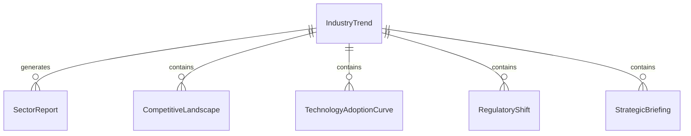
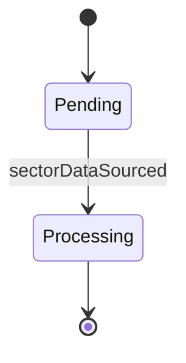
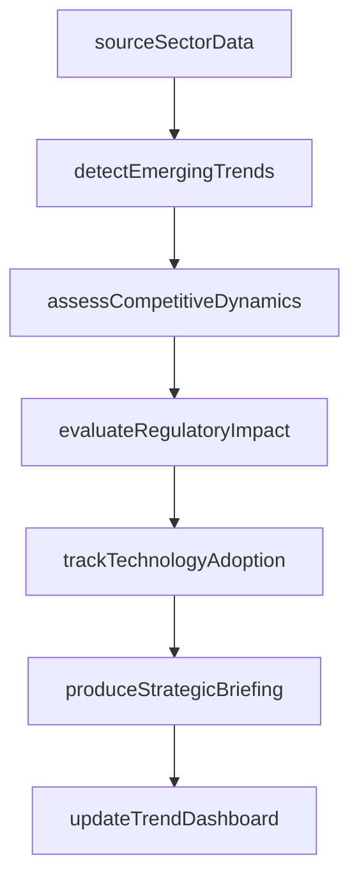
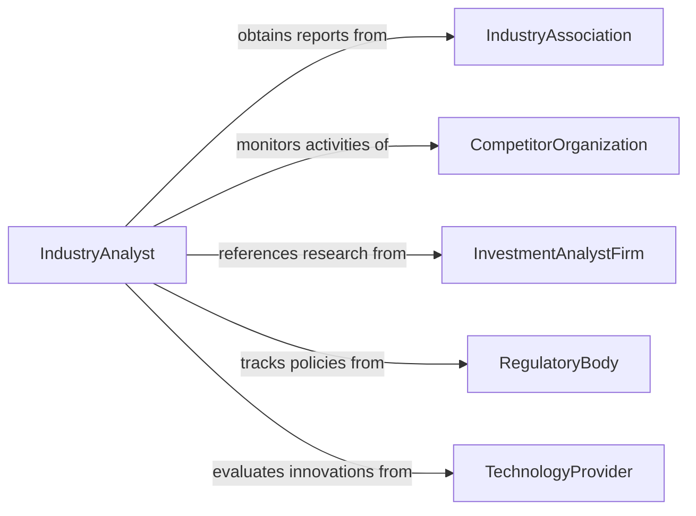

# Analyze Industry Trends

> Business-as-Code definition for analyzing industry trends. Models the systematic monitoring and interpretation of sector-level data including market growth rates, technology adoption, regulatory shifts, competitive dynamics, and supply chain developments to inform strategic decision-making.

## Overview

Analyzing industry trends involves tracking sector-level indicators such as market growth rates, technology adoption curves, merger and acquisition activity, regulatory changes, and supply chain shifts to identify patterns that affect competitive positioning and strategic planning. This definition provides actions for data sourcing, trend detection, impact assessment, and strategic briefing production. It supports strategic planners, industry analysts, business development teams, and executive leadership.

## Actors

| Actor | Description |
|-------|-------------|
| IndustryAssociation | Publishes sector reports and aggregate performance data |
| CompetitorOrganization | Represents peer companies whose activities signal industry direction |
| InvestmentAnalystFirm | Produces equity research and industry outlook reports |
| RegulatoryBody | Introduces policy changes that reshape industry conditions |
| TechnologyProvider | Drives innovation that creates or disrupts industry segments |

## Roles

| Role | Description |
|------|-------------|
| IndustryAnalyst | Monitors sector data and identifies emerging trends |
| StrategicPlanner | Translates trend analysis into organizational strategy recommendations |
| CompetitiveIntelligenceOfficer | Tracks competitor activities and market positioning |
| ChiefStrategyOfficer | Uses trend analysis to guide corporate direction |

## Entities

| Entity | Description |
|--------|-------------|
| IndustryTrend | A sustained directional change in a sector metric or characteristic |
| SectorReport | A published analysis of industry conditions and outlook |
| CompetitiveLandscape | A mapping of key players, market shares, and strategic positions |
| TechnologyAdoptionCurve | A model of how new technologies spread across an industry |
| RegulatoryShift | A policy change that alters industry operating conditions |
| StrategicBriefing | A summary of trend analysis with recommended strategic actions |

## Actions

| Action | Description |
|--------|-------------|
| sourceSectorData | Collect industry reports, financial data, and market intelligence |
| detectEmergingTrends | Identify new or accelerating patterns in industry data |
| assessCompetitiveDynamics | Evaluate changes in market share, positioning, and competitor strategy |
| evaluateRegulatoryImpact | Analyze how policy changes affect industry operations and opportunities |
| trackTechnologyAdoption | Monitor the penetration of new technologies across the sector |
| produceStrategicBriefing | Generate an executive summary of trend findings and recommendations |
| updateTrendDashboard | Refresh real-time industry trend metrics and visualizations |

## Events

| Event | Description |
|-------|-------------|
| sectorDataSourced | Industry reports and market data have been collected |
| emergingTrendDetected | A new or accelerating industry pattern has been identified |
| competitiveDynamicsAssessed | Changes in market positioning have been evaluated |
| regulatoryImpactEvaluated | Effects of policy changes on the industry have been analyzed |
| technologyAdoptionTracked | New technology penetration across the sector has been monitored |
| strategicBriefingProduced | An executive trend summary has been generated |
| trendDashboardUpdated | Industry trend metrics have been refreshed |

## Searches

| Search | Description |
|--------|-------------|
| findTrends | List identified industry trends by sector, date, or significance |
| getCompetitiveLandscape | View competitor positioning and market share data |
| getRegulatoryChanges | Retrieve policy shifts affecting the industry |
| getTechnologyAdoption | Access technology penetration rates by product or sector |
| getStrategicBriefings | Locate executive trend summaries by period or topic |


## Entity Relationships



## State Diagram


## Workflow



## Actor Relationships



## Usage

### Calling Actions

```typescript
import { analyzeIndustryTrends } from '@headlessly/analyze-industry-trends'

const analyst = analyzeIndustryTrends()

// Source sector data
const analysis = await analyst.sourceSectorData({
  sector: 'enterprise-SaaS',
  dataSources: ['gartner-market-guide', 'IDC-tracker', 'SEC-10K-filings', 'crunchbase-funding'],
  period: { start: '2024-01-01', end: '2025-12-31' }
})

// Detect and assess trends
await analyst.detectEmergingTrends({ analysisId: analysis.id })
await analyst.assessCompetitiveDynamics({ analysisId: analysis.id })
await analyst.evaluateRegulatoryImpact({ analysisId: analysis.id })
await analyst.trackTechnologyAdoption({
  analysisId: analysis.id,
  technologies: ['AI-copilots', 'usage-based-pricing', 'composable-architecture']
})

// Produce strategic briefing
await analyst.produceStrategicBriefing({ analysisId: analysis.id })
```

### Event-Driven Automation

```typescript
// Alert leadership on significant emerging trends
analyst.emergingTrendDetected(async ({ analysisId, trend, significance }) => {
  if (significance === 'high') {
    await notify({
      to: 'executive-team',
      message: `High-significance industry trend detected: ${trend}`
    })
  }
})

// Auto-refresh trend dashboard
analyst.sectorDataSourced(async ({ analysisId, sector }) => {
  await analyst.updateTrendDashboard({ analysisId, sector })
})
```
