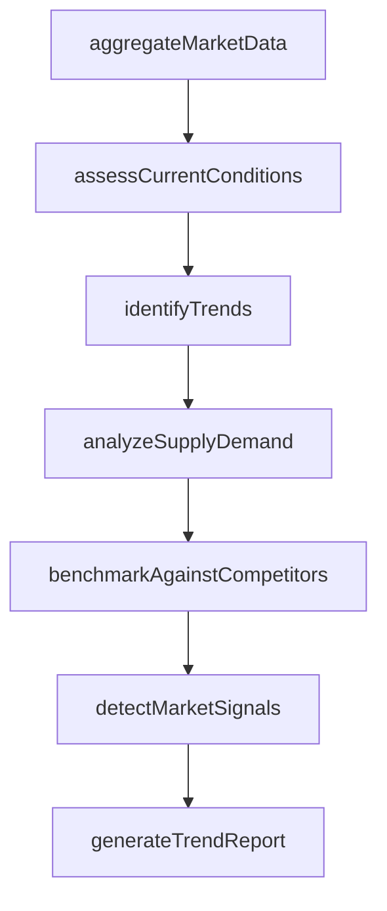
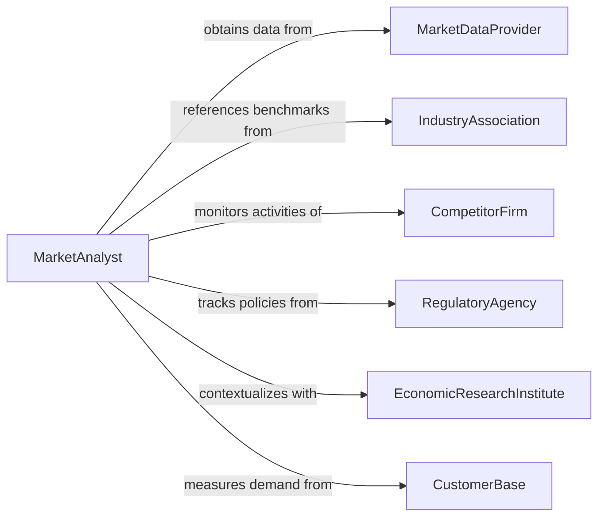

# Analyze Market Conditions or Trends

> Business-as-Code definition for analyzing market conditions and trends. Models the systematic collection and interpretation of pricing data, supply-demand dynamics, competitive intelligence, and macroeconomic signals to identify current market states and directional movements that inform business strategy.

## Overview

Analyzing market conditions or trends involves monitoring pricing movements, supply and demand balances, competitive activity, regulatory developments, and macroeconomic indicators to characterize the current state of a market and project its near-term trajectory. This definition provides actions for data aggregation, condition assessment, trend identification, and strategic reporting. It supports market analysts, portfolio managers, commodity traders, and corporate strategy teams.

## Actors

| Actor | Description |
|-------|-------------|
| MarketDataProvider | Supplies real-time and historical pricing and volume data |
| IndustryAssociation | Publishes sector benchmarks and aggregate market statistics |
| CompetitorFirm | Represents peer companies whose pricing and strategy signal market direction |
| RegulatoryAgency | Introduces policy changes that alter market conditions |
| EconomicResearchInstitute | Produces macroeconomic analyses that contextualize market movements |
| CustomerBase | Generates demand signals through purchasing behavior and sentiment |

## Roles

| Role | Description |
|------|-------------|
| MarketAnalyst | Collects and interprets market data to identify conditions and trends |
| ChiefMarketingOfficer | Uses market analysis to guide go-to-market strategy |
| PricingStrategist | Adjusts pricing based on market condition assessments |
| BusinessDevelopmentManager | Identifies market opportunities from trend analysis |

## Entities

| Entity | Description |
|--------|-------------|
| MarketCondition | A characterized state of a market at a point in time |
| PriceTrend | A directional movement in pricing over a defined period |
| SupplyDemandBalance | A quantified relationship between available supply and market demand |
| CompetitivePositionMap | A visualization of competitor market shares and strategic positions |
| MarketSignal | An indicator or data point suggesting a shift in market conditions |
| TrendReport | A document summarizing market conditions and projected trajectories |
| SeasonalIndex | A measure of recurring market fluctuations tied to calendar periods |

## Actions

| Action | Description |
|--------|-------------|
| aggregateMarketData | Collect pricing, volume, and competitive data from multiple sources |
| assessCurrentConditions | Characterize the present state of a market segment |
| identifyTrends | Detect directional movements and patterns in market data |
| analyzeSupplyDemand | Evaluate the balance between market supply and demand |
| benchmarkAgainstCompetitors | Compare market position and pricing against peer firms |
| detectMarketSignals | Identify early indicators of market shifts or disruptions |
| generateTrendReport | Produce a summary of market conditions with forward-looking projections |

## Events

| Event | Description |
|-------|-------------|
| marketDataAggregated | Pricing and volume data have been collected from sources |
| currentConditionsAssessed | The present market state has been characterized |
| trendsIdentified | Directional patterns in market data have been detected |
| supplyDemandAnalyzed | The supply-demand balance has been evaluated |
| competitorsBenchmarked | Market positioning has been compared against peers |
| marketSignalDetected | An early indicator of market change has been identified |
| trendReportGenerated | A market conditions summary has been produced |

## Searches

| Search | Description |
|--------|-------------|
| findMarketConditions | List market condition assessments by segment, date, or state |
| getPriceTrends | Retrieve pricing trend data by product, market, or period |
| getSupplyDemandMetrics | Access supply-demand balance data by market segment |
| getCompetitiveBenchmarks | View competitive positioning data by market or competitor |
| getMarketSignals | List detected market signals by type, strength, or date |

## Workflow



## Actor Relationships



## Usage

### Calling Actions

```typescript
import { analyzeMarketConditionsTrends } from '@headlessly/analyze-market-conditions-trends'

const analyst = analyzeMarketConditionsTrends()

// Aggregate market data
const analysis = await analyst.aggregateMarketData({
  market: 'enterprise-cloud-services',
  sources: ['gartner-tracker', 'IDC-spending-guide', 'public-earnings-reports'],
  period: { start: '2025-01-01', end: '2025-12-31' }
})

// Assess conditions and identify trends
await analyst.assessCurrentConditions({ analysisId: analysis.id })
await analyst.identifyTrends({ analysisId: analysis.id })
await analyst.analyzeSupplyDemand({ analysisId: analysis.id })
await analyst.benchmarkAgainstCompetitors({
  analysisId: analysis.id,
  competitors: ['aws', 'azure', 'gcp']
})

// Generate report
await analyst.generateTrendReport({ analysisId: analysis.id })
```

### Event-Driven Automation

```typescript
// Alert on significant market signals
analyst.marketSignalDetected(async ({ analysisId, signal, strength }) => {
  if (strength === 'strong') {
    await notify({
      to: 'strategy-team',
      message: `Strong market signal detected: ${signal.description}`
    })
  }
})

// Distribute trend reports to stakeholders
analyst.trendReportGenerated(async ({ analysisId, reportId, market }) => {
  await distribute({ reportId, recipients: ['executive-team', 'sales-leadership', 'product-management'] })
})
```
