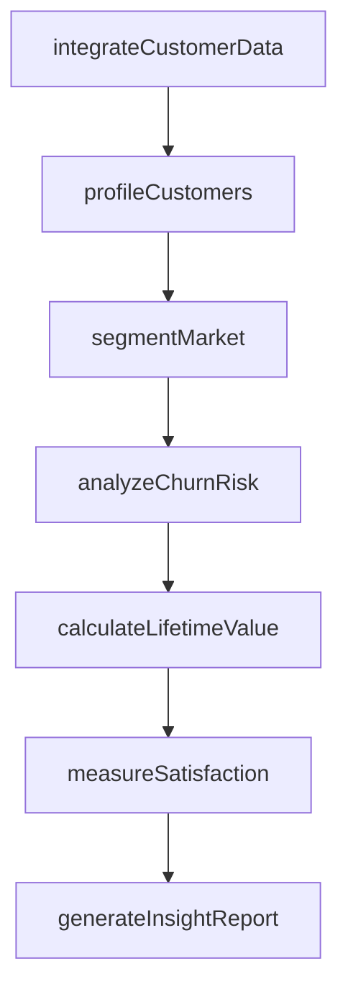
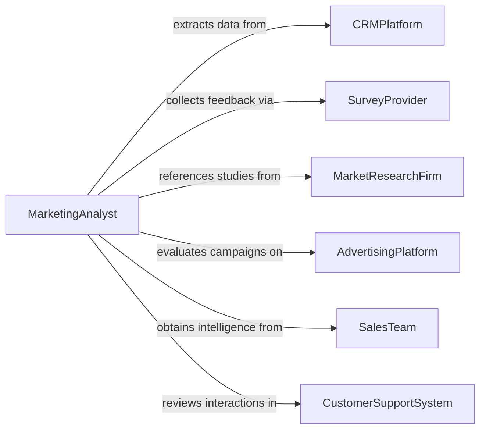

# Analyze Market or Customer Related Data

> Business-as-Code definition for analyzing market and customer related data. Models the systematic examination of customer demographics, purchasing behavior, satisfaction scores, and market segmentation data to understand customer needs, identify growth opportunities, and optimize marketing strategies.

## Overview

Analyzing market or customer related data involves processing customer transaction histories, demographic profiles, satisfaction surveys, churn metrics, and market segmentation studies to understand customer behavior patterns and market dynamics. This definition provides actions for data integration, customer profiling, segmentation analysis, and insight reporting. It supports marketing analysts, customer success teams, product managers, and revenue operations professionals.

## Actors

| Actor | Description |
|-------|-------------|
| CRMPlatform | Stores customer interaction histories and relationship data |
| SurveyProvider | Administers customer satisfaction and market research surveys |
| MarketResearchFirm | Supplies industry-level customer and market segmentation studies |
| AdvertisingPlatform | Provides customer acquisition and targeting performance data |
| SalesTeam | Generates pipeline and deal-level customer intelligence |
| CustomerSupportSystem | Records service interactions and issue resolution data |

## Roles

| Role | Description |
|------|-------------|
| MarketingAnalyst | Interprets customer and market data to guide marketing strategy |
| CustomerInsightsManager | Synthesizes customer behavior data into actionable profiles |
| SegmentationSpecialist | Develops and maintains customer and market segmentation models |
| RevenueOperationsAnalyst | Connects customer data across sales, marketing, and success |

## Entities

| Entity | Description |
|--------|-------------|
| CustomerProfile | An aggregated view of a customer's demographics, behavior, and value |
| MarketSegment | A defined group of customers or prospects sharing common characteristics |
| PurchaseBehavior | A pattern of buying frequency, value, and product preferences |
| SatisfactionScore | A quantified measure of customer sentiment toward a product or service |
| ChurnIndicator | A signal suggesting a customer is at risk of discontinuing service |
| LifetimeValueEstimate | A projected total revenue contribution from a customer relationship |
| InsightReport | A document presenting customer and market data analysis findings |

## Actions

| Action | Description |
|--------|-------------|
| integrateCustomerData | Consolidate customer data from CRM, support, and transaction systems |
| profileCustomers | Build comprehensive profiles combining demographic and behavioral data |
| segmentMarket | Divide the market into groups based on shared characteristics |
| analyzeChurnRisk | Identify customers showing indicators of potential attrition |
| calculateLifetimeValue | Estimate the projected revenue contribution of customer segments |
| measureSatisfaction | Aggregate and interpret customer satisfaction survey results |
| generateInsightReport | Produce a findings document with recommended actions |

## Events

| Event | Description |
|-------|-------------|
| customerDataIntegrated | Customer data from multiple systems has been consolidated |
| customersProfiled | Comprehensive customer profiles have been constructed |
| marketSegmented | The market has been divided into defined customer groups |
| churnRiskAnalyzed | At-risk customers have been identified |
| lifetimeValueCalculated | Revenue contribution projections have been estimated |
| satisfactionMeasured | Customer satisfaction scores have been aggregated |
| insightReportGenerated | A customer and market analysis report has been produced |

## Searches

| Search | Description |
|--------|-------------|
| findCustomerProfiles | List customer profiles by segment, value tier, or status |
| getMarketSegments | Retrieve market segment definitions and membership data |
| getChurnIndicators | Access churn risk scores by customer or segment |
| getSatisfactionScores | View satisfaction metrics by product, segment, or period |
| getLifetimeValues | Retrieve lifetime value estimates by customer or cohort |

## Workflow



## Actor Relationships



## Usage

### Calling Actions

```typescript
import { analyzeMarketCustomerRelatedData } from '@headlessly/analyze-market-customer-related-data'

const analyst = analyzeMarketCustomerRelatedData()

// Integrate and profile customer data
const analysis = await analyst.integrateCustomerData({
  sources: ['salesforce-crm', 'zendesk-support', 'stripe-billing', 'hubspot-marketing'],
  period: { start: '2024-01-01', end: '2025-12-31' }
})

await analyst.profileCustomers({ analysisId: analysis.id })
await analyst.segmentMarket({
  analysisId: analysis.id,
  criteria: ['company-size', 'industry', 'usage-frequency', 'contract-value']
})

// Analyze risk and value
await analyst.analyzeChurnRisk({ analysisId: analysis.id })
await analyst.calculateLifetimeValue({ analysisId: analysis.id })
await analyst.measureSatisfaction({ analysisId: analysis.id })

// Generate insights
await analyst.generateInsightReport({ analysisId: analysis.id })
```

### Event-Driven Automation

```typescript
// Alert customer success on high churn risk
analyst.churnRiskAnalyzed(async ({ analysisId, customer, riskScore }) => {
  if (riskScore > 0.75) {
    await notify({
      to: 'customer-success-team',
      message: `High churn risk detected for ${customer.name}: risk score ${riskScore}`
    })
  }
})

// Distribute insight reports
analyst.insightReportGenerated(async ({ analysisId, reportId }) => {
  await distribute({ reportId, recipients: ['marketing-leadership', 'product-team', 'sales-operations'] })
})
```
